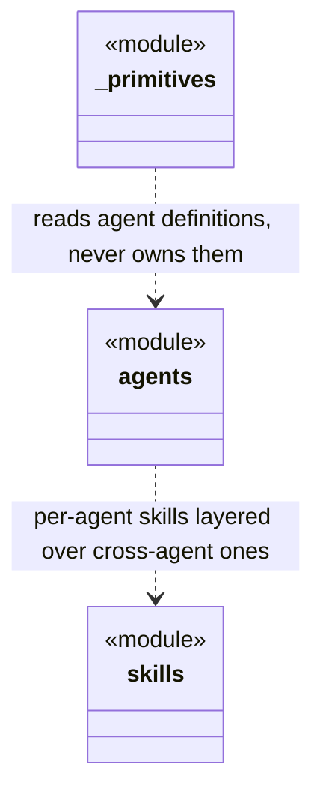

## Positioning

Cbim Cognitive Infrastructure — the agent layer of CBIM. Provides the four built-in agents (architect, auditor, hr, programmer), their skills, and the engine ops (`dna`, `agents`) that govern architecture knowledge and agent file lifecycle.

## Origin Context

CBIM agents need three things to function: (1) their identity/system-prompt definition (`agents/`), (2) skills they invoke at runtime (both per-agent skills under `agents/<x>/skills/` and cross-agent skills under `skills/`), and (3) governance over the artifacts they produce (`.dna/` modules — managed by `engine/`).

## Key Decisions

- **Per-agent skills live under the agent's own directory.** Skills that belong to one agent only (e.g. `architect.arch_modules`) are under `agents/architect/skills/arch_modules/`. Cross-agent skills (`memory_write` etc.) live under `skills/`. This co-location makes agent ownership obvious.
- **`engine/` is the only sub-module that owns kernel-managed mutations.** Since P3 Wave 1 its `cli.py` is an empty stub — the previous `cmd_modules_*` / `cmd_agents_*` handlers were inlined into top-level `engine/cli.py` as `_handle_dna_*` / `_handle_agent_*` private functions, which now drive everything through `cbi.resources.{DNAModule, Agent}`. `agents/` and `skills/` remain read-only resources, surfaced through `cbi.resources.{Agent, Skill}` (the latter exposes `Skill.list_builtin()` / `Skill.load_builtin()`, replacing the old `engine/cli._load_skills`).

## Class Diagram

