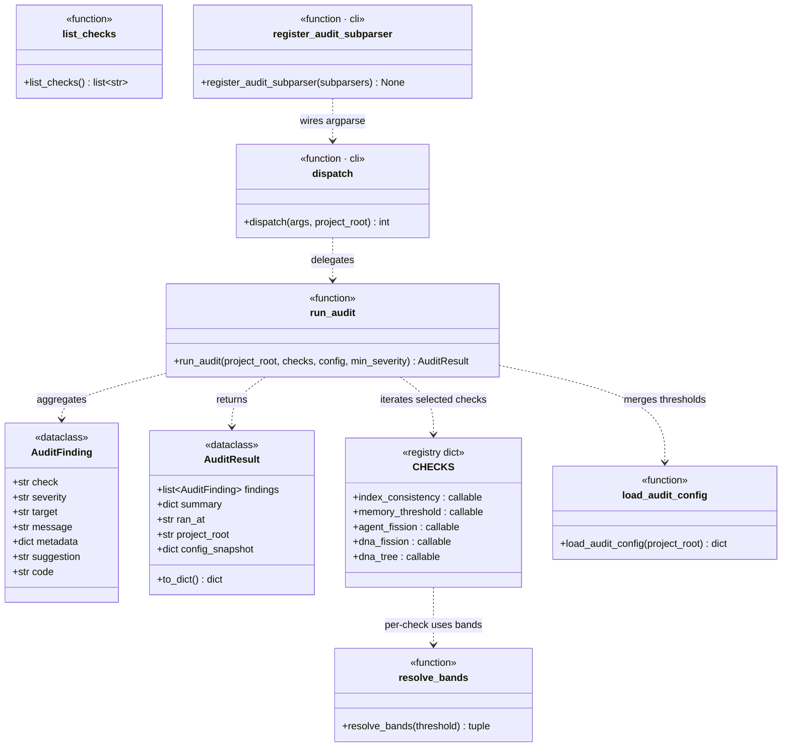

## Positioning

Read-only governance drift guard. Inspects the project's `.cbim/index.md`, every registered `.dna/module.md`, every project-level agent under `.claude/agents/`, and the memory service's published `stats()` output. Returns structured findings; never mutates anything.

Five checks, single dispatch surface:

- `index_consistency` — registry vs. on-disk module list
- `memory_threshold` — pulls metrics from `kernel/memory`'s `stats()` only; flags when short-tier count / staleness / candidate backlog cross the configured bands. **Does not own the thresholds' meaning, does not judge promotion-worthiness, does not read raw memory files.**
- `agent_fission` — project agent body & skill count oversize
- `dna_fission` — module body & workflow count oversize
- `dna_tree` — parent/child orphans, dep DAG (cycles, dangling, up-tree direction)

Lives **inside** the engine package because every check threads through `engine.config` (audit thresholds live in `.cbim/config.json`'s `audit` section) and because the CLI surface (`cbim audit ...`) is one more sub-domain of `python -m engine`.

## Class Diagram

## Key Decisions

- **Read-only by construction.** No check writes to `.dna/`, `.claude/agents/`, `.cbim/memory/`, or `.cbim/index.md` — even the registry it audits. Mutation belongs to dedicated commands (`cbim dna reindex`, `cbim memory cleanup`, `cbim agent ...`). Audit reports drift; it does not heal it.
- **Embedded inside `engine/`, not a sibling package.** The CLI surface is a sub-domain of `cbim ...` and config thresholds live in `.cbim/config.json`; making audit a sibling of `engine` would require an extra cross-package import dance for no real boundary win. Reversible later if audit grows non-CLI consumers.
- **Three-band severity (info / warn / error) via `resolve_bands`.** `info` = 80% of threshold (early-warning), `warn` = at threshold, `error` = 150% of threshold. Single helper used by every quantitative check; no per-check threshold logic drift.
- **Hardcoded `DEFAULTS` are pure fallback.** `load_audit_config` deep-merges `.cbim/config.json`'s `audit` section over `DEFAULTS`; audit itself never writes the merged result back. Users can override thresholds; the defaults stay readable in source.
- **Skill counting is a heuristic, isolated.** `_agent_skill_parser.count_skills` does fragile markdown-table parsing plus a `cbim skill show <agent>.X` regex fallback. Lives in its own module so a future structured skill metadata can drop the heuristic without touching the check.
- **Memory threshold check is a thin metrics consumer, not a judge.** `memory_threshold` pulls numbers from `kernel/memory`'s `stats()` interface and applies the audit-side band thresholds — that's it. It does **not** read raw entries under `.cbim/memory/`, does **not** decide what "should be promoted" to agent skills or `.dna/`, and does **not** emit per-tier promotion findings. v3 memory design (G5) reserves promotion-candidate identification for `kernel/memory/compaction/`; promotion candidates surface via `scan(filter="promote_candidate")` on the architect's own knowledge loop, not via audit. Audit only flags "candidate backlog crossed the band" as a quantitative drift signal.
- **Exit code follows max severity of the (filtered) findings.** 0 = clean / info, 1 = warn, 2 = error. `--severity X` filters display AND affects the exit code; that way CI can gate on `cbim audit run --severity error`.

- **`dependencies` frontmatter 语义**：仅声明跨边界、非祖先的依赖。同层兄弟、向下抽象层、外部模块都要列；任何祖先链上的模块一律不列。这一约定由 `dna_tree` 检查的 `TREE_DEP_ANCESTOR_DECLARED` 强制。

## Non-Goals

- **No auto-fix.** Audit reports drift; it never rewrites `.dna/`, `.claude/agents/`, or `.cbim/memory/`. Fix commands stay in their owning modules.
- **No writes to `.dna/` from inside any check.** This includes the registry: even though `index_consistency` knows when `.cbim/index.md` is stale, it only emits a finding pointing at `cbim dna reindex`.
- **No semantic judgment.** Audit does not decide whether a memory entry "should be promoted" to agent skills or `.dna/`. Promotion-candidate identification belongs to `kernel/memory/compaction/`; the architect's knowledge loop consumes those candidates via `scan(filter="promote_candidate")`. Same for fission: audit reports oversize, it does not propose how to split.
- **No raw reads under `.cbim/memory/`.** `memory_threshold` reaches memory **only** through `kernel/memory`'s `stats()` interface. Direct file walks under `.cbim/memory/short/` / `medium/` / `candidates/` are forbidden — that would couple audit to memory's internal layout and re-introduce the threshold-judgment leak this collapse was meant to fix.
- **No deep semantic import scan.** Dependency direction comes from `frontmatter.dependencies`. We do not parse Python imports, grep code references, or trace call graphs — that is a separate concern with very different cost/precision trade-offs.

