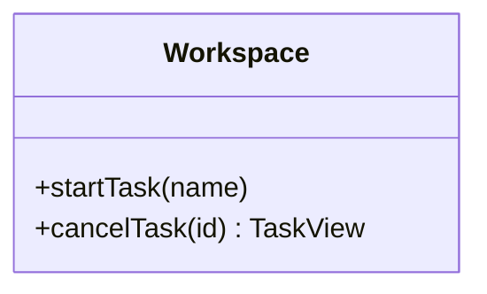

### 维护任务取消边界

```mermaid
classDiagram
class Workspace {
  +startTask(name)
  +cancelTask(id) TaskView
}
```

- `startTask/cancelTask` 只管理当前实例的知识检查与索引维护任务。取消前核验运行态；未知、其他工作区、对话或成员派发任务 ID 返回 `TASK_NOT_FOUND`。取消请求不伪造终态：正在提交的事务可继续完成，已完成/失败/取消的任务重复调用保持真实结果。
