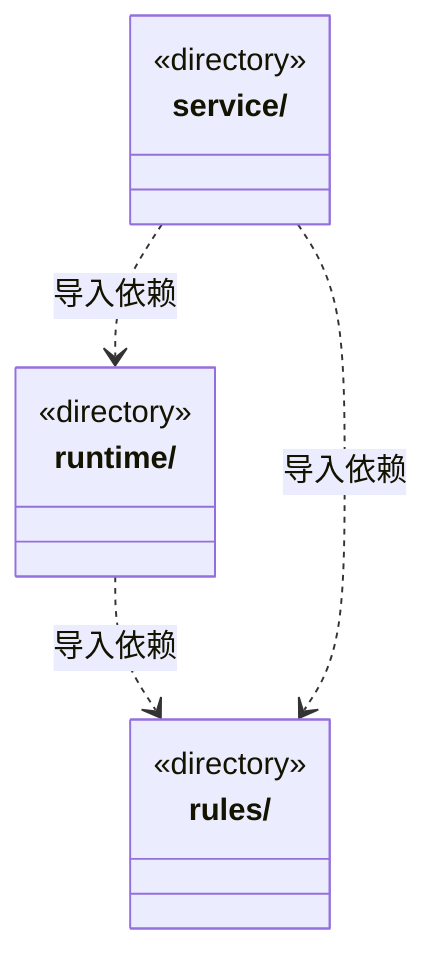

# src/logic/automation 架构

本目录只维护这一份说明。设计与契约直接编辑本文；文件清单、类图和导航由 [架构脚本](../../../scripts/source-architecture.mjs) 更新，生成区域之外的人工说明会保留。

## 封装意图

自动化计划、触发条件及计划契约；服务与规则分开归属，实际依赖通过明确入口验证。

## 类与模块的设计意图

本层没有直接源码声明，负责组合下级封装；各子系统的类、状态与公开入口见本文的[子目录导航](#子目录导航)。

## 接口设计契约

本层没有独立代码入口或运行实例。公开契约与资源生命周期分别归属下级封装，按[子目录导航](#子目录导航)进入实际所有者。

## 开闭边界

本目录的职责及允许协作由[封装意图](#封装意图)限定，输入输出、状态与失败语义以[接口设计契约](#接口设计契约)为准。扩展从已有公开入口及实际装配位置进入；没有明确可替换契约的部分按真实影响修改和验证，不预建未使用的基类或插件入口。

<!-- architecture:generated:start -->

## 文件清单

| 文件 | 形式 | 当前职责 |
| --- | --- | --- |
| [ARCHITECTURE.md](ARCHITECTURE.md) | 说明文档 | 本目录的文件清单、真实声明、依赖与子封装导航。 |

本层无直接代码文件。

## 架构类图

成员标记：`+` 公开、`-` 私有、`#` 受保护、`$` 静态；构造函数单独列出。文档和资源仅在文件清单中导航，不作为代码节点。

```mermaid
classDiagram
class N_src_logic_automation_rules["rules/"] {
  <<directory>>
}
class N_src_logic_automation_runtime["runtime/"] {
  <<directory>>
}
class N_src_logic_automation_service["service/"] {
  <<directory>>
}
N_src_logic_automation_runtime ..> N_src_logic_automation_rules : 导入依赖
N_src_logic_automation_service ..> N_src_logic_automation_rules : 导入依赖
N_src_logic_automation_service ..> N_src_logic_automation_runtime : 导入依赖
```

各图中的同名节点表示同一目录边界；跨组及完整直接依赖如下（无边不代表继承）：

- `runtime` → `rules`：导入。
- `service` → `rules`：导入。
- `service` → `runtime`：导入。

## 子目录导航

- [rules/](rules/ARCHITECTURE.md)：自动化定义、运行与执行/存储端口及纯时区日程计算，不依赖调度和桌面实现。
- [runtime/](runtime/ARCHITECTURE.md)：串行版本配置、持久启动意图与定时调度；同项不重叠，重开跳过过期，不重放未知运行。
- [service/](service/ARCHITECTURE.md)：自动化应用服务及文件存储：计划、执行请求与持久化属于同一应用职责，领域调度契约归 logic/automation/rules。

[返回上层](../ARCHITECTURE.md)。

每次修改本目录代码，同步维护文件头、关键契约说明及本图。未实现的治理、证据验收和自动编排能力不列入当前类图。

<!-- architecture:generated:end -->
