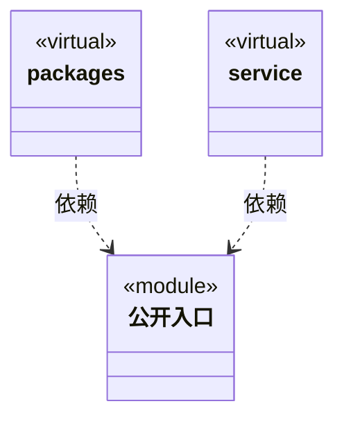

# src/logic/engines 架构

## 设计意图

装配引擎的模型配置、安装状态和本机运行包。

## 主要组成

| 组成 | 定位 |
| --- | --- |
| [公开入口](index.ts) | 供现有消费者访问公开协议。 |

<!-- architecture:generated:start -->

## 架构关系

标注为 `virtual` 的节点是直接子模块的虚拟类封装；内部设计沿下方入口阅读。

```mermaid
classDiagram
class N_fbb1ef4949d9["公开入口"] {
  <<module>>
}
click N_fbb1ef4949d9 href "index.ts"
class N_e36725470015["packages"] {
  <<virtual>>
}
click N_e36725470015 href "packages/ARCHITECTURE.md"
class N_c89715d50249["service"] {
  <<virtual>>
}
click N_c89715d50249 href "service/ARCHITECTURE.md"
N_e36725470015 ..> N_fbb1ef4949d9 : 依赖
N_c89715d50249 ..> N_fbb1ef4949d9 : 依赖
```

## 子模块

| 虚拟封装 | 整体职责 |
| --- | --- |
| [packages](packages/ARCHITECTURE.md) | 管理应用选择的官方引擎版本、依赖闭包和运行引用，隔离下载制品与启用选择。 |
| [service](service/ARCHITECTURE.md) | 把引擎选择转换为模型服务可核实的协议需求，返回绑定引擎身份的冻结执行快照。 |

[上层设计](../ARCHITECTURE.md)

<!-- architecture:generated:end -->
