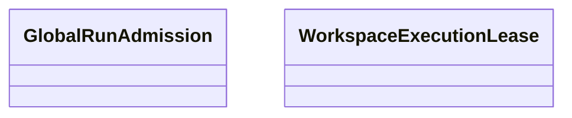

# src/logic/execution/admission 架构

## 设计意图

运行准入的票据与运行注册，保持可信入口、占用与释放语义；与业务验收分离。

## 主要组成

| 组成 | 定位 |
| --- | --- |
| [GlobalRunAdmission](run-admission.ts) | 为应用内主轮和成员轮统一提供同步执行准入、FIFO 等待及独立只读投影。 |
| [WorkspaceExecutionLease](workspace-lease.ts) | 同一已打开工作区内，主会话与独立成员共享的执行占用协调器。 |

<!-- architecture:generated:start -->

## 架构关系

```mermaid
classDiagram
class N_8f845963282f["GlobalRunAdmission"]
click N_8f845963282f href "run-admission.ts"
class N_ecf8ed39e0fc["WorkspaceExecutionLease"]
click N_ecf8ed39e0fc href "workspace-lease.ts"
```

[上层设计](../ARCHITECTURE.md)

<!-- architecture:generated:end -->
