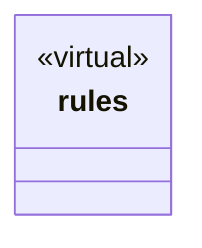

# src/logic/file-operations 架构

## 设计意图

保存工具协议引用的文件操作与受控执行声明。实际 Office 文件和命令入口位于 Bridge 桌面工具，声明本身不授予权限。

## 主要组成

本层只划分子模块；规则与运行边界沿下方子模块阅读。

<!-- architecture:generated:start -->

## 架构关系

标注为 `virtual` 的节点是直接子模块的虚拟类封装；内部设计沿下方入口阅读。

```mermaid
classDiagram
class N_bdaac93625d3["rules"] {
  <<virtual>>
}
click N_bdaac93625d3 href "rules/ARCHITECTURE.md"
```

## 子模块

| 虚拟封装 | 整体职责 |
| --- | --- |
| [rules](rules/ARCHITECTURE.md) | 保存工具协议引用的文件操作与受控执行声明。实际 Office 文件和命令入口位于 Bridge 桌面工具，声明本身不授予权限。 |

[上层设计](../ARCHITECTURE.md)

<!-- architecture:generated:end -->
