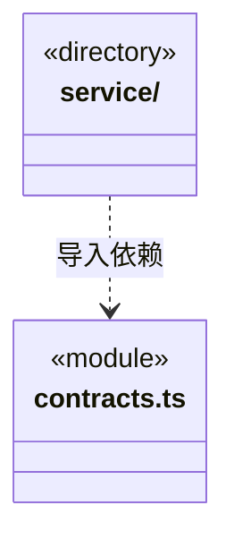

# src/logic/materials 架构

本目录只维护这一份说明。设计与契约直接编辑本文；文件清单、类图和导航由 [架构脚本](../../../scripts/source-architecture.mjs) 更新，生成区域之外的人工说明会保留。

## 封装意图

聊天资料的身份、预览契约与采集保存服务；来源证明由业务持有，桥接仅传输受限数据。

## 类与模块的设计意图

下表依据源码声明及文件头说明定位封装。字段表示该实例持有的状态或协作引用，不表示它拥有被引用服务的生命周期；实际资源责任和调用限制见下文契约及源码注释。

| 类／模块 | 实现形式与实例字段 | 封装依据 |
| --- | --- | --- |
| [contracts.ts](contracts.ts) | 函数／契约模块 | 业务保存来源与正文，桥接只运输数据；纯类型不加载文件或平台。 |

## 接口设计契约

- [contracts.ts](contracts.ts)：资料快照的附件身份和预览数据契约。

## 开闭边界

本目录的职责及允许协作由[封装意图](#封装意图)限定，输入输出、状态与失败语义以[接口设计契约](#接口设计契约)为准。扩展从已有公开入口及实际装配位置进入；没有明确可替换契约的部分按真实影响修改和验证，不预建未使用的基类或插件入口。

<!-- architecture:generated:start -->

## 文件清单

| 文件 | 形式 | 当前职责 |
| --- | --- | --- |
| [ARCHITECTURE.md](ARCHITECTURE.md) | 说明文档 | 本目录的文件清单、真实声明、依赖与子封装导航。 |
| [contracts.ts](contracts.ts) | 源码模块 | 资料快照的附件身份和预览数据契约。 |

## 架构类图

成员标记：`+` 公开、`-` 私有、`#` 受保护、`$` 静态；构造函数单独列出。文档和资源仅在文件清单中导航，不作为代码节点。

```mermaid
classDiagram
class N_src_logic_materials_service["service/"] {
  <<directory>>
}
class N_src_logic_materials_contracts_ts["contracts.ts"] {
  <<module>>
}
N_src_logic_materials_service ..> N_src_logic_materials_contracts_ts : 导入依赖
```

各图中的同名节点表示同一目录边界；跨组及完整直接依赖如下（无边不代表继承）：

- `service` → `contracts.ts`：导入。

## 子目录导航

- [service/](service/ARCHITECTURE.md)：聊天输入、附件与引用材料的本机采集/持久化；保存的快照不自动证明当前来源有效。

[返回上层](../ARCHITECTURE.md)。

每次修改本目录代码，同步维护文件头、关键契约说明及本图。未实现的治理、证据验收和自动编排能力不列入当前类图。

<!-- architecture:generated:end -->
