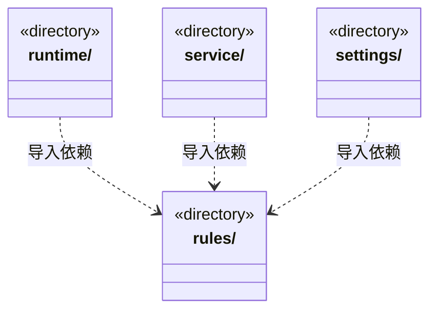

# src/logic/team 架构

本目录只维护这一份说明。设计与契约直接编辑本文；文件清单、类图和导航由 [架构脚本](../../../scripts/source-architecture.mjs) 更新，生成区域之外的人工说明会保留。

## 封装意图

团队成员、岗位与履历契约；服务与规则分开归属，实际依赖通过明确入口验证。

## 类与模块的设计意图

本层没有直接源码声明，负责组合下级封装；各子系统的类、状态与公开入口见本文的[子目录导航](#子目录导航)。

## 接口设计契约

本层没有独立代码入口或运行实例。公开契约与资源生命周期分别归属下级封装，按[子目录导航](#子目录导航)进入实际所有者。

## 开闭边界

本目录的职责及允许协作由[封装意图](#封装意图)限定，输入输出、状态与失败语义以[接口设计契约](#接口设计契约)为准。扩展从已有公开入口及实际装配位置进入；没有明确可替换契约的部分按真实影响修改和验证，不预建未使用的基类或插件入口。

<!-- architecture:generated:start -->

## 文件清单

| 文件 | 形式 | 当前职责 |
| --- | --- | --- |
| [ARCHITECTURE.md](ARCHITECTURE.md) | 说明文档 | 本目录的文件清单、真实声明、依赖与子封装导航。 |

本层无直接代码文件。

## 架构类图

成员标记：`+` 公开、`-` 私有、`#` 受保护、`$` 静态；`function` 为函数值成员，`get`／`set` 为访问器。调用／构造／索引签名按匿名签名列出，不虚构方法名；`global.` 表示全局声明补充，非运行时嵌套类。构造函数单独列出，运行时私有字段保留 `#`。文档和资源仅在文件清单中导航，不作为代码节点。

```mermaid
classDiagram
class N_src_logic_team_rules["rules/"] {
  <<directory>>
}
class N_src_logic_team_runtime["runtime/"] {
  <<directory>>
}
class N_src_logic_team_service["service/"] {
  <<directory>>
}
class N_src_logic_team_settings["settings/"] {
  <<directory>>
}
N_src_logic_team_runtime ..> N_src_logic_team_rules : 导入依赖
N_src_logic_team_service ..> N_src_logic_team_rules : 导入依赖
N_src_logic_team_settings ..> N_src_logic_team_rules : 导入依赖
```

各图中的同名节点表示同一目录边界；跨组及完整直接依赖如下（无边不代表继承）：

- `runtime` → `rules`：导入。
- `service` → `rules`：导入。
- `settings` → `rules`：导入。

## 子目录导航

- [rules/](rules/ARCHITECTURE.md)：Team、小组、Agent 和父链 Skill 视图、实例及静态角色 Session 履历契约。主实例归主会话，业务实例归周期与任务；履历按角色聚合真实通道，释放或删定义后保留，旧记录不补造实例。另含稳定工作区岗位的严格DTO、采纳快照与不可变登记规则；岗位启用不等于执行许可。 只读视图归 logic/knowledge/rules/read-models，外部通过其 index.ts 访问；岗位与执行状态契约不归读取视图所有。 负责岗位选择、冻结执行绑定、当前来源/能力/模型判定及只读分组发现均为纯契约；同角色多岗位独立。
- [runtime/](runtime/ARCHITECTURE.md)：正式成员执行、自动协作与检查点服务；按冻结任务/Workflow 建立真实运行，保留取消、等待与证据绑定。
- [service/](service/ARCHITECTURE.md)：岗位、来源与责任登记的应用服务；协调知识、文件实现和 Logic 领域规则，不拥有正式运行准入。
- [settings/](settings/ARCHITECTURE.md)：仅保留主 Agent 设置及工作区 revision 校验；模型配置服务已迁至 logic/models/service，经 logic/engines/service 的引擎投影复用同一个模型配置短锁。

[返回上层](../ARCHITECTURE.md)。

每次修改本目录代码，同步维护文件头、关键契约说明及本图。未实现的治理、证据验收和自动编排能力不列入当前类图。

<!-- architecture:generated:end -->
