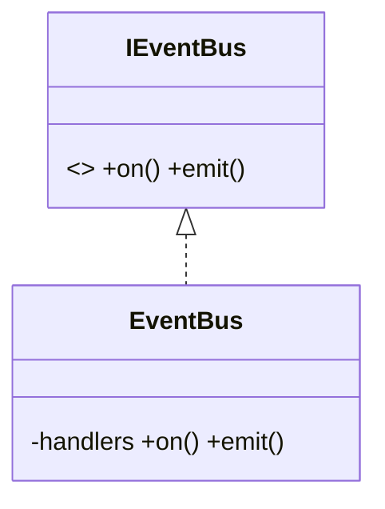
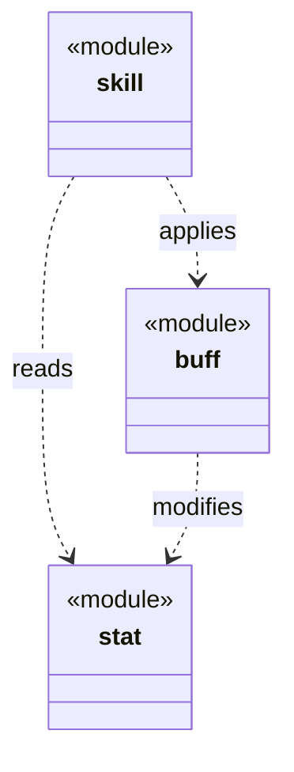
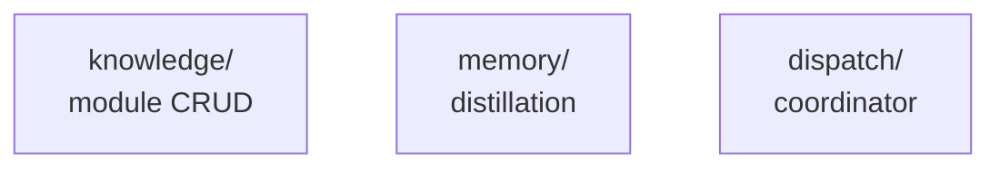
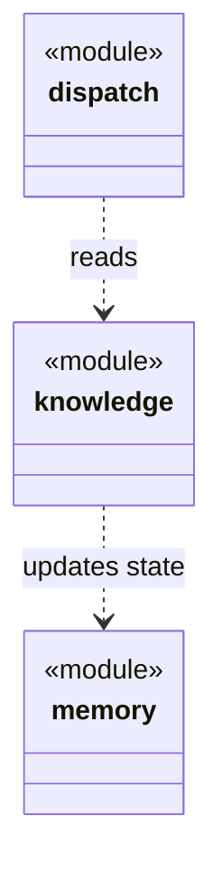

[English](MODULE-MD-DESIGN.md) | [中文](MODULE-MD-DESIGN.zh-CN.md)

# Design Guide: Writing `module.md`

## Overview

`module.md` is the architecture document for a module — the sole place where a module describes itself to the rest of the project. Each `.dna/module.md` is the self-contained knowledge unit for one module, combining metadata (YAML frontmatter) and architecture (markdown body) in a single file.

The document must reflect current reality: the working state of the code as it exists today. It is not a changelog or a historical log — when architecture changes, the document is updated to reflect the new design, and git history captures what was replaced.

---

## Part 1: Module Types and Templates

### Three Module Types

Every module is exactly one of three types, determined at initialization and reflected in the body structure.

| Type | When to use | Parent or leaf | Mermaid syntax |
|------|-------------|---|---|
| **leaf** | A self-contained module with no sub-modules; fully independent responsibility | Leaf — no children | `classDiagram` (real classes/interfaces at code level) |
| **parent** | A module that contains other modules, each with its own `.dna/`; composing multiple responsibilities | Parent — has children | `classDiagram` (sub-modules represented as high-level classes) |
| **root** | The project root only; applies parent template at the top level. Only allowed at project root directory. | Parent (same as parent type) | `classDiagram` (same as parent) |

### ClassDiagram is universal — only granularity changes

All three module types use `classDiagram`. The difference is **what each class node represents**:

| Module type | A class node represents | Example node |
|-------------|------------------------|--------------|
| leaf | A real code-level class or interface | `class EventBus { -handlers +on() +emit() }` |
| parent / root | A sub-module (use `<<module>>` stereotype) | `class skill { <<module>> }` |

**Leaf example (code-level classes):**



**Parent example (sub-module-level classes):**



Same syntax. Same arrows. Different zoom level.

### Leaf Module Template

A leaf module describes a single responsibility: its positioning in the parent's axis, the classes and interfaces that make it up, and the key design choices that explain "why" beyond what code alone shows.

Initial body template:

```markdown
## Positioning

<!-- One or two sentences (at most three) — the abstract positioning of this module: what it is, why it exists. Keep it tight. -->

## Class Diagram

```mermaid
classDiagram
    %% classes, interfaces, key method signatures, relationships
```

## Key Decisions

<!-- Design choices whose "why" is invisible from the code itself.
     Each decision applies to the module as a whole. -->
```

**Mermaid syntax requirement**: Must use `classDiagram`. If your 'classes' are actually directory names or sub-system labels, you are not in a leaf module — promote each to a real sub-module first.

### Parent Module Template

A parent module describes relationships between child modules: how they are positioned, which ones depend on which, and the emergent insights that arise at their boundaries.

Initial body template:

```markdown
## Positioning

<!-- One or two sentences (at most three) — the abstract positioning of this module: what it is, why it exists. Keep it tight. -->

## Class Diagram

```mermaid
classDiagram
    %% Each class = one sub-module (named after the sub-module directory).
    %% Stereotype <<module>> distinguishes these from code-level classes.
    %% Arrows (..>) = inter-sub-module dependencies.
```

## Key Decisions

<!-- ONLY cross-sub-module emergent insights:
     why these sub-modules exist together, how they relate at boundaries.
     DO NOT write any single sub-module's internal design here —
     that belongs in the sub-module's own .dna/module.md. -->
```

**Critical constraint**: A parent module writes about its children only as a group at their boundaries. Never drill into a single child's internal design — that belongs exclusively in that child's own `.dna/module.md`.

**Mermaid syntax requirement**: Must use `classDiagram`. Each class node represents one sub-module (use `<<module>>` stereotype). Use `..>` association arrows for dependencies. The diagram syntax is identical to leaf modules — only the granularity differs (sub-modules instead of code-level classes).

### Module Type Decision Matrix

When deciding if a module is leaf or parent:

| Signal | Type |
|--------|------|
| No sub-directories with distinct responsibilities; fully self-contained behavior | **Leaf** |
| Contains sub-directories that each carry an independent responsibility | **Parent** — those sub-directories must first become CBIM modules with their own `.dna/` (depth-first); only then write this parent |

**Depth-first rule**: If you are designing a component diagram where boxes represent internal sub-components, first promote each box to its own real CBIM module with a `.dna/` directory. Only after sub-modules exist, write this parent module's `.dna/module.md`.

---

## Part 2: Frontmatter Architecture

### Field Checklist

Every `module.md` begins with YAML frontmatter. These fields are **required**:

| Field | Type | Description | Example |
|-------|------|-------------|---------|
| `name` | string | Kebab-case module identifier | `event-bus` |
| `owner` | string | Responsible agent id (usually `architect`) | `architect` |
| `status` | enum | Declared implementation state: `spec`, `planned`, or `implemented` | `implemented` |

These fields are **optional**:

| Field | Type | Description | Example |
|-------|------|-------------|---------|
| `description` | string | One-sentence purpose | `Decoupled, type-safe event dispatch` |
| `keywords` | list | Search tags | `[event, pub-sub]` |
| `dependencies` | list | Module paths this module depends on | `[".", "src/types"]` |
| `includeDirs` | list | Subdirectories to include in the module boundary | `["src", "tests"]` |

### Status Field: Three Lifecycle States

The `status` field records the **declared implementation state** of the module — set by the architect to express intent.

| Status | Meaning | When to use |
|--------|---------|-------------|
| `spec` | Designed but not yet implemented; the `.dna/module.md` is the specification | Architect writes DNA ahead of code; work agents build to this spec |
| `planned` | Named only; design is still pending | Rare; marks a module whose name exists but design hasn't been done yet |
| `implemented` | Code matches the DNA; both are in sync | The steady state; most modules are here |

**Important**: `status` is **independent of the observed state** (whether DNA matches code). An architect can declare `status: spec` on a module whose code hasn't been written yet; later, once the work agent implements it, they flip it to `status: implemented` via `cbim dna edit <module> --target frontmatter --field status --value implemented`.

### Constraint Rules

- `name`: Kebab-case only (lowercase letters, digits, hyphens). Example: `event-bus`, `combat-skill`, `memory-distill`.
- `owner`: Usually the responsible agent id. Standard value is `architect`, but can be any agent id.
- `description`: If present, must be a single sentence.
- `dependencies`: List of module paths (relative paths like `"."`, `"src/types"`, or `"packages/core/event-bus"`). The dependency graph must be acyclic (DAG); cycles are detected and reported as errors by audit check `dna_tree`.
- `includeDirs`: Rarely needed; only when the module's code spans multiple directories that are not direct children. Example: a module in `src/combat` that also owns code in `src/types/combat-types`. Omit if the module is self-contained in one directory.

---

## Part 3: Key Decisions Organization

### The Core Rule: What is a Key Decision?

A **key decision** is a design choice whose "why" is invisible from reading the code alone. It explains architectural intent that code structure alone cannot communicate.

A key decision is **about the module as a whole**, not about internal implementation details of a sub-component.

### Format: list or table, never paragraphs

Key Decisions must be a **bulleted list or compact table** — never prose paragraphs. Each item:

- One short title (bold), then one or two sentences explaining **what** and **why**.
- If "why" needs more than two sentences, the decision is either too coarse (split it) or contains implementation detail (move it to code).
- Point at code for the "how": `see src/event-bus/bus.ts`.

**List form (default):**

```markdown
- **Interface-first**: Consumers depend on `IEventBus`, never on `EventBus`. Enables test doubles without mocking frameworks. See `src/event-bus/types.ts`.
- **Disposable return**: `on()` returns a `Disposable`. Prevents forgotten-unsubscribe leaks.
```

**Table form (when decisions are parallel / comparable):**

| Decision | What | Why |
|----------|------|-----|
| Interface-first | Consumers see `IEventBus` only | Test doubles without mocking |
| Disposable return | `on()` returns `Disposable` | No forgotten `off()` leaks |

If you find yourself writing a paragraph, stop. Either it's a list item that grew too long (trim it and point at code), or it's not a key decision (delete it or move to a design note).

### Examples: Leaf Module Decisions

**Good key decisions in a leaf module:**

- **Interface-first**: Consumers depend on `IEventBus`, never on `EventBus` directly, enabling test doubles without mocking frameworks.
- **Disposable return**: `on()` returns a `Disposable` instead of requiring `off()`, preventing forgotten-unsubscribe memory leaks.
- **No async emit**: Handlers are synchronous by design; async side-effects are managed by the handler itself, keeping the bus simple and predictable.

These explain architectural boundaries, design patterns, and "why we chose this shape" — all invisible from code alone.

**Bad key decisions in a leaf module:**

- ❌ "We use a HashMap to store subscribers" (implementation detail, visible in code)
- ❌ "The map is keyed by event name as a string" (implementation detail, visible in code)
- ❌ "The dispose method calls the unsubscribe function" (code is self-documenting)

### Examples: Parent Module Decisions

**Good key decisions in a parent module (cross-sub-module emergent insights):**

- **skill depends on buff, not the reverse**: Abilities can apply buffs, but buffs must never trigger abilities — this prevents recursive combat loops.
- **stat changes propagate downward only**: When base stats change, derived stats recompute; changes never bubble back up — maintains a clear hierarchy.

These explain why the sub-modules are organized this way, and what the contract is at their boundaries.

**Bad key decisions in a parent module (smell: drills into a child):**

- ❌ "skill uses a cooldown queue to manage ability resets" (internal to skill module; belongs in `skill/.dna/module.md`)
- ❌ "buff state is stored as a circular buffer for memory efficiency" (internal to buff module; belongs in `buff/.dna/module.md`)
- ❌ "The skill module caches compiled ability trees" (implementation detail of skill; belongs in `skill/.dna/module.md`)

### Decision Smell Detection

If a bullet point describes only one sub-module's internal design, it is **not** a cross-sub-module insight. Move it to that sub-module's own `.dna/module.md`.

**Smell markers** (if you find yourself writing these, stop and move to the child):

- Begins with a child module name followed by "uses", "stores", "caches", "compiles", "calculates" its own internals
- Explains a design choice visible only when reading that one child's code
- Would be incomprehensible without reading that child's detailed implementation

---

## Part 4: Architecture Decisions vs. Implementation Decisions

### What Belongs in `module.md`

Write in `module.md` the architectural choices that define the module's **shape and boundaries**:

- **Module responsibility**: What does this module do, in one sentence (Positioning section)
- **Public interfaces**: What contracts does it expose (Class Diagram or Sub-module Relationships)
- **Boundary constraints**: What is forbidden across module lines (Key Decisions section)
- **Emergent properties**: What design insights arise from the overall architecture (Key Decisions section)
- **Tradeoffs**: Why we chose this boundary instead of another (Key Decisions section)

### What Belongs ONLY in Code or Commit Messages

**Implementation decisions** — local optimizations, algorithm choices, data structure internals, call ordering — stay in code and commit messages:

- Algorithm choice for a private function ("why we use quicksort here instead of mergesort")
- Memory optimization ("we pool allocations to reduce GC pressure")
- Temporary workarounds ("this is a hack until we upgrade the dependency")
- Performance tuning ("we batch requests to reduce latency")
- Call ordering details ("must initialize the cache before starting the worker thread")

These are visible in the code; they belong in comments and commit messages, not in `module.md`.

### Decision Boundary Rules

| Question | Answer | Goes in |
|----------|--------|---------|
| Would someone need to read this to understand the module's public shape? | Yes | `module.md` |
| Is this about how a sub-module relates to its siblings? | Yes | Parent's `module.md` |
| Is this about the internals of one module that don't affect other modules? | No | Code comment / commit message |
| Does changing this detail affect other modules' design? | Yes → `module.md` | No → code comment |
| Is this a tradeoff between architecture options? | Yes | `module.md` |
| Is this an implementation detail of the chosen architecture? | Yes | Code comment |

### Signal vs. Noise

`module.md` is **high-density**: architecture only, no filler, no repeated explanations.

Each Key Decision is a **single strong statement**, not a narrative. Avoid:

- Repeated restatements ("we chose this because... and here's why... the reason is...")
- Context dumps ("back when we were using the old system...")
- Tentative language ("we might...", "we could consider...", "in the future we might want to...")
- Change history ("we used to do X, but then switched to Y") — git log shows this

---

## Part 5: Version Evolution Principles

### Replace, Don't Append

When architecture changes, **replace the old decision with the new one**. `module.md` describes the **current final state**, not a log of all past states.

**Bad (history log):**

```markdown
## Key Decisions

- **Original approach**: We initially used a three-tier cache hierarchy...
- **Version 2 (deprecated)**: Later we simplified to a two-tier system...
- **Current (v3)**: Today we use a single-tier LRU cache because...
```

**Good (current state only):**

```markdown
## Key Decisions

- **Single-tier LRU cache**: Simplifies invalidation; memory-efficient for our hot-set size (< 10K items).
```

The replaced design? It's in git history. Run `git log -p src/cache/.dna/module.md` to see what changed.

### When a Decision is Reversed

If a design decision is reversed (you go back to an earlier approach, or choose a different one entirely):

1. Update the decision to state the **new final state**
2. Reference why the intermediate approach didn't work if it's architecturally relevant; otherwise omit it
3. Commit with a message explaining the reversal

**Example reversal:**

```markdown
## Key Decisions

- **Eager plugin load on startup**: All plugins load at boot to resolve the dependency DAG once. (Earlier lazy-per-module approach was reverted — see `git log -p plugins/.dna/module.md`.)
```

The full story ("we tried approach A, that failed, so we did B, that failed, now we do C") lives in `git log`, not in `module.md`.

### The Principle: Module as "Current State"

`module.md` is **prescriptive**: it describes what the module is **right now**, not what it was or might be. This ensures:

- **Single source of truth**: One authoritative answer to "what is this module?" without reading git history
- **Sync with code**: When code changes, the document is updated to match; the two stay aligned
- **Auditability**: Audits check whether `.dna/` matches current code (states 1/2/3); history is irrelevant
- **Clarity**: Someone reading `module.md` gets the current reality, not a bewildering chronicle

---

## Part 6: `module.md` vs. `contract.md` Responsibility Boundary

### When Each is Needed

| Aspect | Goes in `module.md` | Goes in `contract.md` | Neither |
|--------|-----|-----|-----|
| Internal class design, relationships | ✅ | ❌ | |
| Sub-module composition (parent) | ✅ | ❌ | |
| Cross-language / cross-process interface | ❌ | ✅ (if protocol boundary exists) | |
| REST / gRPC / public SDK endpoints | ❌ | ✅ (if applicable) | |
| Internal function signatures | ✅ (if architecturally significant) | ❌ | |
| Wire protocol format | ❌ | ✅ | |
| Consumer-facing service contract | ❌ | ✅ | |
| Implementation-specific optimizations | ❌ | ❌ | ✅ Code comments |

### `module.md` is the Default

Most modules **do not need a `contract.md`**. In strongly-typed languages (TypeScript, Python, Go, Rust, C#), source code itself is the interface contract — type signatures, method visibility, and struct fields are machine-readable and enforced at compile time.

Use `contract.md` **only when**:

- **Language boundary**: Your module exports interfaces to other languages (e.g., Python bindings for a Rust module; C# code calling a REST API)
- **Process boundary**: The module is a network service with a protocol (REST, gRPC, GraphQL, JSON-RPC)
- **Public SDK**: The module is shipped to external consumers who cannot read or depend on your source code
- **Multiple versions coexist**: You must document backward compatibility or deprecation rules for different consumer versions

### Examples: When to Skip `contract.md`

- A TypeScript module in a monorepo: ❌ Consumers can read `module.md` and the source `.ts` files directly
- A Go package in the same project: ❌ Source interfaces are the contract; embed key signatures in `module.md` Class Diagram if needed
- An internal Python utility function: ❌ The docstring and type hints are the contract
- A well-tested REST API: ✅ **Do create** `contract.md` to document endpoint schemas, error codes, versioning

### Structure of `contract.md` (When Needed)

If you create a `contract.md`, keep it **high-density** like `module.md`:

```markdown
---
name: <module-name> — Contract
owner: architect
---

## Interfaces

### Public endpoints / method signatures

(e.g., REST routes, gRPC service methods, exported classes)

## Events

### Emitted signals

(if applicable; e.g., Kafka topics, webhook events)

## Errors

### Error codes and meanings

(if applicable; map error code → description)

## Versioning

(if applicable; deprecation rules, compatibility guarantees)
```

---

## Part 7: Writing Checklist

Before marking `module.md` as complete, verify:

### Structure Checklist

- [ ] **Frontmatter**: name (kebab-case), owner (agent id), status (spec/planned/implemented), description (one sentence, if present)
- [ ] **Positioning section**: One or two sentences (three max); abstract and tight, not a description of internals
- [ ] **Diagram section** (leaf): Uses `classDiagram`; shows classes, interfaces, key signatures, relationships
- [ ] **Diagram section** (parent): Uses `classDiagram`; each node is a sub-module with `<<module>>` stereotype; edges use `..>` and show dependencies
- [ ] **Key Decisions section**: Each decision is a bullet or table (never paragraphs); each item has a bold title and one or two sentences of explanation

### Content Checklist

- [ ] **No sub-module internals in parent**: Parent's Key Decisions discuss only cross-sub-module insights, never internal details of a single child
- [ ] **No implementation noise**: Avoid algorithm details, data structure internals, call ordering, memory optimizations
- [ ] **No change history**: Current state only; git log shows evolution
- [ ] **No vague language**: No "might", "could", "in the future", "we're considering"
- [ ] **No repeated restatements**: Each bullet is a single strong statement

### Type-Specific Checklist

**For leaf modules:**
- [ ] Class Diagram uses `classDiagram` syntax, not a directed graph of components
- [ ] Diagram includes key interfaces, major classes, significant relationships
- [ ] If you want to draw sub-component nodes, split into real sub-modules first

**For parent modules:**
- [ ] Class Diagram uses `classDiagram` syntax with `<<module>>` stereotype for each sub-module
- [ ] Each node is named after a sub-module directory with one-line positioning comment
- [ ] Edges use `..>` and show dependencies between children
- [ ] Key Decisions explain why children are grouped together and how they relate at boundaries

### Quality Checklist

- [ ] **Current reality check**: Does this match the code as it exists today? (Not how it should be, but how it is.)
- [ ] **Audience check**: Would a new team member understand this module's role from `module.md` alone?
- [ ] **Audit check**: Run `cbim audit` and confirm no key decision anti-patterns (dna_tree, dna_fission checks pass)

---

## Part 8: Common Pitfalls and Antipatterns

### Antipattern: Parent Writing Child Internals

**Symptom**: Parent's Key Decisions section contains a bullet about one child's internal design.

**Example (WRONG):**

```markdown
## Key Decisions (in parent combat module)

- skill caches compiled ability trees for fast execution
- buff state uses a circular buffer for memory efficiency
```

**Fix**: Move each bullet to its own sub-module:

```markdown
# In combat/skill/.dna/module.md

## Key Decisions
- **Compiled ability cache**: Abilities are compiled once on load, not per cast.

---

# In combat/buff/.dna/module.md

## Key Decisions
- **Circular buffer state**: Buff state stored in a ring buffer to amortize allocations.
```

### Antipattern: Using `graph TD` instead of `classDiagram`

**Symptom**: A module's Class Diagram section contains a `graph TD` (directed graph) instead of `classDiagram`.

**Why this is wrong**: All modules use `classDiagram`. If you are using `graph TD`, the diagram nodes are likely directory names or sub-system labels, not code-level classes — which means you are either in a parent module that should use `classDiagram` with `<<module>>` stereotypes, or a leaf module that hasn't split into real sub-modules yet.

**Example (WRONG) — in a leaf or misidentified parent:**

```markdown
## Class Diagram


**Fix (if this is a parent module)**: Use `classDiagram` with `<<module>>` stereotype:

```markdown
## Class Diagram


**Fix (if this is a leaf module)**: Split the components into real sub-modules first. Then the leaf's diagram will show code-level classes, not directory names.

### Antipattern: Implementation Smell

**Symptom**: Key Decisions describe how something is implemented, not why the architecture is shaped this way.

**Examples (WRONG):**

- "We use a HashMap to store handlers" (visible in code; not architectural)
- "The loop iterates through subscribers in insertion order" (implementation detail)
- "We pool memory allocations to reduce GC pressure" (optimization, not architecture)

**Fix**: Ask "would someone need to understand this to use the module's public interface?" If no, it belongs in code comments.

### Antipattern: Vague or Tentative Language

**Symptom**: Key Decisions use "might", "could", "we're considering", "might be updated in the future".

**Example (WRONG):**

```markdown
## Key Decisions

- We might eventually add async support
- Could be optimized further
- In the future, we'll consider caching
```

**Fix**: Describe the current decision decisively. If you're not sure, the decision hasn't been made yet — don't write it.

```markdown
## Key Decisions

- **Synchronous emit only**: Handlers are called synchronously; async work is the handler's responsibility.
```

### Antipattern: History as Content

**Symptom**: Module.md reads like a changelog, documenting evolution rather than current state.

**Example (WRONG):**

```markdown
## Key Decisions

- **v1**: We originally used a three-tier cache...
- **v2**: We simplified to two tiers...
- **v3 (current)**: Now we use single-tier LRU because...
```

**Fix**: Document only the current approach.

```markdown
## Key Decisions

- **Single-tier LRU cache**: Simplifies invalidation and works well for our 10K-item hot set.
```

---

## Appendix: File Location and Registry

### File Structure

```
<module-directory>/
  .dna/
    module.md          # Required: metadata + architecture
    contract.md        # Optional: cross-language/process boundary
    workflows/         # Optional: deterministic process workflows
      <name>/
        workflow.md
```

### Registry Auto-Update

When you create a module via `cbim dna init <dir> ...`, the registry `.cbim/index.md` is automatically updated. No manual step needed.

If modules are added outside the CLI (e.g., hand-created), run:

```bash
cbim dna reindex
```

This rescans the filesystem and rebuilds `.cbim/index.md`.

---

## References

- **Architect skill** — `v1/kernel/cbi/agents/architect/skills/arch_modules/skill.py` — rules and CRUD operations
- **Module schema** — `v1/kernel/cbi/_primitives/modules.py` — frontmatter fields, templates, validation
- **Audit checks** — `v1/kernel/engine/audit/checks/dna_tree.py`, `dna_fission.py` — dependency rules and oversize detection
- **Example modules** — `v1/docs/MODULE-MD-EXAMPLE.md` — leaf and parent examples
