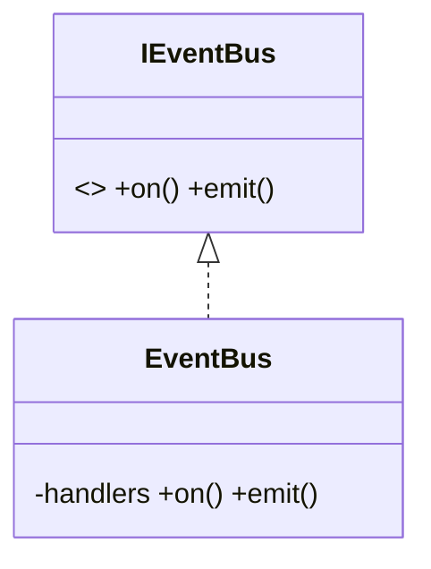
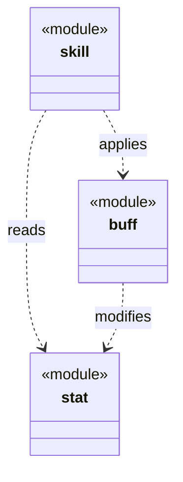
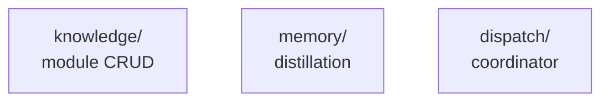
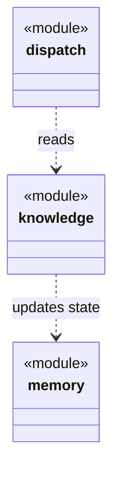
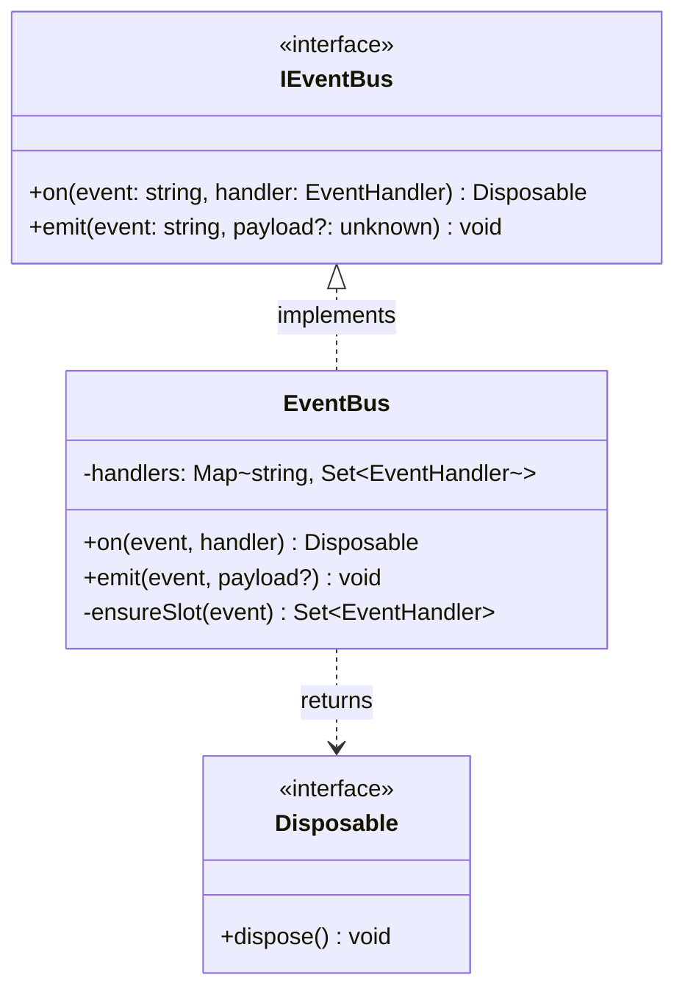
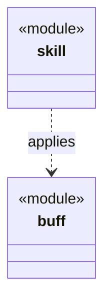

# DNA 设计指南：哲学 · `module.md` 规范 · 示例

> **核心哲学**：用类图递推、单向依赖、分层治理，将复杂混乱的系统建模规范规则化，确保无论多大多复杂的项目都能保持秩序。

本文档是 CBIM DNA 系统的唯一权威文档，分三卷：

- **卷一 · 哲学根基** —— 为什么用类图、为什么单向依赖、实现与治理如何保证项目"可理解 / 可维护 / 可扩展 / 可持续"。
- **卷二 · `module.md` 编写规范** —— 写 `module.md` 的精确规则、字段、反模式、检查清单（架构师与审计的规范源）。
- **卷三 · 示例** —— 叶子与父模块的完整范例。
- **附录** —— 一个真实项目（游戏 10→50 人）的闭环演化案例。

---

# 卷一 · 哲学根基

## 一、为什么是类图、递推、单向依赖

### 1.1 类图：通用的抽象语言

类图不是代码的镜像，而是**实体与关系**这个最基础抽象的表达方式。

| 领域 | 节点（实体） | 边（关系） | 表达方式 |
|------|-----------|---------|---------|
| **代码** | 类、接口 | 继承、组合、依赖 | classDiagram |
| **美术** | 模型、纹理、动画 | 依赖、组合 | 同上 |
| **策划** | 配置表、数据结构、FSM | 依赖、嵌套 | 同上 |
| **架构** | 模块 | 协作、依赖 | 同上（`<<module>>` 刻板印象） |

单一表达消除认知切换成本；跨领域的人用同一种"视觉语言"理解系统；图论的数学性保证可追溯。

### 1.2 递推分层：同构的多层结构

每一层都用**相同的语言**描述，只是**粒度不同**：代码层（类与类）、模块层（模块与模块，带 `<<module>>`）、系统层（系统与系统）。

- 上一层的一个节点，展开就是下一层的完整类图。
- 下一层的所有类，聚合就是上一层的一个节点。
- 可以递推向下拆解，也可以向上聚合理解。

### 1.3 单向依赖：消除混乱的约束

强制 DAG（有向无环图）：禁止 `A ↔ B` 的循环，要求 `A → B → D` 这样自然的拓扑分层。好处：任何修改的影响范围有界且可计算；不存在"改一处、意外波及十处"；系统天然可分层。

### 1.4 治理循环：保持同步的守护者

设计与实现不会永远对齐。DNA 通过**周期性验证**维持同步：

```
实现循环：架构师设计 → 程序员编码
  ↓ [工作中不断变化…]
治理循环：架构师复查 → 发现偏差 → 更新 module.md 或改正代码
  ↓ 系统恢复一致 → [循环 N 次…]
```

## 二、实现阶段如何保证四性

实现阶段的目标：**把模糊需求变成清晰代码，并保证代码就是蓝图的体现**。

- **可理解（设计先行，蓝图清晰）**：架构师先写 `module.md`（定位 + 目标态类图 + 关键决策），程序员按图实现。新人沿"定位 → 类图 → 关键决策 → 代码"四层递进；美术 / 策划 / 程序共看一份类图，无需翻译。
- **可维护（边界清晰，改动有界）**：单向依赖 + 模块隔离。改内部实现 → 影响范围 0（API 不变）；改接口 → 影响范围 = 依赖者集合（可计算）；改依赖关系 → 只影响该模块。改动成本可预测，技术债可控。
- **可扩展（增量设计，隔离扩展）**：新需求优先**新建模块**插入依赖链合适位置，而非改已稳定的旧模块。横切能力（缓存、日志、限流、事件总线）独立成模块，按依赖链组合。系统靠"加模块"增长，不靠"改旧模块"。
- **可持续（决策只存最终态，技术债有据）**：见卷二第五部分「关键决策天然有界」—— 关键决策与当下结构性选择一一对应、有界、替换而非追加；被推翻的旧决策连同时空理由沉入会话记忆。记忆只有短/中期且项目本地；跨项目复用的是能力知识（agents）与业务知识（`module.md` / 约定），不是决策。

## 三、治理阶段如何保证四性

实现完成后系统会逐渐漂移；治理阶段**发现并修正漂移**。

- **可理解（知识蒸馏）**：工作细节进会话记忆（短期）→ 架构师定期蒸馏出有价值的部分进中期记忆（决策演变、踩坑记录）。新人除代码外还能读到历代蒸馏经验，少踩重复的坑。
- **可维护（架构合规检查）**：治理循环（Dream Tick 的架构治理步）做五类检查 —— ①单向依赖验证（查循环依赖）②隐藏耦合检测（代码 import 对比 `module.md` 声明）③接口一致性 ④孤立模块检测 ⑤关键路径分析。无声漂移被自动发现，债务被系统地显现与偿还。
- **可扩展（增长模式识别 + 预防性重构）**：定期分析"哪些模块依赖者在增加 / 频繁变化 / 依赖链在变长"，在系统还没崩之前主动、有计划地拆分与解耦，而不是被迫应急。
- **可持续（治理自动化 + 记忆保护）**：Dream Tick 周期自动跑；记忆分短期（工作流水，几天过期）/ 中期（蒸馏精华，会过期）；`module.md` 只存当前最终态，历史沉在记忆。人员流动时知识不流失，运维成本恒定。

## 四、实现与治理的交互

```
实现（↓）：设计 → 编码 → 集成测试
治理（↑）：自动化检查 → 报告 → 架构师复查
反馈：错误项立即修复 / 风险项计入规划 / 模式项指导下一轮设计
→ 下一轮实现：新需求 + 治理建议 → 新的 module.md
```

要点：实现 = 设计 + 编码 + 测试 + 集成（每环节都参考 `module.md`）；治理 = 检查 + 蒸馏 + 反馈（帮助改进，不是找毛病）；单向依赖是实现期的硬约束、治理期的自动检查项。

## 五、可测性与落地

**指标**：①架构合规率（依赖遵守 `module.md` 声明的比例，目标 > 95%）②知识留存（新人看 `module.md` 15 分钟内理解核心设计）③改动成本稳定性（内部改动影响 0 依赖者；接口改动影响数 = 依赖者数）④技术债知名度（所有黄/红项都有记录）⑤架构演进稳定性（新模块极少破坏既有依赖；大重构前有预警）。

**落地步骤**：建立基础（给现有模块补 `module.md` + 建 `.cbim/index.md` 注册表）→ 自动化检查接入治理循环 → 中期记忆蒸馏流程 → 代码审查强制核对 `module.md` → 收集指标、季度复盘。

---

# 卷二 · `module.md` 编写规范

## 概述

`module.md` 是一个模块的架构文档 — 模块向项目其他部分描述自己的唯一场所。每个 `.dna/module.md` 是一个模块的自包含知识单元，以单个文件的形式组合元数据（YAML 前言）和架构（markdown 正文）。

这份文档必须反映当前现实：代码如同今天的样子。它不是变更日志或历史记录 — 当架构变化时，文档会被更新以反映新设计，git 历史记录捕捉被替换的内容。

---

## 第一部分：三种模块类型与模板

### 三种模块类型

每个模块恰好是以下三种类型之一，在初始化时确定，并反映在正文结构中。

| 类型 | 何时使用 | 属性 | Mermaid 语法 |
|------|--------|------|---------|
| **叶子模块** | 独立、无子模块的自包含单元 | 叶子 — 无子模块 | `classDiagram`（代码级别的真实类/接口） |
| **父模块** | 包含其他模块、各自拥有 `.dna/` 的模块 | 父模块 — 有子模块 | `classDiagram`（子模块表示为高级类） |
| **根模块** | 仅项目根目录；采用父模块模板。仅允许在项目根目录。| 父模块（同 parent 类型） | `classDiagram`（同 parent 类型） |

### 类图是通用的 — 仅粒度不同

所有三种模块类型都使用 `classDiagram`。区别在于**每个类节点代表什么**：

| 模块类型 | 类节点代表 | 示例节点 |
|---------|----------|--------|
| 叶子 | 真实的代码级类或接口 | `class EventBus { -handlers +on() +emit() }` |
| 父模块 / 根 | 子模块（使用 `<<module>>` 刻板印象） | `class skill { <<module>> }` |

**叶子示例（代码级类）：**



**父模块示例（子模块级类）：**



相同的语法。相同的箭头。不同的放大级别。

### 叶子模块模板

叶子模块描述单一职责：它在父模块轴上的定位、组成它的类和接口，以及解释"为什么"的关键设计选择 — 这些内容从代码本身看不出来。

初始的正文模板：

```markdown
## 定位

<!-- 一句话到三句话（最多）— 这个模块的抽象定位：它是什么，为什么存在。保持简洁。 -->

## 类图

```mermaid
classDiagram
    %% 类、接口、关键方法签名、关系
```

## 关键决策

<!-- 设计选择，其"为什么"从代码中看不出来。
     每项决策都适用于整个模块。 -->
```

**Mermaid 语法要求**：必须使用 `classDiagram`。如果你的"类"实际上是目录名或子系统标签，那你不在叶子模块中 — 先将每个目录提升为真正的子模块。

### 父模块模板

父模块描述子模块间的关系：它们如何定位、哪些依赖哪些，以及在它们边界处产生的涌现洞察。

初始的正文模板：

```markdown
## 定位

<!-- 一句话到三句话（最多）— 这个模块的抽象定位：它是什么，为什么存在。保持简洁。 -->

## 类图

```mermaid
classDiagram
    %% 每个类 = 一个子模块（按子模块目录命名）。
    %% 刻板印象 <<module>> 将这些与代码级类区分开。
    %% 箭头 (...>) = 子模块间依赖。
```

## 关键决策

<!-- 仅跨子模块的涌现洞察：
     为什么这些子模块存在在一起，它们在边界处如何相关。
     不要在这里写任何单个子模块的内部设计 —
     那属于该子模块自己的 .dna/module.md。 -->
```

**关键约束**：父模块仅在边界处、作为一个整体来谈论它的子模块。永远不要钻进单个子模块的内部设计 — 那属于那个子模块自己的 `.dna/module.md`。

**Mermaid 语法要求**：必须使用 `classDiagram`。每个类节点代表一个子模块（使用 `<<module>>` 刻板印象）。使用 `..>` 关联箭头表示依赖。图表语法与叶子模块相同 — 仅粒度不同（子模块而非代码级类）。

### 模块类型决策矩阵

在决定模块是叶子还是父模块时：

| 信号 | 类型 |
|-----|------|
| 没有具有不同职责的子目录；完全自包含 | **叶子** |
| 包含各自拥有独立职责的子目录 | **父模块** — 这些子目录必须先成为 CBIM 模块、各自拥有 `.dna/`（深度优先）；之后才写这个父模块 |

**深度优先规则**：如果你在设计一个组件图，其中每个方框代表内部的子组件，请先把每个方框提升为真正的 CBIM 模块，拥有自己的 `.dna/` 目录。只有在子模块存在之后，才写这个父模块的 `.dna/module.md`。

---

## 第二部分：前言架构

### 字段清单

每个 `module.md` 以 YAML 前言开始。这些字段是**必需的**：

| 字段 | 类型 | 描述 | 示例 |
|------|------|------|------|
| `name` | string | 中划线分隔的模块标识符 | `event-bus` |
| `owner` | string | 负责的代理 id（通常是 `architect`） | `architect` |
| `status` | enum | 声明的实现状态：`spec`、`planned` 或 `implemented` | `implemented` |

这些字段是**可选的**：

| 字段 | 类型 | 描述 | 示例 |
|------|------|------|------|
| `description` | string | 一句话目的 | `解耦的、类型安全的事件分发` |
| `keywords` | list | 搜索标签 | `[event, pub-sub]` |
| `dependencies` | list | 本模块依赖的模块路径（拓扑语义见下方约束规则；从父模块 `## 类图` 的 `..>` 边机器派生） | `["src/types", "packages/core/event-bus"]` |
| `includeDirs` | list | 要包含在模块边界内的子目录 | `["src", "tests"]` |

### Status 字段：三种生命周期状态

`status` 字段记录模块的**声明实现状态** — 由架构师设置以表达意图。

| 状态 | 含义 | 何时使用 |
|------|------|---------|
| `spec` | 已设计，但尚未实现；`.dna/module.md` 是规范 | 架构师提前写好 DNA；工作代理按照规范构建 |
| `planned` | 仅命名；设计尚待定 | 罕见；标记一个已命名但设计尚未进行的模块 |
| `implemented` | 代码与 DNA 匹配；两者同步 | 稳定状态；大多数模块在这里 |

**重要**：`status` 是**独立于观察到的状态**（DNA 是否与代码匹配）。架构师可以在一个代码尚未编写的模块上声明 `status: spec`；之后，工作代理实现后，通过 `cbim dna edit <module> --target frontmatter --field status --value implemented` 将其翻转为 `status: implemented`。

### 约束规则

- `name`：仅中划线分隔（小写字母、数字、中划线）。示例：`event-bus`、`combat-skill`、`memory-distill`。
- `owner`：通常是负责代理的 id。标准值是 `architect`，但可以是任何代理 id。
- `description`：如果存在，必须是单个句子。
- `dependencies`：模块路径列表（相对路径如 `"src/types"`、`"packages/core/event-bus"`）。依赖图必须是无环的（DAG）；循环由审计检查 `dna_tree` 检测和报告为错误。

  **拓扑语义**：依赖的合法目标按模块树的位置关系判定 ——

  - **允许列入**：① 同层兄弟模块（与本模块共享父目录的模块）；② 叔伯及其整棵子树（祖先节点的兄弟，以及那些兄弟下的全部后代）；③ 不在本模块祖先链上的任意外部模块。
  - **禁止列入**：① 本模块的任一祖先（含项目根 `"."`）—— 子模块对父模块、孙模块对祖父模块的可见性都是隐式的，无需也不得声明；② 本模块自身子树下的任一后代 —— 后代对自己也是隐式可见，不应反向声明；③ 任何会与既有依赖形成环的目标。
  - **直观判别法**：把本模块的路径与候选依赖的路径并排写出，去掉两者的公共前缀；只有当两侧剩余部分都非空、且各自的第一段不同（即"自己这一侧立刻分叉"）时，候选才合法。若本侧剩余为空，候选是后代；若候选侧剩余为空，候选是祖先；任一种都不合法。
  - **举例**（设本模块路径为 `A/B/C`）：合法依赖包括 `A/B/D`（同层兄弟）、`A/D`（叔伯）、`A/D/E`（叔伯子树后代）、`X/Y`（外部模块）；不得列入 `A`、`A/B`、`.`（祖先链）以及 `A/B/C/F`（自身后代）。
  - **强制方**：祖先违规由 `dna_tree` 报 `TREE_DEP_ANCESTOR_DECLARED`；指向树上层但非祖先的不稳定侧由 `TREE_DEP_UP_TREE` 报告；引用不存在的路径由 `TREE_DEP_DANGLING` 报告；循环由 `TREE_CYCLE` 报告为 error。

  **声明源 vs. 派生缓存**：依赖关系的**唯一声明源**是父模块 `## 类图` 中的 `..>` 边；frontmatter 的 `dependencies` 字段是从类图边机器派生的缓存，便于审计与索引快速读取。两边不一致时，由 `dna_tree` 的 `TREE_DEP_DIAGRAM_MISMATCH` 报错（审计码 T4 实装；本规范先行声明）。写入纪律：架构师必须先改 `## 类图` 的 `..>` 边，再让工具重生成 frontmatter 的 `dependencies`；不得手工编辑 frontmatter 字段而不同步类图。
- `includeDirs`：很少需要；仅当模块的代码跨越多个不是直接子目录的目录时使用。示例：`src/combat` 中的模块，也在 `src/types/combat-types` 中拥有代码。如果模块自包含在一个目录中，则省略。

---

## 第三部分：关键决策组织

### 核心规则：什么是关键决策？

**关键决策**是一个设计选择，其"为什么"从阅读代码中看不出来。它解释代码结构本身无法沟通的架构意图。

关键决策**关于整个模块**，而非子组件的内部实现细节。

### 格式：列表或表格，不是段落

关键决策必须是**项目列表或紧凑表格** — 不得是散文段落。每个项目：

- 一个简短标题（粗体），然后一到两句话解释**是什么**和**为什么**。
- 如果"为什么"需要超过两句话，决策要么太粗糙（拆分它），要么包含实现细节（移到代码）。
- 为"如何"指向代码：`见 src/event-bus/bus.ts`。

**列表形式（默认）：**

```markdown
- **接口优先**：消费方依赖 `IEventBus`，从不依赖 `EventBus`。无需模拟框架就能换用测试替身。见 `src/event-bus/types.ts`。
- **Disposable 返回值**：`on()` 返回 `Disposable`。防止忘记取消订阅的内存泄漏。
```

**表格形式（当决策是平行/可比的时）：**

| 决策 | 是什么 | 为什么 |
|-----|------|------|
| 接口优先 | 消费方仅看 `IEventBus` | 无需模拟框架的测试替身 |
| Disposable 返回值 | `on()` 返回 `Disposable` | 无忘记 `off()` 的泄漏 |

如果你发现自己在写段落，停下。要么是列表项长得太长（修剪并指向代码），要么不是关键决策（删除或移到设计笔记）。

### 示例：叶子模块决策

**叶子模块中的好决策：**

- **接口优先**：消费方依赖 `IEventBus`，永不直接依赖 `EventBus`，无需 mock 框架就能换用测试替身。
- **Disposable 返回值**：`on()` 返回 `Disposable` 而非要求调用 `off()`，防止忘记取消订阅导致的内存泄漏。
- **同步 emit**：Handler 设计为同步执行；异步副作用由 handler 自行管理，保持 bus 简单可预测。

这些解释了架构边界、设计模式和"为什么我们选择这种形状" — 都从代码中看不出来。

**叶子模块中的坏决策：**

- ❌ "我们使用 HashMap 存储订阅者"（实现细节，代码中可见）
- ❌ "映射键是字符串形式的事件名"（实现细节，代码中可见）
- ❌ "dispose 方法调用取消订阅函数"（代码是自解释的）

### 示例：父模块决策

**父模块中的好决策（跨子模块的涌现洞察）：**

- **skill 依赖 buff，反向禁止**：技能可以施加 buff，但 buff 不得触发技能 — 防止递归战斗循环。
- **属性变更仅向下传播**：当基础属性变化时，衍生属性重新计算；变更永不向上冒泡 — 维护清晰的层级。

这些解释了为什么子模块以这种方式组织，以及在它们边界处的约定。

**父模块中的坏决策（征兆：钻入子模块内部）：**

- ❌ "skill 使用冷却队列来管理技能重置"（skill 模块内部；属于 `skill/.dna/module.md`）
- ❌ "buff 状态存储为圆形缓冲以提高内存效率"（buff 模块内部；属于 `buff/.dna/module.md`）
- ❌ "skill 模块缓存编译的技能树"（skill 的实现细节；属于 `skill/.dna/module.md`）

### 决策征兆检测

如果一个要点仅描述一个子模块的内部设计，它**不是**跨子模块洞察。将其移到那个子模块自己的 `.dna/module.md`。

**征兆标记**（如果你发现自己在写这些，停下并移动到子模块）：

- 以子模块名称开头，后跟该子模块自己的"使用"、"存储"、"缓存"、"编译"、"计算"
- 解释只有在阅读那个子模块详细实现时才可见的设计选择
- 不阅读那个子模块的详细实现就无法理解

---

## 第四部分：架构决策 vs. 实现决策

### 什么属于 `module.md`

在 `module.md` 中写下定义模块**形状和边界**的架构选择：

- **模块职责**：这个模块做什么，一句话（定位部分）
- **公开接口**：它公开什么契约（类图或子模块关系）
- **边界约束**：模块间禁止什么（关键决策部分）
- **涌现特性**：整体架构产生什么设计洞察（关键决策部分）
- **权衡**：为什么我们选择这个边界而不是另一个（关键决策部分）

### 仅属于代码或提交消息的内容

**实现决策** — 本地优化、算法选择、数据结构内部、调用顺序 — 留在代码和提交消息中：

- 私有函数的算法选择（"为什么我们在这里使用快速排序而非合并排序"）
- 内存优化（"我们池化分配以减少 GC 压力"）
- 临时变通方案（"这是个临时方案，直到我们升级依赖"）
- 性能调优（"我们批量请求以降低延迟"）
- 调用顺序细节（"必须在启动工作线程之前初始化缓存"）

这些在代码中可见；它们属于注释和提交消息，不属于 `module.md`。

### 决策边界规则

| 问题 | 答案 | 属于 |
|-----|------|-----|
| 有人需要读这个来理解模块的公开形状吗？ | 是 | `module.md` |
| 这是关于子模块与其兄弟模块的关系吗？ | 是 | 父模块的 `module.md` |
| 这是关于一个模块的内部、不影响其他模块的内容吗？ | 否 | 代码注释 / 提交消息 |
| 改变这个细节会影响其他模块的设计吗？ | 是 → `module.md` | 否 → 代码注释 |
| 这是架构选项间的权衡吗？ | 是 | `module.md` |
| 这是所选架构的实现细节吗？ | 是 | 代码注释 |

### 信号 vs. 噪声

`module.md` 是**高密度**的：仅架构，无填充物，无重复解释。

每个关键决策是**单一强有力的陈述**，不是叙述。避免：

- 重复陈述（"我们选择这个是因为... 这就是为什么... 原因是..."）
- 上下文转储（"回到我们使用旧系统的时候..."）
- 模棱两可的语言（"我们可能..."、"我们可以考虑..."、"将来我们可能想..."）
- 变更历史（"我们曾经做 X，后来改为 Y"） — git log 显示这些

---

## 第五部分：版本演进原则

### 替换，不追加

当架构改变时，**用新决策替换旧决策**。`module.md` 描述**当前最终状态**，不是所有过去状态的日志。

**坏的（历史日志）：**

```markdown
## 关键决策

- **原始方法**：我们最初使用三层缓存层级...
- **版本 2（已弃用）**：后来我们简化为两层系统...
- **当前（v3）**：今天我们使用单层 LRU 缓存，因为...
```

**好的（仅当前状态）：**

```markdown
## 关键决策

- **单层 LRU 缓存**：简化失效；对我们的热集大小（< 10K 项）内存高效。
```

被替换的设计？它在 git 历史中。运行 `git log -p src/cache/.dna/module.md` 查看变更内容。

### 当决策被反转时

如果一个设计决策被反转（你回到早期方法，或选择一个完全不同的方法）：

1. 更新决策以陈述**新的最终状态**
2. 如果中间方法失败的原因在架构上相关，就引用它；否则省略
3. 用解释反转的消息进行提交

**示例反转：**

```markdown
## 关键决策

- **启动时急切加载插件**：所有插件在启动时加载以解析依赖 DAG 一次。（早期按模块延迟加载的方法已回滚 — 见 `git log -p plugins/.dna/module.md`。）
```

完整故事（"我们尝试方法 A，失败了，所以做 B，也失败了，现在做 C"）在 `git log` 中，不在 `module.md` 中。

### 原则：模块作为"当前状态"

`module.md` 是**规范性的**：它描述模块**现在是什么**，不是过去是什么或可能是什么。这确保：

- **单一信息源**："这个模块是什么？"的单一权威答案，无需阅读 git 历史
- **与代码同步**：当代码改变时，文档更新以匹配；两者保持对齐
- **可审计性**：审计检查 `.dna/` 是否与当前代码匹配（状态 1/2/3）；历史无关
- **清晰**：阅读 `module.md` 的人得到当前现实，不是令人困惑的编年史

### 关键决策天然有界，不会撑大 `module.md`

关键决策与模块**当下的结构性选择一一对应**（接口边界、同步/异步、依赖方向、关键数据结构）。一个模块的核心取舍就那么几个，所以决策条数小、且**不随项目年龄增长** —— 只要坚持"替换不追加"，`module.md` 不会膨胀。

膨胀的根因从来不是"决策写在 `module.md`"，而是**过期决策在里面堆积**，那本质是往设计文档塞历史。正确动作是替换：决策被推翻时，删掉旧条目、新决策顶上；旧决策连同它的时空理由（"2024 年因为团队小才选 X"）落进会话记忆，绝不在 `module.md` 累积。

**为什么决策必须住 `module.md`，而不是记忆**：它是同一份知识的另一半 —— 类图说"当下是什么形状"（WHAT），决策说"为何是这形状"（WHY）。拆开，读者只看到结构却不知道背后的约束，容易好心改坏。

| | 内容 | 性质 | 去处 |
|---|------|------|------|
| **最终决策** | 当下为何是这样（剥掉时间） | 知识 | `module.md` 关键决策 |
| **决策演变** | 曾经是 X、改成 Y、因为当时… | 记忆 | 会话记忆（短/中期，项目本地，会过期） |

记忆只有**短期 + 中期**，且项目本地；能跨项目复用、全网络共享、可合并的是**能力知识**（agents）与**业务知识**（`module.md` / 约定本身）—— 决策本身始终是本地、临时的，不会"升级"成跨项目资产。

---

## 第六部分：`module.md` vs. `contract.md` 职责边界

### 何时需要各个文件

| 方面 | 属于 `module.md` | 属于 `contract.md` | 都不 |
|-----|-----|-----|-----|
| 内部类设计、关系 | ✅ | ❌ | |
| 子模块组合（父模块） | ✅ | ❌ | |
| 跨语言 / 跨进程接口 | ❌ | ✅（如果存在协议边界） | |
| REST / gRPC / 公开 SDK 端点 | ❌ | ✅（如适用） | |
| 内部函数签名 | ✅（如在架构上重要） | ❌ | |
| 线路协议格式 | ❌ | ✅ | |
| 消费者面向的服务契约 | ❌ | ✅ | |
| 特定于实现的优化 | ❌ | ❌ | ✅ 代码注释 |

### `module.md` 是默认

大多数模块**不需要 `contract.md`**。在强类型语言（TypeScript、Python、Go、Rust、C#）中，源代码本身就是接口契约 — 类型签名、方法可见性和结构体字段是机器可读的并在编译时强制。

**仅在以下情况使用 `contract.md`**：

- **语言边界**：你的模块导出接口到其他语言（如 Rust 模块的 Python 绑定；C# 代码调用 REST API）
- **进程边界**：模块是具有协议的网络服务（REST、gRPC、GraphQL、JSON-RPC）
- **公开 SDK**：模块交付给无法阅读或依赖源代码的外部消费方
- **多版本共存**：你必须为不同消费方版本记录向后兼容性或弃用规则

### 示例：何时跳过 `contract.md`

- 单体仓库中的 TypeScript 模块：❌ 消费方可以直接阅读 `module.md` 和源 `.ts` 文件
- 同一项目中的 Go 包：❌ 源接口就是契约；如需要可在 `module.md` 类图中嵌入关键签名
- 内部 Python 工具函数：❌ docstring 和类型提示就是契约
- 测试完善的 REST API：✅ **创建** `contract.md` 以记录端点模式、错误代码、版本管理

### `contract.md` 结构（需要时）

如果创建 `contract.md`，保持**高密度**，如 `module.md`：

```markdown
---
name: <module-name> — 契约
owner: architect
---

## 接口

### 公开端点 / 方法签名

（如 REST 路由、gRPC 服务方法、导出类）

## 事件

### 发出的信号

（如适用；如 Kafka 主题、webhook 事件）

## 错误

### 错误代码和含义

（如适用；映射错误代码 → 描述）

## 版本管理

（如适用；弃用规则、兼容性保证）
```

---

## 第七部分：编写检查清单

在将 `module.md` 标记为完成之前，验证：

### 结构检查清单

- [ ] **前言**：name（中划线）、owner（代理 id）、status（spec/planned/implemented）、description（一句话，如果存在）
- [ ] **定位部分**：一到两句话（最多三句）；抽象且简洁，而非内部描述
- [ ] **图表部分**（叶子）：使用 `classDiagram`；显示类、接口、关键签名、关系
- [ ] **图表部分**（父模块）：使用 `classDiagram`；每个节点是子模块、带 `<<module>>` 刻板印象；边使用 `..>` 显示依赖
- [ ] **关键决策部分**：每个决策是项目或表格（不是段落）；每项有粗体标题和一到两句解释

### 内容检查清单

- [ ] **父模块中无子模块内部**：父模块的关键决策仅讨论跨子模块洞察，从不讨论单个子模块内部
- [ ] **无实现噪声**：避免算法细节、数据结构内部、调用顺序、内存优化
- [ ] **无变更历史**：仅当前状态；git log 显示演进
- [ ] **无模棱两可语言**："可能"、"可以"、"将来"、"我们在考虑"
- [ ] **无重复陈述**：每个要点是单一强有力的陈述

### 特定类型检查清单

**对于叶子模块：**
- [ ] 类图使用 `classDiagram` 语法，不是组件的有向图
- [ ] 图表包括关键接口、主要类、重要关系
- [ ] 如果想画子组件节点，先拆分成真正的子模块

**对于父模块：**
- [ ] 类图使用带 `<<module>>` 刻板印象的 `classDiagram` 语法，每个子模块一个
- [ ] 每个节点以子模块目录命名，有一句话定位注释
- [ ] 边使用 `..>` 显示子模块间的依赖
- [ ] 关键决策解释为什么子模块分组在一起及它们在边界处如何相关

### 质量检查清单

- [ ] **当前现实检查**：这与代码今天的样子是否匹配？（不是应该怎样，而是实际怎样。）
- [ ] **受众检查**：新团队成员能仅从 `module.md` 理解这个模块的角色吗？
- [ ] **审计检查**：运行 `cbim audit`，确认无关键决策反模式（dna_tree、dna_fission 检查通过）

---

## 第八部分：常见陷阱和反模式

### 反模式：父模块写子模块内部

**征兆**：父模块的关键决策部分包含关于一个子模块内部设计的要点。

**示例（错误）：**

```markdown
## 关键决策（在父模块 combat 中）

- skill 缓存编译的技能树以快速执行
- buff 状态使用圆形缓冲以提高内存效率
```

**修正**：将每个要点移到其子模块：

```markdown
# 在 combat/skill/.dna/module.md

## 关键决策
- **编译技能缓存**：技能在加载时编译一次，不在每次施放时编译。

---

# 在 combat/buff/.dna/module.md

## 关键决策
- **圆形缓冲状态**：Buff 状态存储在环形缓冲中以分摊分配。
```

### 反模式：使用 `graph TD` 而非 `classDiagram`

**征兆**：模块的类图部分包含 `graph TD`（有向图）而不是 `classDiagram`。

**为什么这是错误的**：所有模块都使用 `classDiagram`。如果你使用 `graph TD`，图表节点很可能是目录名或子系统标签，而非代码级类 — 这意味着你要么在应该使用带 `<<module>>` 刻板印象的 `classDiagram` 的父模块中，要么在尚未拆分成真正子模块的叶子模块中。

**示例（错误）— 在叶子模块或被误识别的父模块中：**

```markdown
## 类图


**修正（如果这是父模块）**：使用带 `<<module>>` 刻板印象的 `classDiagram`：

```markdown
## 类图


**修正（如果这是叶子模块）**：先拆分组件成真正的子模块。然后叶子的图表将显示代码级类，而非目录名。

### 反模式：实现征兆

**征兆**：关键决策描述某物如何实现，而非架构为什么以这种方式塑造。

**示例（错误）：**

- "我们使用 HashMap 存储处理器"（代码中可见；不是架构）
- "循环以插入顺序遍历订阅者"（实现细节）
- "我们池化内存分配以减少 GC 压力"（优化，不是架构）

**修正**：问"有人需要理解这个才能使用模块的公开接口吗？"如果否，它属于代码注释。

### 反模式：模棱两可或模糊语言

**征兆**：关键决策使用"可能"、"可以"、"我们在考虑"、"将来可能更新"。

**示例（错误）：**

```markdown
## 关键决策

- 我们将来可能添加异步支持
- 可能进一步优化
- 将来，我们会考虑缓存
```

**修正**：描述当前决策时干脆决绝。如果不确定，决策还没做 — 不要写。

```markdown
## 关键决策

- **仅同步 emit**：Handler 同步调用；异步工作是 handler 的职责。
```

### 反模式：历史作为内容

**征兆**：module.md 读起来像变更日志，记录演进而非当前状态。

**示例（错误）：**

```markdown
## 关键决策

- **v1**：我们最初使用三层缓存...
- **v2**：我们简化为两层...
- **v3（当前）**：现在我们使用单层 LRU，因为...
```

**修正**：仅记录当前方法。

```markdown
## 关键决策

- **单层 LRU 缓存**：简化失效，对我们的 10K 项热集表现良好。
```

---

## 第九部分：模块变更工作流与硬规则

### 三种变更场景

**1. 新建模块**

```
架构师写 module.md（前言 + 目标态类图）
  → 程序员按图实现
  → （可选）架构师对照蓝图复查实现
```

类图代表**目标状态** —— 模块实现完成后应有的样子。

**2. 增量改动（行为微调，无结构变化）**

```
程序员直接改代码
  → module.md 不更新（类图与结构不变）
  → 变更细节进会话记忆
```

若改动不触及类/接口边界、方法签名或类图中的关系，程序员无需惊动架构师，`module.md` 保持原样。

**3. 结构重构（接口/结构变化）**

```
架构师更新 module.md（新类图 + 新关键决策）
  → 程序员按新 module.md 实现
  → （大型多步迁移）架构师可临时建 contract.md 作迁移蓝图，迁移完成后删除
```

任何改动类图的变更（新增类、改接口、重组关系）都要架构师先更新 `module.md`。大规模重构需要协调多步迁移时，`contract.md` 可作**临时迁移蓝图**，迁移完成后必须移除。

### 业务硬规则

1. **无历史** —— `module.md` 与 `contract.md` 只描述当前最终状态，绝不写改了什么、为什么改。变更进会话记忆（`.cbim/memory/`），架构师定期蒸馏并提升。关键决策同理：只留当前理由，替换而非追加，被推翻的旧决策连同时空理由沉入会话记忆。
2. **父模块只写关系与定位** —— 父模块正文只描述子模块间关系（依赖/组合/聚合）与各子模块定位，绝不写任何子模块的内部细节；那是各子模块自己 `module.md` 的职责。
3. **能力与业务分离** —— 知识包只含项目/模块知识，不得引用 agent 能力规格。
4. **图语法统一** —— 三种模块类型（叶子/父/根）一律用 `classDiagram`，不用 `graph TD` / `flowchart`。叶子展示代码级类/接口，父/根用 `<<module>>` 刻板印象展示子模块。

### 向后兼容：旧格式

引擎支持双格式加载：

- **新格式（首选）**：`.dna/module.md`（YAML 前言 + markdown 正文）
- **旧格式（已废弃）**：`.dna/module.json` + `.dna/architecture.md`

仅存在旧格式时，引擎加载并给出废弃警告。用户项目中的既有旧文件**不会被删除** —— 迁移时机由用户决定。

---

## 附录：文件位置和注册表

### 文件结构

```
<module-directory>/
  .dna/
    module.md          # 必需：元数据 + 架构
    contract.md        # 可选：跨语言/进程边界
    workflows/         # 可选：确定性流程工作流
      <name>/
        workflow.md
```

### 注册表自动更新

当你通过 `cbim dna init <dir> ...` 创建模块时，注册表 `.cbim/index.md` 自动更新。无需手动步骤。

如果模块在 CLI 之外添加（如手工创建），运行：

```bash
cbim dna reindex
```

这会重新扫描文件系统并重建 `.cbim/index.md`。

---

## 参考文献

- **架构师技能** — `v1/kernel/cbi/agents/architect/skills/arch_modules/skill.py` — 规则和 CRUD 操作
- **模块模式** — `v1/kernel/cbi/_primitives/modules.py` — 前言字段、模板、验证
- **审计检查** — `v1/kernel/engine/audit/checks/dna_tree.py`、`dna_fission.py` — 依赖规则和超大检测
- **示例模块** — 见本文档「卷三 · 示例」

---

# 卷三 · 示例

`module.md` 是 `.dna/` 中唯一的必需文件。它将元数据（YAML frontmatter）与架构（markdown 正文）合并在一个文件中 —— 与 `.claude/agents/<name>.md` 和 `.cbim/cbi/skills/<name>/skill.py` 形成统一的 `frontmatter + 正文` 模式。

## 叶子模块示例

````markdown
---
name: event-bus
owner: architect
description: 解耦的、类型安全的进程内事件分发
keywords: [event, pub-sub, decoupling]
dependencies: []
---

## 定位

解耦的、类型安全的进程内事件分发，用于跨模块通信。

## 类图



## 关键决策

- **接口优先**：消费方依赖 `IEventBus`，不直接依赖 `EventBus`，无需 mock 框架即可替换测试替身。
- **Disposable 返回值**：`on()` 返回 `Disposable` 而非要求调用 `off()`，防止忘记取消订阅导致的内存泄漏。
- **同步 emit**：Handler 设计为同步执行；异步副作用由 handler 自行管理，保持 bus 简单可预测。
````

## 父模块示例

父模块的正文只描述定位、子模块关系和跨子模块的涌现洞察 —— 不写任何子模块的内部细节。

````markdown
---
name: combat
owner: architect
description: 战斗系统根模块
keywords: [combat, battle]
dependencies:
  - src/types
---

## 定位

所有战斗相关子系统的顶层容器。

## 类图



- **skill** — 主动技能执行（施放、冷却、目标选取）
- **buff** — 被动状态效果（施加、持续、过期）

## 关键决策

- **skill 依赖 buff，反向禁止**：技能可以施加 buff，但 buff 不得触发技能 —— 防止递归战斗循环。
````

---

# 附录 · 闭环演化案例（游戏项目 10 → 50 人）

一个真实的演化轨迹，展示实现与治理两个循环如何让项目在体量翻倍时仍保持秩序。

**第 1 月 · 初始设计**：架构师写出根/父/叶模块的 `module.md`，依赖单向（World → Battle → Player），新人一眼看清、无循环。

**第 1–3 月 · 基础实现**：程序员按图实现，类图与代码一一对应。

**第 4 月 · 首个治理循环**：检查全绿（无循环依赖、依赖链最长 3）；黄色预警 —— Battle 模块类数逼近复杂度上限，建议准备拆分。

**第 5–6 月 · 第一次扩展**：新增 BUFF / 技能树需求。做法是**新建 Skill 模块**插入依赖链（Battle → Skill → Player），而非把逻辑塞进 Battle。旧代码零改动，新功能隔离。

**第 7–9 月 · 人员扩张与知识积累**：团队 10→25 人。会话记忆里积累了"SkillTree 加 lazy-load 提速 60%""发现 World 越权调用 Player 私有方法""Buff 过期检查频率应为 100ms"等细节。

**第 10 月 · 蒸馏与复查**：架构师蒸馏记忆（更新 Skill 关键决策、登记隐藏耦合、把 Buff 频率写进中期记忆）。检查报红：World 越权调用 Player 私有方法（违反单向依赖精神）。修复方案 —— **新增 EventBus 模块**解耦，World 改为通过事件协调，不再直接依赖各模块。问题被自动发现、方案被原则指导、已有代码大部分无需改动。

**第 11–12 月 · 预防性重构**：团队 50 人。架构师据增长指标（Skill 25 类、Battle 依赖者升到 8、World 改动最频繁、最长依赖链 4）预测瓶颈，主动计划：拆 Skill → SkillCore + SkillUI、引入 Cache 减少 Player 访问、拆 World → Core + UI + Event，分三季度实施。重构是主动、有计划的，不是被迫应急。

**第 13–18 月 · 稳定增长**：形成清晰的三层架构 —— Core（Player / SkillCore / BattleCore）/ Feature（各 UI 与新需求）/ Service（EventBus / Cache / Network）/ 顶层 World 协调。新需求往 Feature 加模块，Core 与 Service 改动最少；依赖稳定单向；所有决策都在各自 `module.md`，新架构师秒懂。

**结果**：团队翻 5 倍、模块从 10 增到上百，管理复杂度没有成倍增长 —— 不是靠某个人的聪慧，而是靠"类图 + 单向依赖 + 分层治理"这套体系的力量。
