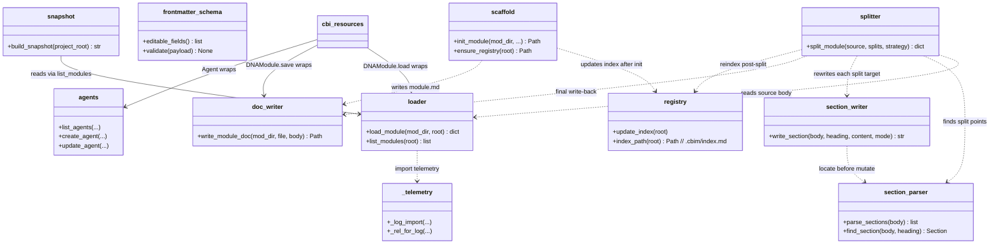

## Positioning

CBI internal primitives: dna (module CRUD, index, write-doc, reindex), agents (agent file CRUD), snapshot (project knowledge snapshot for LLM context). The single low-level write surface for `.dna/` and `.claude/agents/`. **Internal — external callers must go through `cbi.resources`.**

## Class Diagram

`modules/` is the single 10-file sub-package owning all `.dna/` CRUD primitives. Each file has one responsibility (loader / scaffold / registry / doc_writer / section_parser / section_writer / frontmatter_schema / splitter / _telemetry / __init__). The 10-way split came from collapsing the legacy `modules.py` (1185 LOC) into single-responsibility files; `_telemetry.py` centralises the `_log_import` / `_rel_for_log` plumbing every other file used to re-import.

`agents.py` and `snapshot.py` remain single-file primitives — neither has hit the splitting threshold, and `cbi.resources.{Agent,Snapshot}` already gives the public object shell.

All `cmd_*` handlers previously hosted here were deleted in P3 Wave 1. The top-level `engine/cli/` (now a package — see `engine/.dna/module.md`) dispatches directly to `cbi.resources.{DNAModule, Agent}`. Frontmatter parsing duplicates inside the legacy `modules.py` / `agents.py` (`_parse_frontmatter` / `_strip_frontmatter` / `_parse_yaml_block`) were removed in the same wave; both now import the single source of truth from `services._fm`.

## Key Decisions

- **`modules.py` (1185 LOC) was split into a 10-file `modules/` sub-package in Batch 3.** One file per concern: `loader.py` (parse + list), `scaffold.py` (init), `registry.py` (`.cbim/index.md` writer), `doc_writer.py` (whole-file write), `section_parser.py` + `section_writer.py` (heading-level edits), `frontmatter_schema.py` (editable-field whitelist + validation), `splitter.py` (atomic multi-file split), `_telemetry.py` (`_log_import` / `_rel_for_log`), `__init__.py` (re-exports). Public import path stays `from cbi._primitives.modules import ...` so neither `services` nor `cbi.resources` needed touching.
- **<300 LOC is the soft per-file target inside `modules/`.** Most files land 25–203 lines. `splitter.py` is the deliberate exception at ~400 LOC: it owns one indivisible transactional flow (parse → plan splits → rewrite N targets → reindex) and any internal cut would either force a public sub-API for a single caller or leak partial-state between sub-helpers. Splitting is the wrong refactor for it; the soft target yields to single-responsibility integrity.
- **`_log_import` is centralised in `_telemetry.py`.** Before the split, every file in the legacy `modules.py` re-imported `engine.import_log.log_import` with its own try/except fallback stub. `_telemetry.py` owns one canonical try/except, exposes `_log_import` and `_rel_for_log`, and every other file in `modules/` imports from it. Removes nine copies of the same boilerplate; gives the audit a single line to ban / mock.
- **Module registry is `.cbim/index.md`, not the project-root `.dna/`.** Decouples the framework-managed fast-path registry from the optional project-root module document. `.cbim/` is the framework (not a business module), so it has no `.dna/` and no `module.md`; the registry sits directly at `.cbim/index.md` with no redundant wrapper layer.
- **`dna init` requires the registry to exist.** It does not auto-bootstrap. Registry creation is the responsibility of `dna reindex` (which creates an empty registry on a clean repo via `_write_index → ensure_registry`) or `cbim init`. *Architect note: this means architects working on a fresh kernel checkout must run `dna reindex` once before any `dna init`.*
- **`dna edit` is the unified write surface; `write-doc` / `write-section` are deprecated aliases.** Since P3, all edits route through `cbim dna edit --target {frontmatter | body | section | contract | contract-section | workflow}`, implemented by `_handle_dna_edit` over `DNAModule` and its sub-objects (`.frontmatter` / `.body` / `.contract` / `.workflows`). Frontmatter is always preserved verbatim; `.save()` is atomic. Direct file edits remain banned by the Kernel-Only Writes rule.
- **Dependency direction is strictly unidirectional.** `engine/cli → cbi/resources → cbi/_primitives → services/_fm`. `cbi/_primitives` must not import `cbi/resources`; the resource layer wraps the primitives, never the other way round.
- **Package name `_primitives` uses the underscore-prefix convention for internal-use packages.** External callers (work agents, hooks, MCP, dashboard) must go through `cbi.resources` for the rich object model, or `services.*` for the read-mostly facade. P3 Wave 2 renamed `cbi/engine` → `cbi/_primitives` to make this boundary explicit.

- **Legacy `module.json` + `architecture.md` 加载分支计划下一个 minor release（1.1.0）移除；Batch 4 仅加 stderr 警告，未删。** 加载分支有两入口：(a) 读路径上 `cbi/_primitives/modules/loader.py::load_module()` 发现某模块仅有 `.dna/module.json` 时调 `_load_legacy_format()`；(b) `cbi/resources/dna_module.py::DNAModule.load()` 读取同一 fallback 路径。两入口都在函数体首行 `print("[DEPRECATED] {mod_path}: legacy module.json + architecture.md format is deprecated and will be removed in the next minor release (1.1.0); migrate to module.md.", file=sys.stderr)`。迁移路径：对受影响模块走 `cbim dna edit --target body` 课写 `module.md`（或手工拼 `module.md` 的 frontmatter + body，DNAModule.save() 有自动在 legacy 路径上 save 时写新格式 旁路径的 fallback）。下一个 minor release 一起删：两个 `_load_legacy_format()` / legacy 分支、`DNAModule._legacy` 字段、`exists()` 中的 `module.json` 检测、对应单测；代码库中现有 `.dna/module.json` 有位置所不允许同时存在同名 `module.md`（新格式上。`load_module()` 以 `module.md` 优先）。

