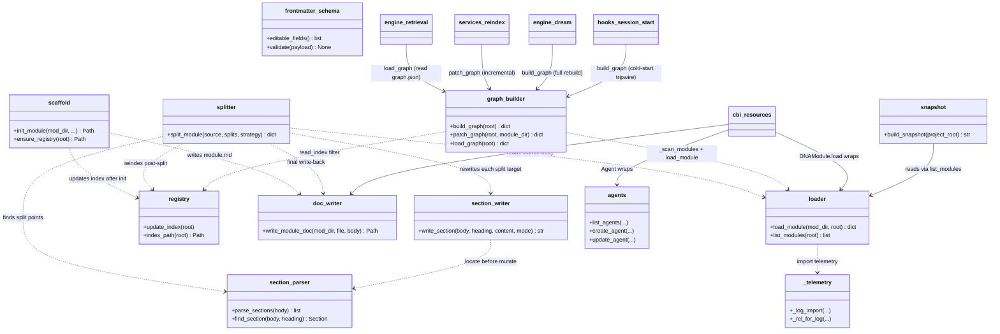

## Positioning

CBI internal primitives: dna (module CRUD, index, write-doc, reindex), agents (agent file CRUD), snapshot (project knowledge snapshot for LLM context). The single low-level write surface for `.dna/` and `.claude/agents/`. **Internal — external callers must go through `cbi.resources`.**

## Class Diagram

`modules/` is the single 11-file sub-package owning all `.dna/` CRUD primitives plus the Phase-3 graph builder. Each file has one responsibility (loader / scaffold / registry / doc_writer / section_parser / section_writer / frontmatter_schema / splitter / _telemetry / `graph_builder` / `__init__`). The 10-way split came from collapsing the legacy `modules.py` (1185 LOC) into single-responsibility files; `_telemetry.py` centralises the `_log_import` / `_rel_for_log` plumbing every other file used to re-import. Phase 3 加进 `graph_builder.py` 是业务知识图谱所需 ——仅复用 `loader._scan_modules` 与 `registry.read_index`，并以同一原子写入语义产出 `<root>/.cbim/index/dna/graph.json`；retrieval / dream / services._reindex / hooks.session_start 都是下游调用方（依赖方向全部外部 → graph_builder）。

`agents.py` and `snapshot.py` remain single-file primitives — neither has hit the splitting threshold, and `cbi.resources.{Agent,Snapshot}` already gives the public object shell.

All `cmd_*` handlers previously hosted here were deleted in P3 Wave 1. The top-level `engine/cli/` (now a package — see `engine/.dna/module.md`) dispatches directly to `cbi.resources.{DNAModule, Agent}`. Frontmatter parsing duplicates inside the legacy `modules.py` / `agents.py` (`_parse_frontmatter` / `_strip_frontmatter` / `_parse_yaml_block`) were removed in the same wave; both now import the single source of truth from `services._fm`.

## Key Decisions

- **`modules.py` (1185 LOC) was split into a 10-file `modules/` sub-package in Batch 3.** One file per concern: `loader.py` (parse + list), `scaffold.py` (init), `registry.py` (`.cbim/index.md` writer), `doc_writer.py` (whole-file write), `section_parser.py` + `section_writer.py` (heading-level edits), `frontmatter_schema.py` (editable-field whitelist + validation), `splitter.py` (atomic multi-file split), `_telemetry.py` (`_log_import` / `_rel_for_log`), `__init__.py` (re-exports). Public import path stays `from cbi._primitives.modules import ...` so neither `services` nor `cbi.resources` needed touching.
- **<300 LOC is the soft per-file target inside `modules/`.** Most files land 25–203 lines. `splitter.py` is the deliberate exception at ~400 LOC: it owns one indivisible transactional flow (parse → plan splits → rewrite N targets → reindex) and any internal cut would either force a public sub-API for a single caller or leak partial-state between sub-helpers. Splitting is the wrong refactor for it; the soft target yields to single-responsibility integrity.
- **`_log_import` is centralised in `_telemetry.py`.** Before the split, every file in the legacy `modules.py` re-imported `engine.import_log.log_import` with its own try/except fallback stub. `_telemetry.py` owns one canonical try/except, exposes `_log_import` and `_rel_for_log`, and every other file in `modules/` imports from it. Removes nine copies of the same boilerplate; gives the audit a single line to ban / mock.
- **Module registry is `.cbim/index.md`, not the project-root `.dna/`.** Decouples the framework-managed fast-path registry from the optional project-root module document. `.cbim/` is the framework (not a business module), so it has no `.dna/` and no `module.md`; the registry sits directly at `.cbim/index.md` with no redundant wrapper layer.
- **`dna init` requires the registry to exist.** It does not auto-bootstrap. Registry creation is the responsibility of `dna reindex` (which creates an empty registry on a clean repo via `_write_index → ensure_registry`) or `cbim init`. *Architect note: this means architects working on a fresh kernel checkout must run `dna reindex` once before any `dna init`.*
- **`dna edit` is the unified write surface; `write-doc` / `write-section` are deprecated aliases.** Since P3, all edits route through `cbim dna edit --target {frontmatter | body | section | contract | contract-section | workflow}`, implemented by `_handle_dna_edit` over `DNAModule` and its sub-objects (`.frontmatter` / `.body` / `.contract` / `.workflows`). Frontmatter is always preserved verbatim; `.save()` is atomic. Direct file edits remain banned by the Kernel-Only Writes rule.
- **Dependency direction is strictly unidirectional.** `engine/cli → cbi/resources → cbi/_primitives → services/_fm`. `cbi/_primitives` must not import `cbi/resources`; the resource layer wraps the primitives, never the other way round.
- **Package name `_primitives` uses the underscore-prefix convention for internal-use packages.** External callers (work agents, hooks, MCP, dashboard) must go through `cbi.resources` for the rich object model, or `services.*` for the read-mostly facade. P3 Wave 2 renamed `cbi/engine` → `cbi/_primitives` to make this boundary explicit.

- **Legacy `module.json` + `architecture.md` 加载分支计划下一个 minor release（1.1.0）移除；Batch 4 仅加 stderr 警告，未删。** 加载分支有两入口：(a) 读路径上 `cbi/_primitives/modules/loader.py::load_module()` 发现某模块仅有 `.dna/module.json` 时调 `_load_legacy_format()`；(b) `cbi/resources/dna_module.py::DNAModule.load()` 读取同一 fallback 路径。两入口都在函数体首行 `print("[DEPRECATED] {mod_path}: legacy module.json + architecture.md format is deprecated and will be removed in the next minor release (1.1.0); migrate to module.md.", file=sys.stderr)`。迁移路径：对受影响模块走 `cbim dna edit --target body` 课写 `module.md`（或手工拼 `module.md` 的 frontmatter + body，DNAModule.save() 有自动在 legacy 路径上 save 时写新格式 旁路径的 fallback）。下一个 minor release 一起删：两个 `_load_legacy_format()` / legacy 分支、`DNAModule._legacy` 字段、`exists()` 中的 `module.json` 检测、对应单测；代码库中现有 `.dna/module.json` 有位置所不允许同时存在同名 `module.md`（新格式上。`load_module()` 以 `module.md` 优先）。

- **Batch 5 异常治理（5.1–5.6）—— 原子写 cleanup-raise 收紧到 `OSError`；splitter stage2 总 rollback 保留 `Exception` + noqa 留名。** `doc_writer.py` / `registry.py` 等所有 "tempfile + os.replace + cleanup-on-fail" 形原子写，cleanup 分支只可能因文件系统/权限失败，已统一收紧到 `except OSError`。`splitter.py` stage2 "已写 N 个 split 目标后任一步失败 → rollback 已写文件 → 重抛主异常" 是不可分割的事务尾，rollback 必须吃下任意子步异常（含 next-arg 解析、section 二次写错、reindex 副作用）以保证主异常上抛；窄化会让真正的根因被次生异常掩盖，故保留 `except Exception:` 紧贴 `# noqa: BLE001 — stage2 总 rollback 必须吃下任意子步异常以保主异常上抛`。完整规约（六类边界、收紧原则、noqa 模板、透传协议）见 `v1/docs/EXCEPTION-GOVERNANCE.zh-CN.md`，不在本模块复述。

- **Phase 3 — `modules/graph_builder.py` 是业务知识图谱的唯一构造入口，位于 `_primitives` 而非 retrieval。** 选择理由：(a) 图构造需要读 `frontmatter.dependencies` 与 Mermaid `..>` 边，这些是 `.dna/` 的业务语义，retrieval 是「对源一视同仁」的原子库，不应该知道「模块」是什么；(b) 业务语义解析 依赖复用 `loader._scan_modules` + `registry.read_index`，这两件全在 `_primitives.modules` 下，同包调用零外报。导入方向锁死：`graph_builder → loader / registry`（包内）；**`engine/retrieval/index/graph.GraphIndex.load` → `cbi._primitives.modules.graph_builder.load_graph`**（包外上调用）。retrieval 不反向 import `_primitives`，零环。
- **Phase 3 — `_primitives` 顶层 import表不付出任何新外部依赖。** `graph_builder` 仅报 `from atomic_io import atomic_write_text`（kernel root leaf，已在现有依赖表内）与同包 `loader` / `registry`；在 `_write_graph` 路径上额外随件 try-import `engine.retrieval.store.IndexStore` 仅为跨进程锁的 best-effort 获取，**失败时 silently fallback 到纯原子写**，不报错不微份跨包依赖。该跨包 import 是「锁依赖」不是「调用路径依赖」，在 audit 扫描上以 `lazy import inside function body` 不计入拓扑环检查；frontmatter `dependencies` 不动。
- **Phase 3 — `graph_builder` 不动 `cbi.resources` 面，仅被 `engine/retrieval` / `engine/dream` / `services/_reindex` / `hooks.session_start` 跨包调用。** 这与P3 对「`_primitives` 是内部原子、外部调用走 `cbi.resources` 」的独严调是合调的一项调领例外：`graph_builder` 输出的是**跨源索引器副产物**（与 BM25/vector 索引同层），不在「DNA 模块 CRUD」语义范畴中，抹上 `cbi.resources` 包装崭会造成「为一个调用方开一套 facade」的反面。外部调用按函数名直接报 `from cbi._primitives.modules.graph_builder import build_graph / patch_graph / load_graph`。这三个函数名是公共契约；其他内部 helper（`_extract_mermaid_blocks` / `_parse_class_diagram_deps` / `_is_leaf` / `_direct_parent` / `_emit_edges_for_module` / `_drop_module_from_graph` / `_graph_path` / `_write_graph`）是实现细节，不对外报。

- **`.dna/module.md` frontmatter `body_edited_at` 字段由 kernel 自动打时间戳，人不维护。** 每次 module.md 走 `doc_writer.write_module_doc(mod_dir, "module.md", body)` 收口写盘，不管触发方是 `DNAModule.body.save()` / `.frontmatter.save()` / `.save()` / `dna_edit` MCP 工具任意一条，kernel 都会在写入前把 frontmatter 中的 `body_edited_at` 更新为当前 UTC ISO 8601 时间戳。**仅针对 module.md：**contract.md 与 workflows/*.md 不受影响——该字段专属 module.md 的修订时钟。存量迁移：`cbim dna stamp-freshness` 子命令一次性扫全模块、调 `DNAModule.save()` 触发收口写以补齐存量 `body_edited_at`。**与“Kernel-Only Writes”铁律的连动**：任何绕过 `doc_writer` 的 raw `Write`/`Edit` 不会更新这个字段——stamp 停推本身就是 `engine/audit/checks/dna_freshness.py` 消费的漂移信号，反向推导出“module.md 绕过 kernel 直写”这种违规行为。

- **新增 `_primitives/skills.py` —— project-侧 agent skill 目录 CRUD 原语（2026-07-14 决策锁定）**。与 `agents.py` 平行，单文件不拆包。属于 `_primitives` 内部层，外部调用方仍需走 `cbi.resources.Skill` / `services.SkillService`。

  - **仅侜 `.claude/agents/<agent>/skills/` 子树**。内置四 agent 的内核版 skill（制 `SKILL` 常量形式位于 `cbi/agents/<name>/skills/<skill>/skill.py`）不在本原语范围内；`cbi/resources/Skill.load_builtin` 继续处理只读内核版。接口层面无交叉。
  - **单一写入入口**。`.dna/` / `.claude/agents/` 下需要新增“不属于既有 modules/agents 目录”的写入（即 agent skill 目录形态 + assets/）均过本包；任何另起一个与内核写盘入口平行的新包（如先前临时方案中“直接写 assets”）都是回归。
  - **与内核-只-写铁律对齐**。skills.py 预期提供：`create_agent_skill(agents_dir, agent, skill, body, *, as_dir: bool) -> Path`、`load_agent_skill(agents_dir, agent, skill) -> dict`、`list_agent_skills(agents_dir, agent) -> list[dict]`、`update_agent_skill_body(...)`、`delete_agent_skill(...)`、`add_skill_asset(agents_dir, agent, skill, asset_rel_path, content, *, is_executable: bool) -> Path`、`remove_skill_asset(...)`。方法粒度与 `agents.scaffold_agent` / `archive_agent` 一致——“一个方法一个原子写盘事务”，不携带业务护栏（is_executable 白名单、caller 报名、audit log、内置 agent 拒写）——**护栏均上提至服务层**，本原语内只负责“能不能完成物理写入”（路径组装、atomic_write、目录创建、重名、删除）。
  - **路径拼接商止“同名共存”。**创建时误拒：已存在 `<skill>.md` 要创目录形 / 已存在 `<skill>/` 要创单文件形 → `FileExistsError`。`load_agent_skill` 同时发现两种形态 → `AmbiguousSkillError`（与 resources.Skill 同名异常；定义在 primitives 层，resources 层 re-export）。
  - **依赖方向**。`skills.py` 仅 import `services._fm` 与本包内 `_telemetry`；不 import `cbi.resources`，不 import `engine.retrieval`（索引副作用由服务层内联调 `_reindex`），不 import `engine.logger`（audit log 同样由服务层担任）。与已有铁律“依赖方向：engine/cli → cbi/resources → cbi/_primitives → services/_fm”一致。
  - **与 `<300 LOC 软目标`对齐**，预期单文件在此阈值以内；如因开接入 assets 变体发胀至接近阈值，拆包方式参照 `modules/` 拆为 `skills/`子包（loader / crud / assets / …）。当前不预建子包。

