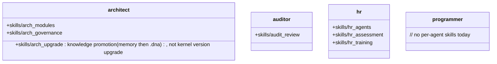

## Positioning

Agent definition source-of-truth lives on the deploy side at `project/agents/<name>.md`. `cbi/agents/` does not own agent identity — it carries only the per-agent private skill subtree (`<name>/skills/...`) for those agents that have private skills today (architect / auditor / hr).

## Class Diagram

## Key Decisions

- **Agent definition single source of truth = `project/agents/<name>.md`.** `cbi/agents/` does NOT own agent identity. The four kernel agent markdowns under `project/agents/` (`architect.md` / `auditor.md` / `hr.md` / `programmer.md`) are the only canonical definition surface — they feed both `cbim soul show` (which now reads `project/agents/*.md` directly) and `project.init` / `project.sync` (which copy them verbatim into `.claude/agents/<name>/<name>.md`). The earlier soul-py source-of-truth model (one `agent.py` per agent under `cbi/agents/<name>/` exporting `<NAME>_MD`) is deprecated and removed; `cbi/agents/<name>/agent.py` and `soul.py` no longer exist.
- **Agent skills are co-located under the agent's own directory.** A skill that only ever runs in the architect's context (e.g. `arch_modules`) belongs to the architect, not to the cross-agent `cbi.skills` package. After the soul-py removal, `cbi/agents/<name>/` carries only the `skills/` subtree (architect / auditor / hr); programmer has no private skills today and its `cbi/agents/programmer/` subtree is empty.

- **HR 责任边界 = 写侧（招 / 训 / 治），不含读侧（查）。** `agent_list` 是系统级查询能力（MCP `agent_list` 工具），所有 agent 都可直接调用，不需要经过 HR。HR 拥有的是 agent 生命周期的写操作——招聘（`hr_agents`）、训练（`hr_training`）、考核与治理（`hr_assessment`）。把「读 agent 清单」也算作 HR 职责，会让 HR 变成所有 agent 调用 agent 的强制中介，违反 C4（接口隔离）。
- **执行热路径不派 HR 做能力匹配。** 主 agent 在执行循环中需要选派 work agent 时，直接用 MCP `agent_list` 自助匹配（读 frontmatter 的 `name` / `description` / `keywords`），匹配不到则回退 `programmer`。这不是「绕过 HR」——HR 的写侧职责（招新 agent、改 agent 定义、考核）一项都没少；被消除的只是「读 agent 清单」这条本就属于系统级查询的能力。把 HR 拉进每次热路径调度，会让一次性查询变成多轮 LLM 往返，纯属过度设计。
- **保留两条 HR 路径：`hr_request`（用户直答）+ `hr_gov`（治理循环）。** 用户显式请求时（「帮我招个 X agent」「评估一下 programmer 的表现」），主 agent 仍走 HR 直答路径，HR 在 BT 中作为一等 agent 存在。治理循环（dream loop）中 HR 仍负责 agent 体系的周期性巡检与重组。被裁掉的只是「执行根中段那条把 HR 当成调度中介的 `hr_exec` 子树」——HR 作为人事职能的入口完整保留。
