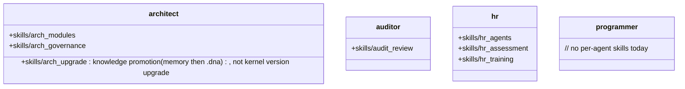

## Positioning

Agent definition source-of-truth lives on the deploy side at `project/agents/<name>.md`. `cbi/agents/` does not own agent identity — it carries only the per-agent private skill subtree (`<name>/skills/...`) for those agents that have private skills today (architect / auditor / hr).

## Class Diagram

## Key Decisions

- **Agent definition single source of truth = `project/agents/<name>.md`.** `cbi/agents/` does NOT own agent identity. The four kernel agent markdowns under `project/agents/` (`architect.md` / `auditor.md` / `hr.md` / `programmer.md`) are the only canonical definition surface — they feed both `cbim soul show` (which now reads `project/agents/*.md` directly) and `project.init` / `project.sync` (which copy them verbatim into `.claude/agents/<name>/<name>.md`). The earlier soul-py source-of-truth model (one `agent.py` per agent under `cbi/agents/<name>/` exporting `<NAME>_MD`) is deprecated and removed; `cbi/agents/<name>/agent.py` and `soul.py` no longer exist.
- **Agent skills are co-located under the agent's own directory.** A skill that only ever runs in the architect's context (e.g. `arch_modules`) belongs to the architect, not to the cross-agent `cbi.skills` package. After the soul-py removal, `cbi/agents/<name>/` carries only the `skills/` subtree (architect / auditor / hr); programmer has no private skills today and its `cbi/agents/programmer/` subtree is empty.

- **HR 责任边界 = 写侧（招 / 训 / 治），不含读侧（查）。** `agent_list` 是系统级查询能力（MCP `agent_list` 工具），所有 agent 都可直接调用，不需要经过 HR。HR 拥有的是 agent 生命周期的写操作——招职（`hr_agents`）、训练（`hr_training`）、考核与治理（`hr_assessment`）。把「读 agent 清单」也算作 HR 职责，会让 HR 变成所有 agent 调用 agent 的强制中介，违反 C4（接口隔离）。
- **执行热路径不派 HR 做能力匹配。** 主 agent 在执行循环中需要选派 work agent 时，直接用 MCP `agent_list` 自助匹配（读 frontmatter 的 `name` / `description` / `keywords`），匹配不到则回退 `programmer`。这不是「绕过 HR」——HR 的写侧职责（招新 agent、改 agent 定义、考核）一项都没少；被消除的只是「读 agent 清单」这条本就属于系统级查询的能力。把 HR 拉进每次热路径调度，会让一次性查询变成多轮 LLM 往返，纯属过度设计。
- **保留两条 HR 路径：`hr_request`（用户直答）+ `hr_gov`（治理循环）。** 用户显式请求时（「帮我招个 X agent」「评估一下 programmer 的表现」），主 agent 仍走 HR 直答路径，HR 在 BT 中作为一等 agent 存在。治理循环（dream loop）中 HR 仍负责 agent 体系的周期性己检与重组。被裁掉的只是「执行根中段那条把 HR 当成调度中介的 `hr_exec` 子树」——HR 作为人事职能的入口完整保留。

### HR Skill CRUD 扩展：skill 目录形态 + 可选可执行资产（2026-07-14 决策锁定）

**适用范围**：仅适用于 HR 招/管理的 **work agent** 的私有 skill（即项目侧 `.claude/agents/<work-agent>/skills/` 下的条目）。内置四个核心 agent（architect / auditor / hr / programmer）的 skill 继续由内核版本管理，不在 HR Skill CRUD 写侧覆盖范围内；MCP 层新增写入工具必须在服务层拒绝这四个名字。

**skill 两种形态**（两者共存，自动识别，不强制升级）：

- **单文件形**（现有默认，不变）：`.claude/agents/<agent>/skills/<skill>.md`。无资产需求时优先选。
- **目录形**（新形态，有资产时启用）：`.claude/agents/<agent>/skills/<skill>/`，内部固定结构：
  - `skill.md`：同单文件形的 SKILL body（frontmatter + 正文），默认入口名。
  - `assets/*`：任意资产文件（脚本、模板、示例数据、prompt 片段等）。资产必须落在该子目录下，不得直接写到 skill 目录根部。

自动识别规则（读侧）：先查 `<skill>.md`，命中即为单文件形；未命中再查 `<skill>/skill.md`，命中为目录形；都不命中则不存在。**禁止同名共存**：`Skill.load` 在同时发现 `<skill>.md` 与 `<skill>/` 时报 `AmbiguousSkillError`（新 ValueError 子类），不隐式选一。

**可执行资产护栏**：

- 可执行后缀白名单固定为 `.ps1 .sh .py .js .ts .rb .pl .bat .cmd .exe .dll .so .dylib .command .app`（写在服务层常量，不可配置——避免“搞个 config 就能注入恶意后缀”的风险）。
- 内核只存不跑：内核（服务层 / MCP / hook）**永不 chmod +x、永不 fork/exec** 任何 assets/ 下的文件；可执行资产只是“写入磁盘的可能受活化内容”，活化行为由下游 agent 自己的 Bash / 子进程控制。
- **is_executable 显式声明铁律**：向 `assets/` 写可执行后缀的文件时，调用方必须传 `is_executable=True`。后缀在白名单内但 `is_executable=False` → `ExecutableAssetRequiresFlagError`（ValueError 子类）拒写。后缀不在白名单内但 `is_executable=True` → 允许写入（预留未来白名单遗漏的安全冒）并同样上 audit log。
- 每次写入或删除可执行资产必须调 `engine.logger.append("CBIM:skill_asset", ...)`，消息必须含（agent_name、skill_name、asset_rel_path、action ∈ {add, remove}、caller）；失败不接手（与现有 logger 一致“日志不能崩写入”铁律）。

**与既有“Agent skills co-located under the agent's own directory”的一致性**：目录形仍完全位于 agent 自己目录，不拆到 `cbi.skills` 公共层；本决策只扩展了内部存储布局，没有变属于。

### 写入层“两条路径并存”的层级判定（2026-07-14 实现后补录）

实际落地后出现两条直接面向 filesystem 的高层写入 API：

- **`cbi.resources.agent.SkillCollection.add / remove`** —— 服务于“内核内部拿到 `Agent` 域对象后在内存里操作 skills 集合”的代码路径：`SkillCollection.add(name, body, *, as_dir=False)` / `remove(name)` → 最终委托 `cbi._primitives.skills` 写盘。
- **`services.skill_service.create_agent_skill / delete_agent_skill / ...`** —— 服务于 MCP 工具入口（LLM 接到“创建/删除 skill”命令），包含内置 agent 拒写 / path traversal / is_executable / audit log / 事务索引副作用等全套护栏，最终也委托 `cbi._primitives.skills` 写盘。

两者共享同一套原语（写磁盘真正只有一处：`_primitives.skills`），彼此不相互感知。

**判断：保留两条路径，不合并**。理由：

1. **两层面向不同调用方**。`SkillCollection` 是 `Agent` 域对象的成员——服务于 resources 层的富对象风格（代码拿到 Agent 对象 → `.skills.add(...)` → `.save()`）；`SkillService` 是 services facade 层——专为 MCP/CLI 入口提供护栏与事务封装。层级面向完全不同，合并会摸掉一个层。
2. **合并会造环**。若强制 `SkillCollection.add` “只能调 SkillService”，resources 层就会反向依赖 services——而现有铁律是 services 依赖 `cbi._primitives`（`_primitives` 不得 import `cbi.resources`）；若发生 `services→resources` 方向引用，直接造环。
3. **内核无气道交错**。MCP 层一律只走 `SkillService`（MCP 层铁律不得 import `cbi.resources.Skill`）；SkillCollection 写侧仅服务于内核内部代码路径（当前仅不多个位点）——同一进程内不存在两条写入流同时并行。

**后续守护**：SkillCollection 不需自己护栏，依旧在 `Agent` 域对象上仅服务于“内核内部代码路径”。若发现 MCP 层代码直接调 SkillCollection，属于“跨层接错”，需改 MCP 层回走 SkillService 入口，而不是合并两层。

