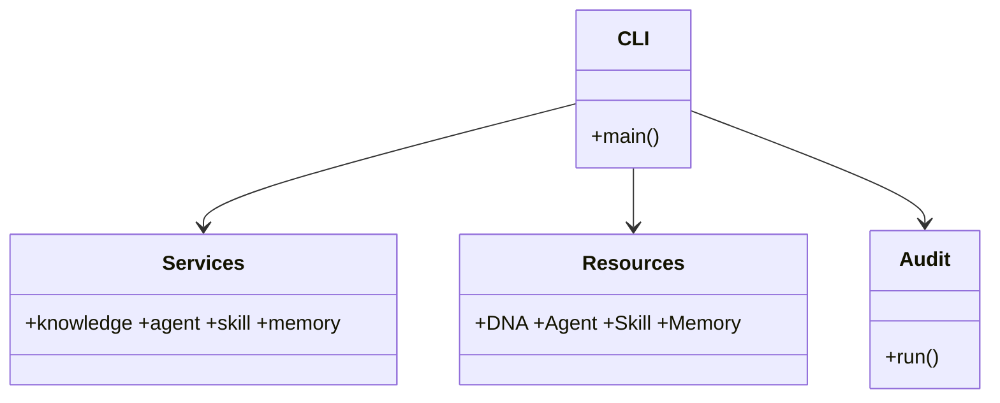

## Positioning

The engine is the thin, synchronous CLI entry point for explicit V1 operations. It parses
commands and delegates to services, resources, memory, project initialization, and audit.
It contains no task router, background loop, lifecycle callback, or business workflow engine.

## Class Diagram

## Key Decisions

- **Thin CLI**: argument parsing and output formatting stay in `engine/cli`; domain behavior
  remains in service/resource modules.
- **Explicit execution**: commands run only when invoked by a user or an authorized caller;
  the engine does not dispatch agents or maintain background state.
- **Stable boundaries**: configuration, path resolution, atomic writes, and audit checks remain
  available to callers without exposing private implementation modules.
