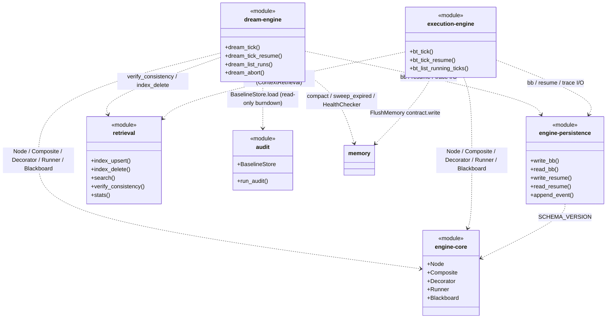

## Positioning

The kernel engine plays a **twin role**:

1. **Unified CLI dispatcher.** Single user-facing entry — `python -m engine <domain> [<command>] [args]`, invoked via the project's shim `.cbim/run`. `__main__.py` calls `engine.cli.main()`, which builds an argparse tree and dispatches each domain to the matching delegate.
2. **Home of the behavior-tree driver (`execution/`).** v2's core driver engine for the execution loop. Each user prompt triggers one `bt_tick`; the BT runner drives a global root node through yield/resume coroutines until `Done`. Exposed to the main agent as MCP tools (`bt_tick` / `bt_tick_resume`), not as a CLI sub-domain.

Engine contains zero business logic in either role. The CLI dispatcher parses arguments and routes; the BT driver runs the tree but defers every actual agent dispatch back to the main agent via `BtResult.Yield`. Every domain (CLI side) and every Action (BT side) delegates outward to the owning module.

## Sub-module Relationships

**Class diagram reading rules.** Nodes are the six registered sub-modules of `engine/` (frontmatter `name` values). Edges (`..>`) declare cross-module dependencies — the authoritative source per the `dna_tree` `TREE_DEP_DIAGRAM_MISMATCH` rule. Outgoing edges from `memory` and `audit` are not shown here because both have other parents (`v1/kernel/memory` is a top-level sibling of `engine`; `audit` is itself an engine child whose own dependencies are declared at its own level). Internal engine code (`cli/` — the 16-file dispatcher package, see below — plus `logger.py`, `session_log.py`, `import_log.py`, `log_view.py`, `debug.py`, `config.py`) does NOT appear here — those are package-internal Python modules, not sub-modules; the narrative below covers their role.

Note: `execution/`, `dream/`, and `retrieval/` are NOT routed through `cli`. `execution/` and `dream/` are exposed to the main agent via the `mcp_server` container as MCP tools; `retrieval/` is an in-process facade called directly by `execution/`, `dream/`, `memory/`, and the `dna_*` / `agent_*` MCP tool layer. The CLI dispatcher only inspects `execution/` and `dream/` for audit / debug purposes (e.g. listing `.cbim/scheduler/bt/<tick_id>/` and `.cbim/scheduler/dream/<run_id>/` directories).

`core/` is the shared BT primitives layer — `Node` ABC, `Composite` (Sequence / Selector / SequenceTolerant), `Decorator`, `Runner`, `Blackboard` (with `SCHEMA_VERSION`), `loop_spec`. Both root loops (`execution/` and `dream/`) build their trees out of `core/` primitives; neither owns these abstractions. `core/` has zero dependency on either root loop — it is the stable abstraction layer that both volatile root trees depend inward on. This is what makes `execution/` and `dream/` siblings rather than parent/child.

`persistence/` is the shared atomic file I/O layer for both root loops. Both `execution/` and `dream/` write `bb.json` / `resume.json` / `trace.jsonl` through it; on-disk paths under `.cbim/scheduler/{bt,dream}/<id>/` are the external contract surface (also read by the dashboard and CLI audit tools). `persistence/` knows nothing about `bt/` vs `dream/` — the caller injects the absolute directory; that is what lets one module serve both loops. It depends only on `core.blackboard.SCHEMA_VERSION`.

`retrieval/` is the shared vector + keyword retrieval primitives layer used by **both root loops** (execution: `ContextRetrieval` front-loads 4-source search before `ModeClassify`; dream: `MemRebuildIndex` runs `verify_consistency(mode="full")` and `TranscriptDelete` calls `index_delete("transcript", ...)`) plus by **every write path that owns one of the four sources** (memory.crud / mcp_server.tools.dna / mcp_server.tools.agents / hooks.session_stop). It treats source as a string enum (transcript / memory_medium / dna / agents) and is intentionally ignorant of business semantics. BM25 fallback is always-on; `EmbeddingProvider` is pluggable. Depends on Python stdlib only (optional numpy + optional embedding SDK). Sibling to `execution/` and `dream/` under `engine/`, **not** owned by either root.

Dispatched domains (current surface, mirrors `engine/cli/__init__.py:main`):

- `memory` → `memory.cli` (create / add / query / delete / reindex / cleanup)
- `dna` → in-process handlers driving `cbi.resources.DNAModule` and `cbi._primitives.modules` (list / show / init / reindex / edit / write-doc[deprecated] / write-section[deprecated] / split)
- `agent` → in-process handlers driving `cbi.resources.Agent` (list / show / scaffold / archive / update / add-skill)
- `snapshot` → `cbi._primitives.snapshot.build_snapshot`
- `skill` → `cbi.resources.Skill` (list / show)
- `soul` → reads `project/agents/<name>.md` (the 4 kernel agents) + `project/templates/CLAUDE.md.tmpl` (assistant). After the soul-py removal, agent definitions live exclusively under `project/agents/` as plain Markdown; there is no Python rendering step.
- `config` → `engine.config` (get / set / show on `.cbim/config.json`)
- `dashboard` → `dashboard.server.start_server`
- `preview` → `dashboard` (deprecated alias)
- `debug` → toggles `.cbim/.debug` flag (on / off / status)
- `log` → `engine.log_view` (show / tail per-session logs)
- `audit` → `engine.audit.cli` (run / index / memory / agents / dna / tree / list-checks — read-only drift checks across `.dna`, `.claude/agents`, `.cbim/memory`)
- `mcp` → `mcp_server.server.mcp.run()` (stdio)
- `init` → `project.init.init_project` (bootstrap cwd)
- `project sync` → `project.sync.sync_templates` (refresh templated files)

Hook events are NOT dispatched through this CLI — Claude Code invokes the in-process bridge scripts at `.claude/hooks/cbim_*.py` directly.

Internal cross-cutting code files (not sub-modules, do NOT appear in the class diagram above): `logger.py` + `session_log.py` (per-session text logs), `call_log.py` + `import_log.py` (PreToolUse/PostToolUse + import telemetry), `log_view.py` (read-back surface for `log show` / `log tail`), `debug.py` (.debug flag toggle), `config.py` (config get/set/show), `cli/` (the 16-file CLI dispatcher package: one file per domain plus `__init__.py` aggregator, `_shared.py` shared helpers; each domain file owns its own `register(sub)` and `dispatch(args, parser)` pair). These are engine-internal Python modules; only the six registered sub-modules (`core/`, `persistence/`, `retrieval/`, `execution/`, `dream/`, `audit/`) appear as classDiagram nodes.

Non-CLI sub-modules (driven through other surfaces):

- `core/` — shared behavior-tree primitives layer. Owns `Node` ABC, `Composite` (Sequence / Selector / SequenceTolerant), `Decorator`, `Runner`, `Blackboard` (with `SCHEMA_VERSION`), and `loop_spec`. The stable abstraction floor under both root loops: `execution/` and `dream/` both import from `core/` to build their trees, but `core/` has zero knowledge of either loop. Unidirectional dependency: `{execution, dream, persistence} → core`, never the reverse.
- `persistence/` — atomic file persistence for behavior-tree state (bb.json + resume.json via `snapshot.py`; trace.jsonl via `trace.py`). Shared by `execution/` and `dream/` runners; loop-agnostic (the caller injects the absolute directory). On-disk paths under `.cbim/scheduler/{bt,dream}/<id>/` are an external contract — read by the dashboard and CLI audit tools. Depends on `engine/core/blackboard.SCHEMA_VERSION` only. See `engine/persistence/.dna/module.md`.
- `retrieval/` — vector + keyword retrieval primitives (embedding-provider abstraction, BM25 fallback, per-source index storage at `.cbim/index/<source>/`, similarity search, two-tier drift verification). Treats the four data sources (transcript / memory_medium / dna / agents) uniformly via a string-enum `source` parameter; does NOT know what those sources mean semantically. Loop-agnostic and source-agnostic. Used by `execution/` (`ContextRetrieval` runs 4-source `search` before `ModeClassify`), by `dream/` (`MemRebuildIndex` runs `verify_consistency(mode="full")`; `TranscriptDelete` runs `index_delete("transcript", ...)`), and by every write path of the four indexed sources (`memory.crud` / `mcp_server.tools.dna` / `mcp_server.tools.agents` / `hooks.session_stop`) as a synchronous side-effect of writing. Sibling to `execution/` and `dream/` under `engine/`; not owned by either root. Dependency direction: `{execution, dream, memory.crud, memory.compaction, mcp_server.tools.dna, mcp_server.tools.agents, hooks.session_*} → engine/retrieval`; the reverse is forbidden. See `engine/retrieval/.dna/module.md` and `engine/retrieval/.dna/contract.md`.
- `execution/` — behavior-tree driver for the **execution loop** (user-driven root). Exposes `bt_tick(user_request, context=None)` / `bt_tick_resume(tick_id, dispatch_result)` / `bt_list_running_ticks()` as MCP tools (registered by `mcp_server`). The main agent calls `bt_tick` on each user prompt; the BT runner drives the global root node through yield/resume until `Done`. Builds its tree out of `engine/core/` primitives. See `engine/execution/.dna/module.md` and `engine/execution/.dna/contract.md`. Persistence at `.cbim/scheduler/bt/<tick_id>/{bb.json, trace.jsonl, resume.json}` (writes via `engine/persistence/`); 4-source context retrieval via `engine/retrieval/`.
- `dream/` — behavior-tree driver for the **governance loop** (SessionStart-catchup-driven root, CBIM's second root, peer to `execution/`). Exposes `dream_tick(reason, run_id=None)` / `dream_tick_resume(run_id, dispatch_result)` / `dream_list_runs(limit=10)` / `dream_abort(run_id, reason)` as MCP tools. Triggered by SessionStart hook when ≥20 hours since last successful run. Drives three governance steps (memory / knowledge / capability) via `SequenceTolerant`; memory step calls `memory/` internal maintenance interfaces in-process (no LLM) plus `engine/retrieval/` for full-mode drift verification and transcript index cleanup; knowledge / capability steps yield to dispatch Architect / HR in governance mode. Reuses `engine/core/` primitives (Node ABC, Composite, Decorator, Runner), `engine/persistence/` for bb / resume / trace I/O, and `engine/retrieval/` for index drift checks but holds an independent root tree, independent blackboard schema (8 fields), independent trace, independent entry tools. Dependency direction is `dream → engine/core`, `dream → engine/persistence`, `dream → engine/retrieval`, `dream → engine/audit` (BaselineStore.load read-only); `execution` does NOT depend on `dream`, and `dream` does NOT depend on `execution` — they are siblings sharing `core/` / `persistence/` / `retrieval/`. See `engine/dream/.dna/module.md` and `engine/dream/.dna/contract.md`. Persistence at `.cbim/scheduler/dream/<run_id>/{bb.json, trace.jsonl, resume.json, report.md, current.json, last_success.json, abandoned.json}` — physically isolated from `execution/`.
- `audit/` — read-only architecture drift guard exposing five checks (`index_consistency` / `memory_threshold` / `agent_fission` / `dna_fission` / `dna_tree`) plus a `BaselineStore` for the audit ratchet. Sibling to `execution` / `dream` / `core` / `persistence` / `retrieval` under `engine/`. Consumed by (a) `execution`'s `ArchCheckGate` leaf (runs `run_audit(checks=[dna_tree, dna_fission])` after `DispatchWork`) and (b) `dream`'s `BaselineBurndown` action (calls `BaselineStore.load()` to surface burndown advice). `audit` does NOT depend on `execution` or `dream` — it is the stable downstream side of both consumer relationships. See `engine/audit/.dna/module.md`.

## Origin Context

Every CBIM operation that an LLM or human types is one CLI invocation. The kernel needs exactly one routing surface because:

1. **Single discoverability point.** `python -m engine --help` lists every available domain. No second binary, no second entry point.
2. **One logging seam.** Every invocation flows through `cli.main()`, so per-session call logging is uniform across all domains without each sub-engine reinventing the wheel.
3. **Domain isolation.** Each domain's real implementation lives in a sibling sub-module (`memory/`, `cbi/`, `mcp_server/`, etc.). Engine merely parses and dispatches. A domain can be refactored, removed, or added without touching the other domains.

`engine/` is also the home of `execution/` — the v2 behavior-tree driver. Why colocate the BT driver with the CLI dispatcher rather than make it a sibling top-level package? Two reasons:

1. **Shared cross-cutting infrastructure.** `execution/` reuses `engine.config` (audit / iteration thresholds), `engine.logger` (session-level signals; BT trace is separate), and the same project-root resolution machinery. Promoting BT to a sibling would force every cross-cutting access through an extra package boundary for zero design win.
2. **One "engine" mental model.** The kernel has one operational engine, with two faces: a synchronous CLI face (humans / scripts call `cbim ...`) and a coroutine-driven BT face (the main agent calls `bt_tick` via MCP). Both faces live under `engine/` because they share the same "router-with-no-business-logic" personality — neither owns business semantics; both delegate outward.

## Key Decisions

- **Thin dispatcher, no business logic.** Every domain handler is a few lines: parse args, call delegate, return exit code. Anything more substantial belongs in the delegate module. This keeps the `engine/cli/` package legible and prevents it from accumulating cross-domain knowledge.
- **`engine/cli.py` (1356 LOC) was split into a 16-file `engine/cli/` package in Batch 3.** One file per CLI domain (`agent.py`, `audit.py`, `config.py`, `dashboard.py`, `debug.py`, `dna.py`, `init.py`, `log.py`, `mcp.py`, `memory.py`, `project.py`, `skill.py`, `snapshot.py`, `soul.py`) plus `__init__.py` (the aggregator that wires sub-parsers + dispatch table) and `_shared.py` (cross-domain helpers like `_read_content_arg`). Each domain file owns its own `register(sub) → ArgumentParser` and `dispatch(args, parser) → int` pair — the **register/dispatch double interface** is the single contract the aggregator depends on, so adding a domain never touches `__init__.py` beyond two import + two map-entry lines.
- **Late-lookup dispatcher pattern preserves the test monkey-patch contract.** When `engine.cli.py` was a single file, the test suite monkey-patched `engine.cli._handle_dna_show` (and a dozen sister handlers) by name, expecting the dispatcher to invoke whatever the attribute resolves to at call time. The split package preserves this by (a) re-exporting every `_handle_*` / `_apply_*_in_memory` / `_build_*_payload` / `_*_FM_EDITABLE` / `cmd_*` helper from `engine/cli/__init__.py`, and (b) every domain `dispatch` function looking up its handler via `getattr(engine.cli, '_handle_xxx')` at call time rather than capturing a direct reference at import. Tests that rebind `engine.cli._handle_dna_show = mock` keep working zero-touch.
- **`dna` and `agent` handlers live inline in `engine/cli/{dna,agent}.py`.** Historically they delegated to `cbi/_primitives/cli.py`; that thin wrapper layer was deleted in P3 Wave 1. The handlers now drive `cbi.resources.{DNAModule, Agent}` directly. Reason: a one-level dispatch (engine → resource model) is cheaper to read and modify than two-level dispatch (engine → cbi/cli → resource model), and the resource model is the de-facto public API. `dna.py` (631 LOC) and `agent.py` (365 LOC) are deliberate over-target outliers — each owns the full args→payload→service flow for one resource type, and any internal cut would force a public sub-API for a single caller; their per-file lint baselines carry an explicit length-limit waiver.
- **Imports across the `cli/` package are absolute, never relative.** `engine/cli/dna.py` imports `from engine.cli._shared import ...` and `from cbi.resources import ...`, never `from ._shared import ...` or `from ...cbi.resources import ...`. Reason: parent-relative imports inside the dispatcher were the most common cause of "works in pytest, breaks under `python -m engine`" symptoms during the Batch 3 split; absolute is the iron rule.
- **`cli/*.py` carries an E402 + ARG001 transitional baseline.** Domain files routinely import after a small bootstrap block (E402) and accept argparse-injected `parser` arguments they never read in handlers that only need `args` (ARG001). Both rules are silenced in the per-file lint baseline as a deliberate, documented exception — not a TODO. Any third lint rule needing the same waiver must enter the same baseline file with a one-line rationale.
- **`init` targets `Path.cwd()`, NOT `project_root()`.** `project_root()` walks up to find an existing `.cbim/`, which is the wrong semantics for bootstrap and historically caused init to clobber a parent project when run from a non-project subdirectory. Bootstrap always targets cwd.
- **No `hook` subcommand.** Hook events are not dispatched through this CLI. Claude Code invokes the in-process bridge scripts at `.claude/hooks/cbim_*.py` directly; those scripts bootstrap `<project>/.cbim/kernel/` onto `sys.path` and call `memory.*` / `cbi.*` / `engine.*` in-process. The earlier `.cbim/run hook <event>` indirection and the `hooks/` sub-package were removed in Phase 6.
- **`init` does more than scaffold `.cbim/`.** Since Phase 3b, `init` also: (1) copies the 7 `cbim_*.py` hook scripts plus `_lib/` into `.claude/hooks/` with 0755 on the scripts; (2) writes the `hooks` section of `.claude/settings.json` to invoke those scripts directly; (3) extends `permissions.deny` to four entries (Write/Edit/Read on `.cbim/**`, plus `Bash(.cbim/run *)`); (4) appends missing kernel entries to `.claudeignore` (merge-only, never clobber); (5) verifies that `mcp` is importable from the managed venv (post-condition check; warn-only); (6) writes/merges `.mcp.json` at the project root with the `cbim` MCP server registration (Phase 7 split: previously `mcpServers.cbim` lived inside `.claude/settings.json`; it now lives in the project-root `.mcp.json` so Claude Code auto-discovers it, and the sync path drops any stale `mcpServers.cbim` from `.claude/settings.json` on upgrade); (7) builds and manages `.cbim/.venv/` — a project-local venv bootstrapped with the system `python3` — and installs the `mcp` SDK into it (Phase 8). The user's system Python is never modified; the `.cbim/run` shim invokes `.venv/bin/python` directly. Venv build is idempotent (skip if `import mcp` succeeds, repair if venv exists but mcp is missing, rebuild if venv is broken). Venv build failure is fatal with a clear hint about `python3-venv`; mcp install failure inside an otherwise-healthy venv is soft-fail (warn, keep going).
- **`preview` is a deprecated alias for `dashboard`.** Kept for one release cycle. Emits a stderr deprecation line and forwards to `cmd_dashboard`.
- **Debug flag is engine-scoped, not memory-scoped.** `.cbim/.debug` (a zero-byte file at the project root's `.cbim/` directory) gates the extra `[ENG]/[IMP]` log lines from `call_log` and `import_log`. Session-level signals (`[SESSION]/[USER]/[TOOL]/[RESULT]/[TURN]`) always log regardless of the flag.
- **`audit/` is embedded inside `engine/`, not a sibling package.** The CLI surface is one more `cbim ...` sub-domain and the threshold config lives in `.cbim/config.json` under the `audit` section — both already first-class engine responsibilities. Making audit a top-level sibling would require an extra cross-package import dance for zero boundary win. Reversible if non-CLI consumers ever appear.
- **`engine/audit/checks/index_consistency.py` is the permanent white-box exception to the `cbi._primitives` banned-api lock.** It deliberately reaches past `services/` into `cbi._primitives.modules.loader` to compare the on-disk index against the primitives' view; this is by-design — the check exists precisely to detect drift that the facade would hide. The white-box client allowlist for `cbi._primitives` is exactly four call sites: `services` (the only general-purpose facade), `cbi.resources` (the wrapper layer that owns the public object model), `engine.audit.checks.index_consistency` (this check), and `project.hooks_src` (install-time snapshot bootstrap). Any other client triggers an audit failure.

- **CLI deprecated 入口（`dna write-doc` / `dna write-section` / `preview`）计划下一个 minor release（1.1.0）移除；Batch 4 仅加 stderr 警告，未删。** 三个入口都在主调用路径中 `print("[DEPRECATED] ... will be removed in the next minor release (1.1.0); use ... instead.", file=sys.stderr)`：`engine/cli/dna.py` 里 `cmd_dna_write_doc` / `cmd_dna_write_section` 提示改走 `dna edit --target body|section`；`engine/cli/dashboard.py` 里 `cmd_preview` 提示改走 `dashboard`。代码不删、行为不变，只推使用户迁到 `dna edit` 单入口与 `dashboard` 正名。下一个 minor release 一起拆三个 `cmd_*` 函数 + 在 `engine/cli/__init__.py` 中的注册 / 分发表条目 + 对应单测。`preview` 上轮「保一个 release 周期」的 Key Decision 在本轮费机明确为 1.1.0 别。

## Non-Goals

- No `cbim_kernel.*` import paths. The kernel root is now the package root (after flatten); imports are `from engine ...`, `from memory ...`, `from cbi.resources ...`, never `from cbim_kernel.engine ...`.
- No `migrate` or `upgrade` subcommands. Project lifecycle = `init` + `project sync` only.
- No `pin` subcommand, no `versions.json` reader, no installer-side subprocess.
