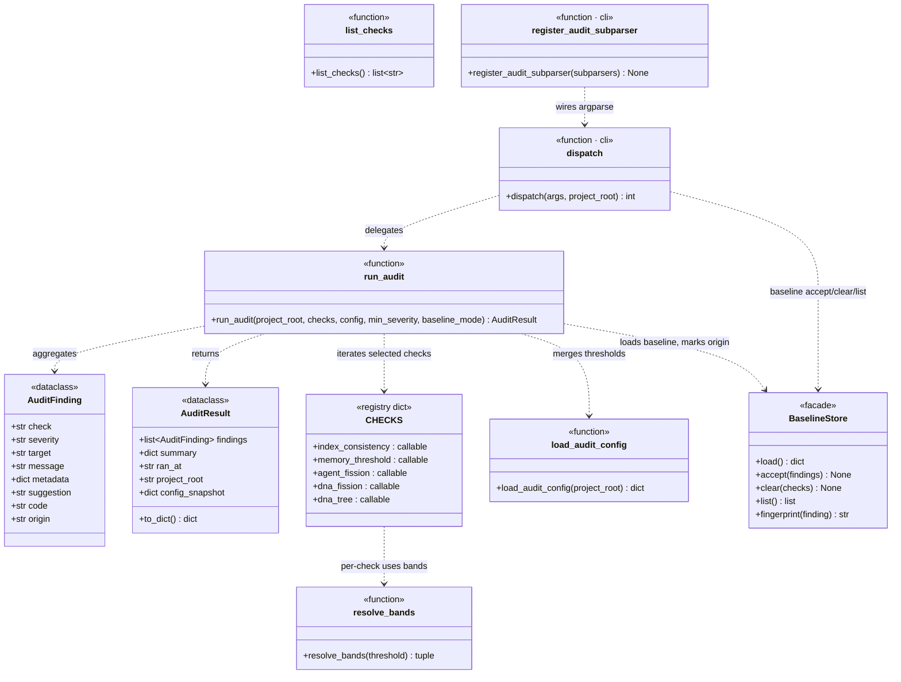

## Positioning

Read-only governance drift guard. Inspects the project's `.cbim/index.md`, every registered `.dna/module.md`, every project-level agent under `.claude/agents/`, and the memory service's published `stats()` output. Returns structured findings; never mutates anything.

Five checks, single dispatch surface:

- `index_consistency` — registry vs. on-disk module list
- `memory_threshold` — pulls metrics from `kernel/memory`'s `stats()` only; flags when short-tier count / staleness / candidate backlog cross the configured bands. **Does not own the thresholds' meaning, does not judge promotion-worthiness, does not read raw memory files.**
- `agent_fission` — project agent body & skill count oversize
- `dna_fission` — module body & workflow count oversize
- `dna_tree` — parent/child orphans, dep DAG (cycles, dangling, up-tree direction)

Lives **inside** the engine package because every check threads through `engine.config` (audit thresholds live in `.cbim/config.json`'s `audit` section) and because the CLI surface (`cbim audit ...`) is one more sub-domain of `python -m engine`.

## Class Diagram

## Key Decisions

- **Read-only by construction.** No check writes to `.dna/`, `.claude/agents/`, `.cbim/memory/`, or `.cbim/index.md` — even the registry it audits. Mutation belongs to dedicated commands (`cbim dna reindex`, `cbim memory cleanup`, `cbim agent ...`). Audit reports drift; it does not heal it.
- **Embedded inside `engine/`, not a sibling package.** The CLI surface is a sub-domain of `cbim ...` and config thresholds live in `.cbim/config.json`; making audit a sibling of `engine` would require an extra cross-package import dance for no real boundary win. Reversible later if audit grows non-CLI consumers.
- **Three-band severity (info / warn / error) via `resolve_bands`.** `info` = 80% of threshold (early-warning), `warn` = at threshold, `error` = 150% of threshold. Single helper used by every quantitative check; no per-check threshold logic drift.
- **Hardcoded `DEFAULTS` are pure fallback.** `load_audit_config` deep-merges `.cbim/config.json`'s `audit` section over `DEFAULTS`; audit itself never writes the merged result back. Users can override thresholds; the defaults stay readable in source.
- **Skill counting is a heuristic, isolated.** `_agent_skill_parser.count_skills` does fragile markdown-table parsing plus a `cbim skill show <agent>.X` regex fallback. Lives in its own module so a future structured skill metadata can drop the heuristic without touching the check.
- **Memory threshold check is a thin metrics consumer, not a judge.** `memory_threshold` pulls numbers from `kernel/memory`'s `stats()` interface and applies the audit-side band thresholds — that's it. It does **not** read raw entries under `.cbim/memory/`, does **not** decide what "should be promoted" to agent skills or `.dna/`, and does **not** emit per-tier promotion findings. v3 memory design (G5) reserves promotion-candidate identification for `kernel/memory/compaction/`; promotion candidates surface via `scan(filter="promote_candidate")` on the architect's own knowledge loop, not via audit. Audit only flags "candidate backlog crossed the band" as a quantitative drift signal.
- **Exit code follows max severity of the (filtered) findings.** 0 = clean / info, 1 = warn, 2 = error. `--severity X` filters display AND affects the exit code; that way CI can gate on `cbim audit run --severity error`.

- **`dependencies` frontmatter 语义**：仅声明跨边界、非祖先的依赖。同层兄弟、向下抽象层、外部模块都要列；任何祖先链上的模块一律不列。这一约定由 `dna_tree` 检查的 `TREE_DEP_ANCESTOR_DECLARED` 强制。

- **依赖拓扑：允许 vs 禁止**。`dependencies` 仅能列入 ① 同层兄弟（与本模块同父）、② 叔伯及其整棵子树（祖先节点的兄弟与那些兄弟下的全部后代）、③ 不在本模块祖先链上的任意外部模块。禁止列入 ① 任一祖先（含 `.` 项目根，祖先链上的可见性是隐式的）、② 自身子树下的任一后代（同样隐式可见，反向声明无意义）、③ 任何会形成环的目标。直观判别法：把本模块路径与候选路径并排写出、去掉公共前缀，两侧剩余都非空且首段不同（即「自己这一侧立刻分叉」）时才合法 —— 本侧剩余为空 ⇒ 候选是后代；候选侧剩余为空 ⇒ 候选是祖先。举例（本模块=`A/B/C`）：合法 `A/B/D`（兄弟）、`A/D`（叔伯）、`A/D/E`（叔伯子树后代）、`X/Y`（外部）；非法 `A`、`A/B`、`.`（祖先链）、`A/B/C/F`（自身后代）。强制方=`dna_tree`：祖先 → `TREE_DEP_ANCESTOR_DECLARED`；树上层但非祖先 → `TREE_DEP_UP_TREE`；不存在的路径 → `TREE_DEP_DANGLING`；环 → `TREE_CYCLE`(error)。
- **`dependencies` frontmatter 是类图边的派生缓存，不是声明源**。依赖关系的唯一声明源是父模块 `## Class Diagram` 中的 `..>` 边；frontmatter 字段只是为审计与索引快速读取保留的机器派生缓存。两边不一致由 `dna_tree` 的 `TREE_DEP_DIAGRAM_MISMATCH` 报错（**审计码 T4 待实装，本决策先行声明语义**）。写入纪律：先改类图 `..>` 边，再让工具重生成 frontmatter `dependencies`；不得手工编辑 frontmatter 而不动类图。

- **`AuditFinding.origin ∈ {baseline, new}` —— 棘轮机制的根字段**。默认 `new`，向后兼容：老 JSON 缺该字段均视为 `new`。`origin` 是后续所有棘轮策略的唯一输入；除定义论外不允许出现第三个取值。
- **`BaselineStore` 是唯一门面**。原子读写（`tempfile` + `os.replace`）、指纹去重；指纹 = `hash(check + code + target + sha256(message))`。同模块同 finding 一旦 `message` 升级即视为新 finding（重新进入 `new`-origin）—— 避免 “改描述就隐形降级” 的破窗。任何其他模块读 / 写 baseline 都必须走该门面，不得直接触及 `.cbim/audit/baseline.json`。
- **棘轮降级表—— `baseline`-origin 降一档（`error→warn→info`），`new`-origin 永不降级**。源代码读下表，不硬编码任何 check 名：

  | check | 策略 |
  |---|---|
  | `dna_tree` | lenient |
  | `dna_fission` | lenient |
  | `agent_fission` | lenient |
  | `index_consistency` | strict |
  | `memory_threshold` | strict |

  `strict` = 不降级（即使 `origin=baseline`）；`lenient` = 按上文规则降一档。
- **Exit code 默认仅统计 `new`-origin findings**。默认模式下，baseline 里已接受的项不拉高最终 exit code；CI 质量门锁只看“本次新增”。`--baseline-mode=ignore` 时回退全量统计（供一次性全面检查使用）。
- **Audit 进程仍 read-only；baseline 写入仅能走显式 CLI 子命令**。`cbim audit baseline accept` 必须携 `--yes`；`run_audit` 与治理循环（`dream_tick`）绝不自动写 baseline。“接受棘轮退一格” 是人类动作，不是可推导事件。
- **`BaselineStore` 是 audit 的第 9 个节点**，进入 Class Diagram；`run_audit ..> BaselineStore`（读取时加载、为 finding 打 `origin` 标）。CLI `baseline accept/clear/list` 同样仅通过 `BaselineStore` 写入。

## Non-Goals

- **No auto-fix.** Audit reports drift; it never rewrites `.dna/`, `.claude/agents/`, or `.cbim/memory/`. Fix commands stay in their owning modules.
- **No writes to `.dna/` from inside any check.** This includes the registry: even though `index_consistency` knows when `.cbim/index.md` is stale, it only emits a finding pointing at `cbim dna reindex`.
- **No semantic judgment.** Audit does not decide whether a memory entry "should be promoted" to agent skills or `.dna/`. Promotion-candidate identification belongs to `kernel/memory/compaction/`; the architect's knowledge loop consumes those candidates via `scan(filter="promote_candidate")`. Same for fission: audit reports oversize, it does not propose how to split.
- **No raw reads under `.cbim/memory/`.** `memory_threshold` reaches memory **only** through `kernel/memory`'s `stats()` interface. Direct file walks under `.cbim/memory/short/` / `medium/` / `candidates/` are forbidden — that would couple audit to memory's internal layout and re-introduce the threshold-judgment leak this collapse was meant to fix.
- **No deep semantic import scan.** Dependency direction comes from `frontmatter.dependencies`. We do not parse Python imports, grep code references, or trace call graphs — that is a separate concern with very different cost/precision trade-offs.

- **审计本身永不写 `.cbim/audit/baseline.json`**。`run_audit` 只读 baseline、为 finding 打 `origin` 标；写入仅通过显式人类命令（`cbim audit baseline accept --yes` 等）走 `BaselineStore`。治理循环 / CI / 引擎任何路径都不得隐式写入—— 防“深夜静默接受”破窗。

