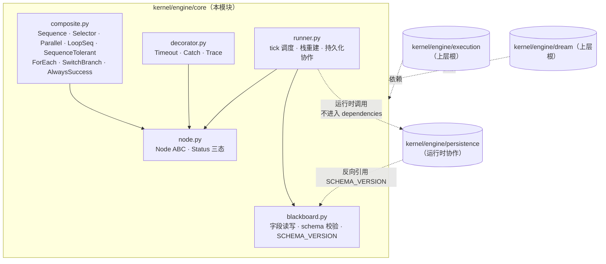

## Positioning

BT 引擎的**共享原语库**——Node ABC、Composite（Sequence / Selector / Parallel / LoopSeq / SequenceTolerant）、Decorator（Timeout / Catch / Trace）、Runner、Blackboard，以及控制流原语 `ForEach` / `SwitchBranch`。

`engine/core` 是 `engine/execution` 和 `engine/dream` 两根循环**共同依赖**的稳定底层，本身**不依赖任何上层模块**——它对「是用户驱动还是 scheduler 驱动」、「是执行循环还是治理循环」完全无感知。两根各自挂载自己的根树、自己的黑板、自己的入口工具，但跑在同一个 `engine/core` 上。

**对应文档**：[`design/WORKFLOW-EXECUTION.zh-CN.md`](../../../../../design/WORKFLOW-EXECUTION.zh-CN.md)、[`design/WORKFLOW-DREAM.zh-CN.md`](../../../../../design/WORKFLOW-DREAM.zh-CN.md) 中关于行为树原语的部分。

**历史备注**：v3.6 之前 `engine/core` 还携带一个 `LlmActionLeaf` 叶原语（「一 tick 一 LLM 调用」的默认资产），v3.7 随 arch_exec 子树坍缩为 `ArchExecYield` 同步下架——引擎进程内不再有 LLM 调用，所有 LLM 调用边界收拢到 `.claude/agents/*.md` persona 内部。该原语不会重新引入；质疑「为什么 core 不提供 LLM 叶」答案统一是「LLM 调用不是控制流原语」。

**它不是什么**：

| 误解 | 澄清 |
|------|------|
| `engine/execution` 的子模块 | 不是。`engine/core` 与 `engine/execution`、`engine/dream` 是**平级**关系——`core` 在下，两根在上，两根都依赖 `core`，`core` 不依赖任一根。 |
| 通用行为树框架 | 不是。`engine/core` 是 CBIM 自用的最小集合——只实现 CBIM 两根循环需要的原语，不追求与 py_trees / behaviour 等公开库 API 兼容。 |
| 业务节点的容器 | 不是。业务 Action（ModeClassify、ContextRetrieval、DispatchWork、MemHealthScan 等）一律归对应根模块的 `actions/` 子目录。`core` 只提供 ABC 与少量通用叶/组合/装饰原语。 |
| LLM 调用原语 | 不是。v3.6 之前 是，现不是。LLM 调用不再出现在引擎进程内，全部走 `BtResult.Yield` 交交 .claude/agents/*.md persona 执行。 |

## Sub-module Relationships

**子模块关系**：

| 关系 | 方向 | 说明 |
|------|------|------|
| Composite / Decorator → Node | 实现 / 继承 | 都是 `Node` ABC 的子类，签名 `tick(bb) -> Status` |
| Runner → Node + Blackboard | 调度协作 | Runner 是唯一持有「如何 tick 一棵树并落盘」的对象；节点对象无状态可重建 |
| Runner ⋯→ persistence | 运行时协作 | 代码中 `import persistence`，但不在 frontmatter dependencies 中声明（避免与 persistence 反向引用 SCHEMA_VERSION 成环） |
| Execution / Dream → core | 单向依赖 | 两根都依赖 core；core 不反向依赖任何根 |

**静态依赖拓扑本模块为叶节点**——`engine/core` 不在 frontmatter 声明任何静态依赖。`persistence` 与 core 的双向交互被划入「运行时协作」类（后续重构推荐走构造器注入 snapshot/trace 函数途径彻底解耦）。

## Origin Context

CBIM v2 设计早期，行为树原语曾内嵌在 `engine/execution` 内。当治理循环（dream）登场时，发现两根需要共享同一套 Node ABC / Composite / Decorator / Runner / Blackboard——把它们留在 execution 内会导致 dream 反向 import execution，循环依赖立刻成立。

解决办法是把共享原语下沉到独立模块 `engine/core`，让 execution 与 dream 各自单向依赖 core，互不依赖。这就是本模块存在的全部理由——**共享原语 + 解环**。

**为什么也承载 `ForEach` / `SwitchBranch`**：这两个不是 "业务 Action"，而是"控制流 / 调用模式的通用原语"——任一根循环、任一子循环都可能用到。把它们放 core 而非各根的 actions/ 是因为：

- `ForEach` 把"对 bb 列表字段逐项 tick 子树"这条模式下沉，让幂等恢复（bb 内存进度索引）只实现一次。
- `SwitchBranch` 把"根据 bb 字段值路由到对应子节点"这条模式下沉，让 match/case 式控制流不必每个业务侧重复发明。

v3.6 之前还携带 `LlmActionLeaf` 叶原语（「一 tick 一 LLM 调用」额外套一个默认 prompt_builder/response_parser）。v3.7 随 arch_exec 多叶子树坍缩为 `ArchExecYield` 单代理同步下架——引擎进程内所有 LLM 调用已退出，原语不再需要。

## Key Decisions

- **Node 三态封死。** `Status = {SUCCESS, FAILURE, RUNNING}`，不引入第四态。第四态语义（INVALID / TIMEOUT / CATCH）由 Decorator 转换为三态之一并写 `bb.interrupt_reason`。
- **节点对象无状态。** 节点对象不持有任何跨 tick 字段——任何「在节点上加 self.x」的写法都是破窗。所有跨 tick 状态必须落黑板（包括 Composite 的「当前子节点指针」，写入 `bb.runner_resume_path` 最后一段）。这是 RUNNING 跨 tick 恢复可正确实现的全部前提。
- **黑板是跨节点状态的唯一容器。** 节点之间不通过事件、不通过回调、不通过共享对象引用通信，只通过黑板字段读写。Blackboard 自身负责 schema 校验与单写多读约束。
- **嵌套子树是引擎天然支持的组合方式。** BT 树的子节点可以是另一棵子树的根节点——`Composite` 接受任意 `Node` 实例作为子节点，递归 tick 即可。这条性质不需要任何特殊适配层，而是 ABC 设计的自然产物。execution / dream 两根的子循环（例如 `WorkLoop`、`MemoryGovernance` 等 LoopSeq / SequenceTolerant 子树）都通过「挂载子树根节点」实现。
- **LLM 调用不是 core 原语。** `engine/core` 不提供 `LlmActionLeaf` 或任何 LLM 客户端包装原语。控制流永远是程序驱动的确定性 Python；LLM 决策走 `BtResult.Yield(DispatchRequest)` 交交主 agent 的 Task tool，上层 agent persona（`.claude/agents/*.md`）负责在自己对话轮内决策并通过 receipt trailer 回执结果。该决定与 v3.6 之前不同：v3.6 及之前 `core` 携带 `LlmActionLeaf` 并提供「一 tick 一 LLM 调用」原语；v3.7 随 arch_exec / hr_exec 子树坍缩同步下架，后续不重新引入。
- **`ForEach` 幂等恢复靠 bb 进度索引。** ForEach 在 bb 内存当前迭代索引（如 `bb.for_each_progress[node_id]`），中断后 resume 从下一项继续，不重跑已完成项。子树本身需保证幂等性（子树作者的契约义务，ForEach 不强制检查）。
- **`SwitchBranch` 是控制流原语，不调 LLM。** 路由依据是 bb 字段的当前值（字符串 / 枚举），子节点表在构造时定死。要让 LLM 决定走哪条分支，应在 `SwitchBranch` 之前由一个 yield 叶节点交给上层 agent persona，由 persona 把决定写回 bb 字段——分支判断本身是确定性 Python。
- **BT 节点执行日志由 Runner 在树外织入，不污染节点实现。** `Runner.__init__` 与每次 `run()` 入口对树做一次幂等的 `_instrument_tree` 遍历，把每个 `Node.tick` 包成 "enter → 原 tick → exit" 的薄壳，向 `bb.trace` 追加 `node_enter` / `node_exit` / `node_error` 三类事件（含节点名、状态、耗时毫秒、ISO 时间戳）。节点类自身无需关心 trace——「无跨 tick 状态」铁律不破，节点对象仍可保持原样；instrumentation 是 Runner 的横切关注点，而非节点契约。
- **`bb.trace` 是事件观测缓冲区，trace.jsonl 是其磁盘落地。** Runner 包装层写节点三事件，SwitchBranch / Selector 决策叶写 `*_decision` 事件，都追加到同一份 `bb.trace` 列表。`bb._trace_flushed_idx` 是已刷盘游标，由 Runner 在每个出口点（yield / done / error / 异常）调 `persistence.trace.append_many` 把游标后的新增条目批量追加到 `trace.jsonl`，然后推进游标。`from_dict` 还原黑板时把游标设为 `len(bb.trace)`——已序列化进 bb.json 的条目就视作已落盘，下一 tick 不重写。
- **trace 落盘是观测，不是权威。** 与 persistence 模块的 "trace.jsonl 仅供观测" 决策一致：刷盘失败不抛出、不阻塞 tick，游标不前进以待下次出口点重试；恢复仍只走 `bb.json + resume.json`，绝不回放 `trace.jsonl`。
- **决策类原语自追踪 `*_decision` 事件。** `SwitchBranch` 在 `key_fn(bb)` 求值后写一条 `switch_decision`（含 `key` / `matched_case` / `chosen_child`）；`Selector` 在每个出口（首子 SUCCESS / 中间 RUNNING / 全 FAILURE）写一条 `selector_decision`（含 `child_results` + `chosen_child` + `outcome`）。两者都追加到同一份 `bb.trace`，由 Runner 出口点统一刷盘——与节点三事件共享缓冲区与刷盘契约，节点对象仍无跨 tick 状态。提取 `core/_trace_utils.py` 私有辅助模块承载 `_append_trace_event` / `_now_iso_ms`，让 `composite.py` 与 `runner.py` 共用同一份实现，避免反向 import。

### v3.9 — 黑板 SCHEMA_VERSION 5：`_PERSISTED_EXTRAS` 增 `arch_check_report`

- **SCHEMA_VERSION 4 → 5。** `engine/core/blackboard.py::SCHEMA_VERSION` 从 4 推进至 5。该常量是黑板 schema 唯一权威源，`engine/persistence/snapshot.py` 划起换数据时反向引用（依赖方向：persistence → core）。本次变更原因：execution 在 v3.9 新增黑板字段 `arch_check_report`（唯一写者 = `actions/arch_check_gate/ArchCheckGate`）。升级走向后兼容读取策略——老 SCHEMA_VERSION 4 的 `bb.json` 由 persistence 读盘时填 `arch_check_report=None`，不报错。
- **`_PERSISTED_EXTRAS` 增 `arch_check_report` 一项。** `blackboard.py::Blackboard._PERSISTED_EXTRAS` 是 「不在 dataclass 字段表但需要被持久化」 的额外字段集合；本次 v3.9 加入 `"arch_check_report"`。`to_dict` / `from_dict` 需同步识别该字段以保证跨 tick 恢复时 verdict / findings / scope 信息不丢。其他 `_PERSISTED_EXTRAS` 成员酶位不变。

**黑板字段表（execution 根重点新增部分，v3.9）**：

| 字段 | 唯一写者 | 读者 | 说明 |
|------|------|------|------|
| `arch_check_report` | `actions/arch_check_gate/ArchCheckGate`（execution 子模块） | `actions/converge_judge/ConvergeJudge`（只读，不允许重写） / `actions/respond/Respond`（耗尽时渲染 summary） / dashboard 与 trace.jsonl 重放器调试观测 | 结构 `{verdict: {pass_, error_count, warn_count, info_count, unresolved, summary}, findings: [...], ran_at, scoped_to: [touched_modules]}`；属于 `_PERSISTED_EXTRAS`；core 只负责 schema 校验（唯一写者 · 字段存在 · 序列化可行），不负责业务语义 |

**业务语义归属**：该字段的所有业务语义（何时写、什么是 pass / fail、何时触发 arch_redo、与 `convergence` 的优先级关系等）归 execution 根。参见 [`../execution/.dna/module.md`](../execution/.dna/module.md) 「黑板关键字段 (v3.9 升级)」与 [`../execution/actions/arch_check_gate/.dna/module.md`](../execution/actions/arch_check_gate/.dna/module.md)。core 仅是黑板 schema 的唯一权威仓库，不持有该字段的业务含义——这与 core 「不承载业务 Action」的 Non-Goal 保持一致。

## Non-Goals

- **不承载业务 Action。** 业务侧 Action（ModeClassify、ContextRetrieval、ArchExecYield、DispatchWork、ConvergeJudge、Respond、FlushMemory、MemHealthScan 等）归对应根模块的 `actions/` 子目录，不归 core。
- **不感知「用户驱动 / scheduler 驱动」。** core 对触发来源完全无感知；触发语义归各根的 `api/` 子目录。
- **不感知「执行根 / 治理根」。** core 不持有任何「如果是 execution 则 X，如果是 dream 则 Y」的分支。两根之间的差异由各自的 actions / tree / api 承载。
- **不暴露事件总线。** 节点之间只通过黑板通信；core 不 emit 跨进程事件、不广播。
- **不持有可执行回调。** Runner 不接受「调一下就能跑某个 Action」的函数引用；树拓扑在构造期静态拼装，运行期不动态注入节点。
- **不提供 LLM 叶原语。** v3.6 之前携带的 `LlmActionLeaf` 在 v3.7 下架；所有 LLM 调用走 yield/resume 交交主 agent 的 Task tool，后续不重新引入。core 也不与记忆服务 / MCP 任何具体后端绑定。

## Outbound

- **kernel/engine/persistence（运行时协作，不在 frontmatter dependencies 中声明）** —— `Runner` 运行时调 `persistence.snapshot.write_bb` / `read_bb` / `write_resume` / `read_resume` 与 `persistence.trace.append_event`。路径前缀由调用方（execution / dream 的 api 层）注入。

**为什么不在 dependencies 声明**：`persistence/snapshot.py` 反向引用了 `engine.core.blackboard.SCHEMA_VERSION`，以使版本成为唯一权威源（persistence 不拥有 schema 权）。两边同时存在 import 关系会在模块拓扑层面构成环。架构上的解环原则：**core 不声明对 persistence 的静态依赖**，把 `persistence` 当作"运行时协作者"看待——与 LLM 客户端、memory 服务同列（均不进入 dependencies）。`Runner` 在实际代码中仍会 `from engine.persistence import snapshot, trace`，但在模块责任划分上表述为“persistence 是 core 的上层调用受体”。后续重构可进一步走“构造器注入 snapshot/trace 函数”路线彻底代码层解耦。

依赖方向（frontmatter 可静态审计部分）：`engine/execution → engine/core`、`engine/dream → engine/core`、`engine/persistence → engine/core`。core 本身不声明对上层任何模块的静态依赖。无环。

