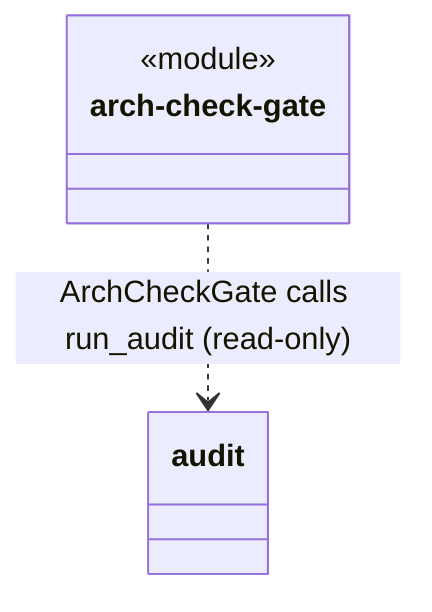
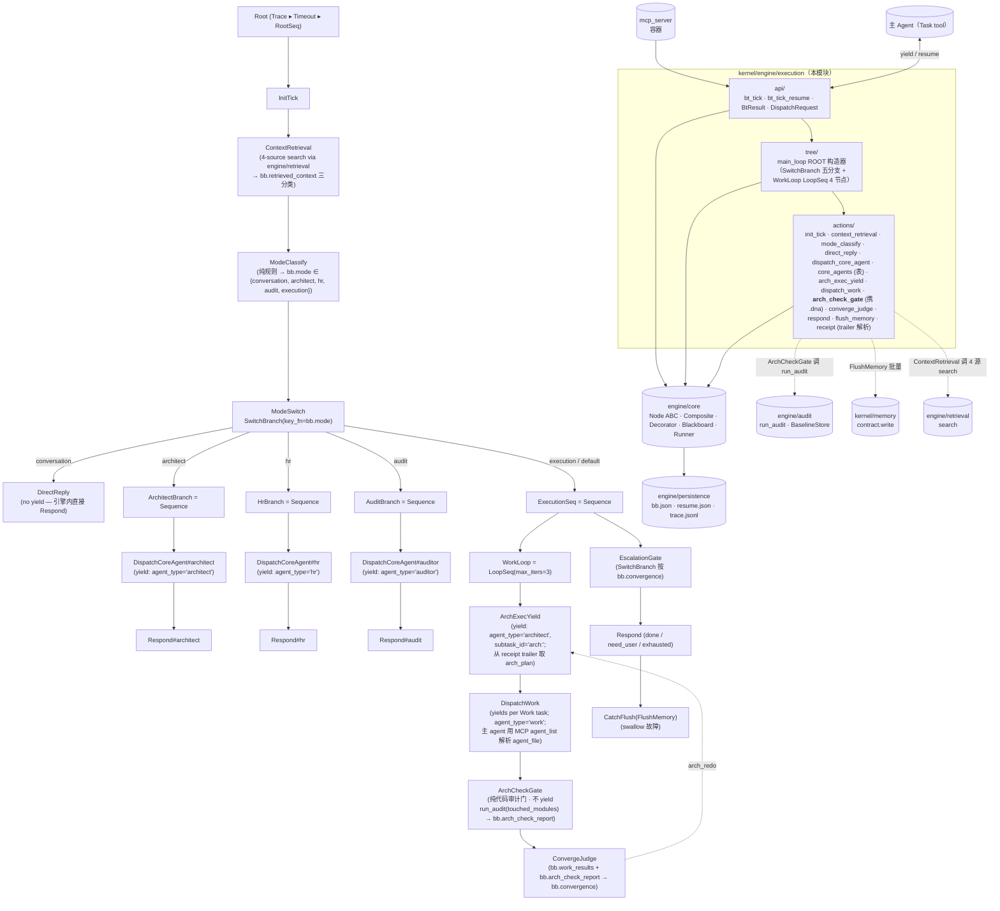

## Positioning

CBIM 执行任务循环的**驱动引擎**。每一次用户 prompt 触发一次全局根节点 tick，由树拓扑决定派谁、装饰器决定异常治理、黑板承载全部跨节点状态。主 agent 不再是"控制流 + 执行手"，退化为"具备 Task 工具的执行手"——控制流被抽到本模块。

**对应文档**：[`design/WORKFLOW-EXECUTION.zh-CN.md`](../../../../../design/WORKFLOW-EXECUTION.zh-CN.md)（执行循环语义、黑板字段、树拓扑、五阶段 Action 契约）、[`../README.md`](../README.md)（引擎实现规约）。本 .dna 不重复设计稿内容——只固化"对外是什么、对内由谁负责、谁也别想破窗"。

**它不是什么**：

| 误解 | 澄清 |
|------|------|
| 五角色子循环的一员 | 不是。本模块**驱动**所有五角色子循环（Coordinator / Architect / HR / Auditor / Work Agent），自身不参与任何业务循环。 |
| 一个调度器 / 计划器 | 不是。引擎不主动派发任何任务——所有"派谁"通过 `BtResult.Yield(dispatch_request)` 交还主 agent，由主 agent 的 Task tool 实际派出。引擎不持有可执行回调。 |
| 一个事件总线 | 不是。节点之间不通过事件通信，只通过黑板字段读写。引擎不 emit 跨进程事件。 |
| 跨 session 任务调度器 | 不是。一次 tick 的生命周期止于 `BtResult.Done` / `BtResult.Error`；孤儿 tick（主 agent 崩溃留下的 `bb_status=running`）默认归档不自动恢复。是否启用孤儿恢复由部署策略决定。 |
| 一个能改 v1 提示词流程的兼容层 | 不是。本引擎是 v2 范式的**唯一**驱动机制，与 v1 的 CLAUDE.md 自驱流程互斥；上线后 v1 提示词驱动废弃。 |

## Sub-module Relationships

**主干拓扑 v3.9**：根节点结构仍为 `Trace ▸ Timeout ▸ RootSeq`，`RootSeq = Sequence(InitTick → ContextRetrieval → ModeClassify → ModeSwitch)`；**变更点在 `execution` 分支的 `WorkLoop`：从 3 节点扩为 4 节点**——`LoopSeq(ArchExecYield → DispatchWork → ArchCheckGate → ConvergeJudge, max_iters=3)`。`ArchCheckGate` 为纯代码检测门，在 `DispatchWork` 产出后紧扣一环只读审计，写 `bb.arch_check_report`；**不 yield**、**不走 FAILURE 短路**（`tick` 永返 SUCCESS），收敛判定权仍归 `ConvergeJudge` 独有。

`ContextRetrieval` 详情（v2 记忆重设计后新增的前置叶）：

- **输入**：`bb.user_request`。
- **动作**：同步调 4 次 `engine/retrieval.search(source, query=user_request, top_k=N_per_source)`，源分别为 `"transcript"` / `"memory_medium"` / `"dna"` / `"agents"`。
- **输出**：按源分桶拼装为三类上下文写入 `bb.retrieved_context`：
  - `recent_memory` = transcript + memory_medium 的 Hit（RRF 融合）
  - `agents` = agents 的 Hit
  - `module_knowledge` = dna 的 Hit
- **不 yield**：`engine/retrieval` 是同步嵌入式接口，不需调外部 agent。
- **下游消费者**：`ArchExecYield._compose_prompt` 读 `bb.retrieved_context.module_knowledge` 作为「知识快照」填入到架构师 prompt；`DispatchCoreAgent` / `DispatchWork` 也可按需读 `agents` / `recent_memory` 桶。
- **失败语义**：retrieval 报错不阻断 tick（`@Catch` 包装）；写 `bb.retrieved_context = {"recent_memory":[], "agents":[], "module_knowledge":[]}` 后继续。

| Mode | 子树 | 是否 yield | DispatchRequest.agent_type |
|------|------|------------|----------------------------|
| `conversation` | `DirectReply` | 否（引擎内直接 Respond） | — |
| `architect` | `ArchitectBranch = Sequence(DispatchCoreAgent#architect → Respond#architect)` | 是（一次） | `"architect"` |
| `hr` | `HrBranch = Sequence(DispatchCoreAgent#hr → Respond#hr)` | 是（一次） | `"hr"` |
| `audit` | `AuditBranch = Sequence(DispatchCoreAgent#auditor → Respond#audit)` | 是（一次） | `"auditor"` |
| `execution`（含 default 回退） | `ExecutionSeq = Sequence(WorkLoop=LoopSeq[ArchExecYield, DispatchWork, ArchCheckGate, ConvergeJudge] → EscalationGate → CatchFlush(FlushMemory))` | 是（架构师 1–3 次 + 每个 Work 任务 1 次；ArchCheckGate 不 yield） | `"architect"` / `"work"` |

**v3.6 重要变更：`HrExecution` 子树从 `ExecutionSeq` 中移除。** 执行链路从 `arch_exec → hr_exec → DispatchWork` 简化为 `WorkLoop(ArchExecYield + DispatchWork + ConvergeJudge)`。理由：(a) 现有 Work Agent 集合短小（programmer / coder / tester …），LLM 能在 yield 时直接匹配，无需引擎内子树流转；(b) 真正的能力缺口治理是治理根 `hr_gov` 子循环的职责，不放在执行热路径上。**`hr` 分支与 `hr_gov` 治理子树保持不变**。

**v3.7 重要变更：`arch_exec` 子树从 in-process 多叶坤缩为 `ArchExecYield` 单节点 yield。** 架构师执行的 LLM 调用完全走外部 agent persona（`.claude/agents/architect/architect.md`）；原 `intent_analyze / decompose / arch_gate / scan / extract / worth / state_check / diff / create / validate / map_tasks / assemble` 多叶全部下架，`engine/core` 中的 `LlmActionLeaf` 原语也同步下架。

**v3.9 重要变更：`WorkLoop` 从 3 节点扩为 4 节点，新增 `ArchCheckGate`。** 该节点位于 `DispatchWork` 之后、`ConvergeJudge` 之前的固定一环，对本轮 arch_plan 声明的 `touched_modules` 调 `engine/audit.run_audit(checks=[dna_tree, dna_fission])`，按 `BaselineStore` 棘轮折算后写 `bb.arch_check_report`。详见子模块 [`actions/arch_check_gate/.dna/module.md`](../actions/arch_check_gate/.dna/module.md)。**架构师必须在 `arch_plan` 的 task.params 中填 `touched_modules`**——该字段是 arch_plan 契约的必填字段，缺失即视为协议违规。

**`DispatchWork` 的 agent_file 解析职责改由主 agent 承担**：架构师在 `arch_plan` 每个 task 上写 `required_capability`（枚举值见 `arch_exec_yield.py::_KNOWN_CAPABILITIES`：programmer / doc_writer / generalist），**不**写 `agent_file`。`WorkAgentLeaf.tick` yield 出的 `DispatchRequest` 携带 `agent_file=None` 与新增的 `required_capability` 字段；主 agent 据此调 MCP `agent_list` 匹配 `.claude/agents/*.md`，匹配不到则回退到默认 work agent `.claude/agents/programmer/programmer.md`。匹配逻辑由 CLAUDE.md 主 agent 提示词承载，不在引擎进程内。

**核心 agent 三分支共享的路径表**：`DispatchCoreAgent(agent_type=...)` 的 `agent_file` 由 `actions/core_agents.py::CORE_AGENT_FILES` 唯一来源解决——这是三大核心 agent → `.claude/agents/*.md` 路径映射的 SoT。三个分支结构同构，差异只在构造 `DispatchCoreAgent` 时传入的 `agent_type` 字符串与对应 `Respond` 节点名后缀。Work Agent 不在该表内——其 `.claude/agents/*.md` 选择由主 agent 在收到 yield 时即时匹配。

**子模块关系**：

| 关系 | 方向 | 说明 |
|------|------|------|
| `tree` → `engine/core` + `actions` | 静态拼装 | `tree/main_loop.py::build_root()` 用 `Sequence(...)` `SwitchBranch(...)` `LoopSeq(...)` `Trace(Timeout(...))` 拼出 `ROOT` 常量；不参与运行时调度 |
| `actions/context_retrieval` → `engine/retrieval` | 同步 4 源 search | 不 yield；retrieval 是同步嵌入式接口。失败被 `@Catch` 吞掉 |
| `actions/arch_exec_yield` → `engine/core` + `actions/core_agents` + `actions/receipt` | yield 单叶 | 单次 yield 到架构师 agent；`on_resume` 调 `parse_trailer` 取 `arch_plan` |
| `actions/dispatch_work` → `engine/core` + `actions/receipt` | yield 多叶顺序 | 为 `bb.arch_plan` 每个 task 生成一个 `WorkAgentLeaf`，严格顺序执行；`on_resume` 调 `parse_trailer` 写 `bb.work_results` |
| `actions/arch_check_gate` → `engine/audit` | 同步只读审计 | 不 yield、不持回调；调 `run_audit(checks=[dna_tree, dna_fission])` + `BaselineStore` 折算后写 `bb.arch_check_report`。携自有 `.dna/` 是 execution 名下首个 `actions/` 叶独立成模块的例外——参见下面「不对称」决策 |
| `actions/converge_judge` → `engine/core` | 纯代码 | 聚合 `bb.work_results` + `bb.arch_check_report` 写 `bb.convergence`；arch_redo 上限由 LoopSeq max_iters 控制 |
| `actions/*` 普通叶 → `engine/core` | 实现 `Node` ABC | 每个 Action 是 `engine.core.Node` 的一个子类，签名 `tick(bb) -> Status` |
| `api` → `tree` + `engine/core` + `engine/persistence` | 入口启动 / 恢复 | `bt_tick` 读 `ROOT` 启 `engine.core.Runner`；`bt_tick_resume` 调 `persistence.snapshot.read_bb / read_resume` 后由 Runner 按 `runner_resume_path` 重建栈；路径前缀注入为 `.cbim/scheduler/bt/<tick_id>/` |

**黑板关键字段 (v3.9 升级)**：

| 字段 | 写者 | 读者 | 说明 |
|------|------|------|------|
| `arch_plan` | `ArchExecYield`（从 receipt trailer 解析写入） | `DispatchWork` / `ArchCheckGate` / `ConvergeJudge` | task.params 中 **`touched_modules` 是必填字段**；架构师漏写即视为协议违规，`ArchCheckGate` 写 fail verdict 让 `ConvergeJudge` 触发 arch_redo |
| `work_results` | `DispatchWork` | `ConvergeJudge` | 不变 |
| `arch_check_report` | `ArchCheckGate`（v3.9 新增唯一写者） | `ConvergeJudge`（只读，不写） / `Respond`（耗尽时渲染 summary） / 调试观测 | 进入 `engine/core/blackboard.py` 的 `_PERSISTED_EXTRAS`；SCHEMA_VERSION 由 4 推进至 5；verdict.pass_=False 优先级 > needs_user_input > needs_arch_decision > done |
| `convergence` | `ConvergeJudge` | `EscalationGate` / `Respond` | 不变；棘轮判定走 `convergence ∈ {arch_redo, done, exhausted, needs_user_input}` |

**无循环依赖**——单向自顶向下：`api → tree → {engine/core, actions} → {engine/persistence, engine/audit, memory.contract, engine/retrieval.contract}`。

**注：`engine/core` / `engine/persistence` / `engine/retrieval` 是 execution 和 dream 共享的平级原语库**——都不属于任一根内部。两根（`engine/execution` 与 `engine/dream`）都依赖 `engine/core` 的 Node ABC / Composite / Decorator / Runner / Blackboard，同时两根都依赖 `engine/persistence/` 的持久化与 trace 文件格式、两根都依赖 `engine/retrieval/` 的检索原语；但两根各持独立根树、独立黑板、独立入口工具。依赖方向 `execution → engine/core`、`dream → engine/core`，**execution 与 dream 互不依赖**（单向铁律）。`engine/audit` 与 execution 是同为 engine 子模块的兄弟；execution 通过 `ArchCheckGate` 单向依赖 audit，audit 不反向依赖 execution。

## Origin Context

CBIM v1 的执行循环是主 agent 在 CLAUDE.md 提示词内自驱：主 agent 同时是控制流（"现在该做什么"）与执行手（"用 Task tool 派谁"）。这导致：

- **控制逻辑不可静态审计**——必须读 prompt 才能知道决策路径；
- **异常处理散落各处**——"如果 X 则 Y"分散在每段提示词里；
- **恢复语义模糊**——一次任务的状态混在对话历史里，无法精确"从中断点继续"。

v2 把控制流抽到引擎，主 agent 退化为执行手。树拓扑可读、装饰器统一异常、状态全在黑板 + `.cbim/scheduler/bt/<tick_id>/`，与对话历史解耦。这就是本模块存在的全部理由。

**双根架构的引擎载体**：BT 引擎不止驱动一棵根树。CBIM 有两个根循环——执行循环（用户驱动，本模块的 `tree/main_loop.py`）和治理循环（SessionStart 补跨驱动，`engine/dream/tree/dream_root.py`）——都跑在本模块的 `core/` 之上。共享行为树引擎本体而黑板 / 根树 / trace / 入口工具各自独立，是 CBIM 双根架构的工程实现方式。

## Key Decisions

- **行为树是 v2 唯一的驱动机制。** 不是“可选优化”，不是“补丁”。本模块上线后，v1 的 CLAUDE.md 自驱流程废弃。控制流的产权从提示词收归到 `tree/main_loop.py`；主 agent 提示词只描述“如何忠实执行 Task tool 派出的子任务”。
- **黑板是跨节点状态的唯一容器。** 节点对象**不持有任何跨 tick 状态字段**——这是 design §2 铁律。节点对象在 Runner 视角是无状态可重建的；任何“在节点上加个 self.x”的写法都是破窗，会让恢复执行不可能正确。组合节点的“当前子节点指针”也必须落黑板（写入 `bb.runner_resume_path` 最后一段），组合节点对象不存。
- **黑板字段单写多读 + schema 校验。** design §2.1 的 14 字段每个都有唯一写者（Root / ModeClassify / DispatchCoreAgent / DispatchWork / Respond / FlushMemory / 引擎自身）；其他节点只读。`bb.json` 落盘前 Runner 按 schema 校验，违规即 `BtResult.Error`。这是恢复正确性、可审计性、调试性的共同地基。`agent_assignments` 字段随 hr_exec 一同废弃，该字段从 blackboard FIELDS 中删除（schema_version 由 2 推进至 3）。`audit_report` 字段随 v3.7 引擎收口同步删除，blackboard FIELDS 中不再保留。
- **节点 Status 三态封死。** `Status = {SUCCESS, FAILURE, RUNNING}`。**不引入 INVALID 等第四态**——这类语义全部由装饰器（Catch / IterationGuard）转换为 SUCCESS/FAILURE/RUNNING 之一并写 `bb.interrupt_reason`。叶节点不抛业务异常；业务错误一律走 FAILURE + `bb` 状态字段。
- **RUNNING 跨 tick 恢复 = `bb.runner_resume_path` + 黑板状态字段。** Runner 落 `bb.json` + `resume.json`，下次 `bt_tick_resume` 读盘 → 按路径重建栈 → 通过 `on_resume(bb, payload)` 把 dispatch 结果交给路径末端的 Action → 继续 `tick(bb)`。重建出的是“中断前的同一棵活树”——这是节点无状态铁律的全部价值。
- **协程式 yield/resume 是 `bt_tick` 的唯一形态（L7 决议）。** 引擎不持有可执行回调、不主动派工。需要派 agent 时把 `DispatchRequest` 装进 `BtResult.Yield` 返回给主 agent，由主 agent 用 Claude Code Task tool 实际派出，结果通过 `bt_tick_resume(tick_id, dispatch_result)` 回交。**严禁引擎自派绕过 Task tool**——绕开会破坏 Claude Code 的会话/权限/计费模型。
- **LLM 调用边界全部收拢到 `.claude/agents/*.md` persona 内（v3.7 之后）；引擎进程内不再存在任何 LLM 调用节点（含已下架的 `LlmActionLeaf`）。** 调度逻辑全程 PROG——树拓扑（`tree/main_loop.py`）、Composite/Decorator 行为、Runner 调度全是确定性 Python 代码，可静态审计、可单步重放。需要 LLM 决策的位点统一通过 `BtResult.Yield(DispatchRequest)` 移交给外部 agent persona，引擎不再持有任何 LLM 客户端注入点。

### 子循环 = 真实 BT 子树（不再是 NodeSpec 描述器）

- **architect_execution 已从 in-process 子树坍缩为一次性 yield。** v3.6 之前的「intent_analyze / decompose / arch_gate / scan / extract / worth / state_check / diff / create / validate / map_tasks / assemble」等多 LLM 叶节点全部下架；现由 `actions/arch_exec_yield.ArchExecYield` 单节点 yield 到 `.claude/agents/architect/architect.md` 持人格代理，由该 agent 自行完成决策并通过 receipt trailer 的 `arch_plan` 字段回执。换言之，架构师执行循环的全部 LLM 调用从「引擎进程内多个 `LlmActionLeaf`」迁移到「执行模式架构师 agent 单次对话」。
- **原 `hr_exec` 子树在 v3.6 中删除**——`actions/hr_exec/` 包、`loops/hr_execution.py` 身上的 `build_hr_execution_subtree` 重导出、`blackboard.FIELDS` 中的 `agent_assignments` 均同步下架。能力匹配职责改由主 agent 收到 `agent_type="work"` yield 时调 MCP `agent_list` 完成；HR 仅保留 `hr` mode 直答与 `hr_gov` 治理两条路径。
- **三个核心 agent 分支仍然各 yield 一次（适用到 architect / hr / audit 三 mode）**。三个分支通过 `DispatchCoreAgent(agent_type=...)` 叶节点 yield——这是主 agent 用 Task tool 派三大核心 agent 的唯一路径。
- **`ExecutionSeq` 的 yield 在 `ArchExecYield` 与 `DispatchWork` 两节点**：`ArchExecYield` 每轮（含 `arch_redo`）yield 一次给架构师 agent；`DispatchWork` 按 arch_plan 子任务数顺序 yield（一次 tick 多 yield，但**严格顺序**而非并发并行）。`CatchFlush(FlushMemory)` 是唯一走记忆落盘的位点，其他四个分支不 flush memory。
- **嵌套子树是 `engine/core` 天然支持的组合方式**。`Composite` 接受任意 `Node` 实例为子节点，递归 tick 自然完成。execution 侧不引入任何「子树宿主」特殊适配层。
- **NodeSpec 描述器与 `LlmActionLeaf` 一并废弃**。原 `loops/architect_execution.py` 中的 NodeSpec 描述器、`engine/core` 中的 `LlmActionLeaf` 原语均已下架；执行模式 LLM 调用边界从引擎进程移到 agent persona 内部。

### 5 分支模式拓扑 + 三大核心 agent 平级直派

- **根节点形态为 `Trace ▸ Timeout ▸ Sequence(InitTick → ContextRetrieval → ModeClassify → SwitchBranch(by bb.mode))`，五分支互斥。** 一次 tick 经 `ModeClassify` 定型 `bb.mode ∈ {conversation, architect, hr, audit, execution}`，SwitchBranch 据此选唯一子树执行。多阶段编排归子树内部（`execution` 分支的 `WorkLoop` LoopSeq 包含 `ArchExecYield → DispatchWork → ConvergeJudge`）或归调用方循环（用户连续 prompt），引擎根树不承担。
- **Architect / HR / Auditor 是引擎一等公民，与 Work Agent 平级。** 引擎根树为这三类各开独立分支（`ArchitectBranch` / `HrBranch` / `AuditBranch`），每个分支以 `DispatchCoreAgent(agent_type=...)` 作为 yielding 叶独立产生 `agent_type` 字段不同的 yield。三个分支结构同构 `Sequence(DispatchCoreAgent#<type> → Respond#<type>)`，差异只在构造参数。它们**不**经 HR 中转匹配——HR 自身就是其中一个 mode，绕到 HR 内部去派 Architect / Auditor 是逻辑回环。
  - **理由 1（依赖方向）**：Architect / Auditor 是控制流层产物（架构治理、独立审计），HR 是能力管理层产物（Work Agent 生命周期）；让控制流依赖能力管理是反向。
  - **理由 2（启动期可用性）**：HR 模块自身未就绪时，Architect 与 Auditor 仍需可用——否则陷入「要先用 HR 才能拿到 Architect 来设计 HR」的鸡蛋循环。
  - **理由 3（C3 单向依赖）**：三大核心 agent 各自的 `.claude/agents/*.md` 路径由引擎直接持有——SoT 是 `actions/core_agents.py::CORE_AGENT_FILES`，`DispatchCoreAgent` 构造时查表填 `DispatchRequest.agent_file`；不经任何 agent 匹配过程。Work Agent 才需要主 agent 在 yield 时匹配，因为 Work Agent 集合是开放可扩展的。
- **三个核心 agent 分支只产生一次 yield，回 resume 后直接 Respond。** 不引入「一个 mode 多次 yield 循环逼近收敛」的形态——若任务确需多轮，由用户的下一次 prompt 触发新 tick（即新一次 SwitchBranch 决策）。`execution` mode 例外：`WorkLoop` LoopSeq 含 `ArchExecYield + DispatchWork`，一次 tick 产生 1 次架构师 yield + N 次子任务 Work Agent yield。
- **ModeClassify 是唯一的 routing 决策节点（纯规则，无 LLM 兑底）。** 五分支各自的子树内部不再调 LLM 做调度决策（`Respond` / `DirectReply` 为确定性 passthrough；core-agent 分支仅负责派送 yield）；「派谁」的决策只在 ModeClassify 这一个叶节点完成、写一次 `bb.mode`、之后再不改。这保证审计与重放只需检查一个分类输入 / 输出。规则优先序（见 `mode_classify.py`， v3.7）：architect-preempt > execution-verb > architect-request > hr-request > audit-request > conversation > default(=execution)。

- **HR 职责边界与本引擎的分工（跨模块契约）。** 本引擎的 `execution` mode 的 `DispatchWork` 只负责按 `arch_plan` 的 `required_capability` yield；「能力 → `.claude/agents/*.md` agent_file」的读侧查表不由引擎进程承担，而是主 agent 收到 yield 后调 MCP `agent_list` 即时完成。HR 作为一个 CBIM 角色的职责是 Work Agent 生命周期的**写侧**（招募 / 训练 / 治理 / 能力画像），走两条独立路径：`hr` mode 的 `hr_request` 直答（用户显式「招个 X」）+ 治理根的 `hr_gov` 子循环（后台扫健康度）。反向响应「查表」的读侧职责不走 HR——详见 [`../../cbi/agents/.dna/module.md`](../../cbi/agents/.dna/module.md) 中 HR 负责能力画像与 agents 集合治理、不负责控制流上的「哪个 agent_file 能接什么活」。这是 C3 单向依赖的直接体现：控制流层（execution）不依赖能力管理层（HR）的运行时查表服务。

### v3.7 — ModeClassify 精度修复：执行意图优先 + 收紧核心 agent 触发词

- **精度优先序翻转**：从 v3.5/v3.6 的 `architect > hr > audit > execution-verb > conversation` 改为 v3.7 的 `architect-preempt > execution-verb > architect-request > hr-request > audit-request > conversation > LLM 兜底`。核心改动原则有三：(1) 执行动词率先短路，避免 "修审计模块的 bug / 重构招聘流程代码" 这类执行任务被核心 agent 主题词误抢；(2) 核心 agent 三表只匹配"显式请求该核心 agent"的短语（直呼角色名 + 派工动词、或元任务动词 + 角色专属产出），不再吃裸主题词；(3) `split/merge/deprecate (a) module` 与 `update .dna` 因语义上无 execution 落点，单独前置为 `_ARCHITECT_PREEMPT_PATTERNS` 预检层，优先于 execution 动词。Schema、契约、黑板字段、持久化均不动；唯一已知翻转的回归用例为 `test_mode_classify_architect_wins_over_execution_verb`。完整草案（问题表、五条策略、五张 pattern 表全文、新主循环顺序、回归用例、programmer 交付清单）见 [`design/MODE-CLASSIFY-V3.7.md`](../../../../../design/MODE-CLASSIFY-V3.7.md)。

### v3.8 — ModeClassify 跨表优先级修复：核心 agent 显式点名优先

- **问题**：v3.7 仍存两类跨表误判——『修一下审计日志的 bug』误进 audit（execution-verb 漏"修一下"，audit b4 含裸词"审计"被 audit 表抢走）；『请审计员做架构评审』误进 architect（architect b5 "做+架构"在 execution-verb 之后先抢走，audit 显式点名优先级排在更后）。两例的共同根因：核心 agent 的「显式点名」（直呼角色名 + 派工动词）在 v3.7 优先序中并未独立成层，而是与各表的主题词混在同一层比较，导致主题词裸匹配跑赢显式点名。
- **修法**：在 `architect-preempt` 与 `execution-verb` 之间插入新层 `core-agent explicit naming`，把架构师 / HR / 审计员各自的 `a1`（直呼角色名）+ `a2`（派工动词）显式点名 pattern 上提到该层；显式点名永远优先于动词推断，从根上杜绝「角色名被裸主题词截胡」。同时收窄三表：(1) `audit b4` 去裸词"审计"，仅保留"审计 + 复合名词"形态；(2) `architect b5` 把 deliverable 里的裸词"架构"拆为"架构图 / 架构设计"，「架构评审 / 架构审查」归 audit；(3) `execution` 中文动词补"修一下 / 改一下 / 调一下 / 顺手修 / 顺便改"，让低强度修动词也能在 execution-verb 层短路。
- **Precedence v3.8**：`architect-preempt > core-agent explicit naming > execution-verb > architect b* > hr b* > audit b* > conversation > default`。该顺序在 `mode_classify.py` 中显式编码；五张 pattern 表的内部主题词收窄使三表不再相互越界，新层只承载"显式点名"这一类高置信信号，与下游 `execution-verb` / 各表主题层语义正交。

### v3.8 — 删除 tester 能力：programmer 通用化承接测试代码

- **现状**：programmer agent 已升级为通用代码 agent，可同时承担产线代码与测试代码编写；引擎能力枚举（`_KNOWN_CAPABILITIES` / 架构师 prompt / `CORE_AGENT_CAPABILITY_TABLE`）中的 `tester` 仅在兜底层指向 `.claude/agents/programmer/programmer.md`，**并无独立 tester agent persona** 存在。enum 中保留 tester 只会让架构师在派工时误以为存在专职 tester，引发空槽位匹配与不必要的能力分类噪音。
- **决策**：从三处同步移除 `tester`——`actions/arch_exec_yield.py::_KNOWN_CAPABILITIES`、架构师 prompt 中列出的可用能力枚举、`CORE_AGENT_CAPABILITY_TABLE` 的兜底映射。删除后能力集合收敛为 `programmer / doc_writer / generalist` 三值。测试代码编写归 programmer 默认职责，不再视为独立能力维度。
- **再招聘触发条件**：当且仅当以下三条**同时**满足时，HR 才启动新一代 tester agent 招聘：(a) 测试工程出现独立工具链（独立测试框架 / 独立 CI 阶段 / 独立测试数据治理）；(b) 测试评审周期独立于代码评审周期（测试 PR 与代码 PR 走两条评审流）；(c) 单一 programmer 因测试责任过载，出现测试代码质量下滑或迭代节奏被测试任务挤占的客观信号。三条任缺其一，tester 留在 programmer 名下。

### v3.9 — ArchCheckGate 插入 WorkLoop：架构合规门与收敛判定解耦

- **`ConvergeJudge` 对 `bb.arch_check_report` 只读不写。** 写者唯一 = `ArchCheckGate`（黑板 schema 强制）。`ConvergeJudge` 仅读 `verdict.pass_` 与 `unresolved` 决策跳 arch_redo，不允许修改 `arch_check_report` 中任何字段（含「重新分类严重性」「调整 unresolved 集合」等隱式重写）。该单写多读隔离是审计棘轮可追溯性的全部前提——任何「启发式抻决」提议都要走 contract 变更；黑板 schema 校验阶段拒绝 `ConvergeJudge` 对 `arch_check_report` 的写动作。
- **`verdict.pass_=False` 优先级 > `needs_user_input` > `needs_arch_decision` > `done`。** `ConvergeJudge` 在计算 `bb.convergence` 时按该优先序检查信号源：首先看架构合规门（`arch_check_report.verdict.pass_=False` → `arch_redo` + `unresolved` 灌入 `arch_redo_context`，除非 LoopSeq max_iters 耗尽转 `exhausted`），再看 Work 层信号（`needs_user_input` / `needs_arch_decision` / `done`）。理由：架构师写出的 .dna 不合规是「为上游一切后续判定奉为地基」的问题——论上游让下游 Work Agent 在不合规的设计上提问或升级决策是糟践资源，架构修正必须先于业务决断。`done` 位于最低位业主要则表示「只有架构合规 + 无人补问 + 无需架构重决三者同时成立才谈完成」。
- **`actions/arch_check_gate/` 是 execution 名下首个携自有 `.dna/` 的 `actions/` 子项，其他叶节点仍属 execution 内部代码——不对称是合理的。** 让某个叶独立成模块的唯一理由是「它承载跨模块边界的独立不变量」：`ArchCheckGate` 携着 INV-CHECK-GATE-1（100% 确定性代码、零 LLM 参与）与 `dependencies: [engine/audit]` 两项爵位，必须独立审计入口且加锁粒度为 `dna_tree` / `dna_fission`；而 init_tick / mode_classify / context_retrieval / dispatch_core_agent / arch_exec_yield / dispatch_work / converge_judge / respond / flush_memory / receipt 都是 execution 内部控制流叶，不过跨模块边界，不需要各自 .dna。未来若再有叶在同一意义上承载独立跨模块契约（例如一个接入外部 retrieval 子系统的 gate），同样可独立成模块——不对称准则是「跨模块契约与独立不变量」，不是「代码量」或「重要性」。

- **召回有 hook 与 BT 双路径，受众不同、互不替代。** `ContextRetrieval` 叶（本模块 `RootSeq` 内、`ModeClassify` 前）走的是 **BT 内 prompt 级召回**——拼装 `bb.retrieved_context` 三分类后由 `ArchExecYield._compose_prompt` / `DispatchCoreAgent` / `DispatchWork` 注入到**外发子 agent 的 prompt** 中（受众 = 被派出的 architect / hr / auditor / work agent）。与之并存但边界清晰的是 `.claude/hooks/cbim_user_prompt_submit.py` 在每次用户输入提交时跑的 hook 召回——经 `additionalContext` 注入到 **coordinator 主上下文**（受众 = 主 agent 自身）。两条路径共用 `engine/retrieval` 同一套 4 源 search 接口，但受众层级正交：hook 路径让 coordinator 看见「永久知识 + 相关记忆」，BT 路径让具体执行 agent 看见「与本任务相关的模块知识 / 历史决议 / 同行能力」。子 agent **不**自动继承 coordinator 主上下文，所以 BT 内的召回不可被 hook 召回替代。

## Non-Goals

- **不引入事件总线。** 节点之间只通过黑板通信，引擎不 emit 跨进程事件、不发布订阅、不广播。
- **不做 scheduler。** 本模块不持有"何时该跑什么"的判断——一次 tick 由用户 prompt 触发，结束于 Done/Error；跨 prompt 的任务编排不在本模块范围。
- **不做跨 session 持久化的任务调度。** `.cbim/scheduler/bt/<tick_id>/` 仅服务于"单次 tick 内的 yield/resume 恢复"。主 agent 崩溃后的孤儿 tick 默认归档不自动续跑；`bt_list_running_ticks()` 仅提供观测，不提供续跑承诺。
- **不主动派 Work Agent 绕过 Claude Code Task tool。** 任何 Action 需要派子 agent 一律通过 yield → 主 agent Task tool → resume 回路。引擎进程内**不**持有任何"直接调用其他 agent 的客户端"。
- **不暴露黑板直接写。** 黑板字段的写者由 design §2.1 表锁定；外部（包括主 agent、MCP 调用方、其他 engine 子模块）不能跨过 Action 直接写 bb。
- **不复用 engine.logger 的 session 日志通道做节点 trace。** 节点 trace 走自管 `trace.jsonl`（append-only，可重放）；session 级日志归 `engine.logger`，两套观测体系互不串扰。

- **不回退到"单次 LLM 调用包揽子循环全程"的描述器模式。** 子循环的每个节点必须拥有独立 prompt 与独立 parse；任何"为了节省 token / 升途设计重新把多个语义步骤填进一个 prompt"的重构提议被明确拒绝。审计 / 重试 / 调试粒度为以 LLM 调用为单位，这是不可赎回的约定。
- **不保留 NodeSpec 描述器产出路径。** `loops/architect_execution.py` / `loops/hr_execution.py` 中的 NodeSpec 仅作为兼容垫片；不再被引擎调度入口调用，下一个版本与 `compose_prompt` 辅助函数一同废弃。

### 5 分支拓扑边界锁定

- **不新增第 6 个 mode（特别是不加 `memory_query` mode）。** 记忆查询不构成根级控制流分支——它要么是某个 Action 内部对 `memory_query` MCP 的调用（如 `mode_classify` 检索历史辅助分类、`respond` 渲染时引用过往决议），要么是用户显式 prompt 触发的 `direct` mode 内回答。把"查记忆"拔到 mode 级别会让根树不可枚举闭合，破坏 SwitchBranch 的有限分支约束。任何"我们再加一个 mode"的提议都要先回答"为什么不能塞进现有 5 个之一"。
- **不把 Auditor 移到 HR 下管理。** Auditor 是引擎一等公民——独立 `.claude/agents/auditor/auditor.md`、独立 `DispatchAuditor` 子树、独立 `agent_type="auditor"` 的 yield。任何"让 HR 统一管所有 agent 包括 Auditor"的重构提议被明确拒绝：Auditor 的独立性是审计权威性的前提，受 HR 调度的审计员不再是独立审计员。Architect 同理。
- **不允许 mode 在一次 tick 内改写。** `ModeClassify` 写完 `bb.mode` 后字段封死；后续节点（含 resume 后重入的节点）只读不写。需要切换 mode 只能通过用户的下一次 prompt 触发新 tick。这保证 SwitchBranch 选择在一次 tick 内幂等，恢复时无需考虑"中途改道"。

- **不在执行热路径上做 agent 能力匹配。** `agent_file` 解析归主 agent 收到 `BtResult.Yield(agent_type=work)` 时调 MCP `agent_list` 完成（这是系统级查询能力，主 agent 即时调用）；HR 的真正职责在写侧——招（招募）/ 训（训练）/ 治（治理），通过 `hr` mode 的 `hr_request` 直答路径 + `hr_gov` 治理子循环两路径承载，与执行热路径的读侧能力查表彻底解耦。

## Outbound

- **engine/core（复用）** —— Node ABC / Composite / Decorator / Runner / Blackboard 全部依赖。`engine/core` 是 execution 和 dream 共享的平级行为树原语库，不属于任一根内部；两根各自依赖、互不依赖。
- **engine/persistence（共享持久化）** —— `engine.core.Runner` 调 `snapshot.write_bb` / `write_resume` / `read_bb` / `read_resume`，调 `trace.append_event`。路径前缀由 `api/bt_tick.py` 注入为 `.cbim/scheduler/bt/<tick_id>/`。与 `engine/dream` 共用同一个持久化模块，该模块本身不区分两根；磁盘路径隔离是调用方职责。
- **engine/retrieval（上下文召回）** —— `ContextRetrieval` 节点调 `retrieval.search("transcript" / "memory_medium" / "dna" / "agents", query=user_request, top_k)` × 4，拼装三类上下文写入 `bb.retrieved_context`。同步调用，不 yield；失败被 `@Catch` 吞掉后写空上下文继续。
- **kernel/memory（contract）** —— 仅 `FlushMemoryAction` 调 `memory_write`；其他 Action 严禁直接调记忆服务，只能往 `bb.memory_flush_queue` push。记忆故障被 `@Catch` 吞掉，不阻塞用户回复。
- **mcp_server（反向，容器）** —— 不在本模块 dependencies 中；`mcp_server` 把 `api/bt_tick.py` 的两个函数注册为 MCP 工具，函数签名即工具签名。引擎不感知 MCP 容器存在。

依赖方向：`execution → engine/core`、`execution → engine/persistence`、`execution → engine/retrieval.contract`、`execution → memory.contract`、`mcp_server → execution`。无环。

