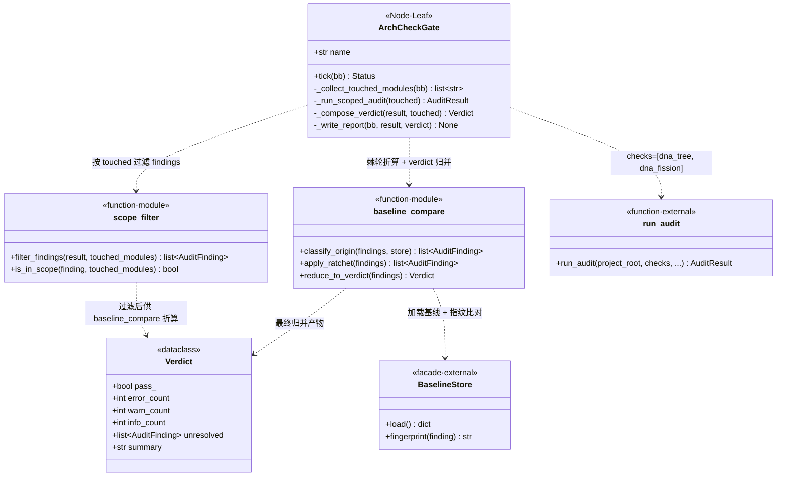

## Positioning

程序化检测门——`WorkLoop` 内紧 `DispatchWork` 之后、`ConvergeJudge` 之前的固定一环。对本轮架构师 `arch_plan` 中声明的「触及模块」跑只读 `run_audit`，按 `BaselineStore` 棘轮折算 verdict，**写入** `bb.arch_check_report` 即返。**100% 确定性代码、零 LLM 参与、不持回调、不 yield**——这是它存在的全部理由。

**对应文档**：父模块 [`../../.dna/module.md`](../../.dna/module.md) 描述 `WorkLoop` 4 节点拓扑（v3.9 升级）；审计入口 [`../../../audit/.dna/module.md`](../../../audit/.dna/module.md) 描述 `run_audit` / `BaselineStore` 契约；本叶仅负责「按需调审计 + 棘轮折算 + 写黑板」三件事。

**它不是什么**：

| 误解 | 澄清 |
|------|------|
| 一个新的审计实现 | 不是。审计逻辑全部沿用 `engine/audit.run_audit`；本叶只是按 `touched_modules` 过滤入参、按 `BaselineStore` 折算 origin、按规则映射 verdict。 |
| LLM 决策节点 | 不是。本叶**禁注**任何 LLM 客户端、`callback`、`dispatcher`；构造期 AST 守门校验。需要 LLM 介入的是下游 `ConvergeJudge` 与架构师 redo（消费 `arch_check_report`），不是本叶。 |
| Yield 节点 | 不是。本叶**不实现** `on_resume`——它的 `tick` 在一次调用内完成 `run_audit` 同步调用与黑板写入，立刻返回 `SUCCESS`。任何「跨 tick 异步审计」的扩展提议都要走 contract 变更，本叶拒绝隐式 yield。 |
| 失败短路的守门 | 不是。`tick` 永远返回 `SUCCESS`——pass/fail 通过 `bb.arch_check_report.verdict.pass_` 字段传递给下游 `ConvergeJudge` 决策，**不走 Status 短路**。原因：让 LoopSeq 的 max_iters / arch_redo 流程仍由 `ConvergeJudge` 统一裁决，避免 FAILURE 短路绕过收敛判定。 |

## Class Diagram

**数据流**（一次 tick 内同步完成，不跨 tick）：

1. **读** `bb.arch_plan.params.touched_modules` → `list[str]` 模块路径集合（必填字段；缺失即视为 `arch_plan` 协议违规，返回 `SUCCESS` 同时写一个 `verdict.pass_=False, summary="missing touched_modules"` 的报告，由下游 `ConvergeJudge` 处理）。
2. **调** `engine.audit.run_audit(project_root, checks=["dna_tree", "dna_fission"])`——只跑两个与「触及模块」直接相关的检查，**不**全量审计（全量审计走治理根 `engine/dream`）。
3. **scope_filter**：把 `AuditResult.findings` 按 `finding.target` 是否落在 `touched_modules` 集合内过滤——非触及模块的存量 drift 不进本轮 verdict（避免「无关历史问题误伤本次任务」破窗）。
4. **baseline_compare**：调 `BaselineStore` 为剩余 findings 打 `origin` 标，按各 check 的 `lenient/strict` 策略应用棘轮（与 `engine/audit` 决策表一致——不在本叶硬编码 check 名）。
5. **reduce_to_verdict**：把棘轮后 findings 归并为 `Verdict`——`pass_ = (error_count == 0)`；`unresolved` 字段保留所有 `severity >= warn` 的 findings 全文，供下游 `ConvergeJudge` 灌入 `arch_redo_context`。
6. **写** `bb.arch_check_report = {verdict, findings, ran_at, scoped_to: touched_modules}`，**返回** `Status.SUCCESS`。

## Key Decisions

- **INV-CHECK-GATE-1：100% 确定性代码、零 LLM 参与。** 不变量由四条铁律共同保证：(a) `ArchCheckGate.__init__` 签名禁注任何 `callback` / `llm_client` / `dispatcher` 参数；(b) 类体内无 `on_resume` 方法实现（违反则 mypy/AST 静态检查在 CI 红灯）；(c) `tick` 方法体内不允许出现 `BtResult.Yield` / `DispatchRequest` 任何符号引用；(d) AST 测试守门固化前三条——位于 `v1/tests/framework/test_arch_check_gate_purity.py`，扫描本模块 `__init__` 签名、方法名集合、`tick` 字节码常量池。任意一条破窗 = CI fail，PR 不许合。
- **检查集合固定为 `[dna_tree, dna_fission]`。** 这两个检查是与「本轮架构师写出的 .dna 改动是否合规」直接相关的最小集合——`dna_tree` 拦循环依赖 / 孤儿 / dangling，`dna_fission` 拦单模块超界。其他三个检查（`index_consistency` / `memory_threshold` / `agent_fission`）与本轮 arch_plan 触及的代码无直接因果——它们是治理根 `engine/dream` 的常驻关注点，不进本叶热路径。**新增检查必须走 contract 变更**——不在本叶随手加 check 名。
- **`scope_filter` 是「无关历史问题不误伤本次任务」的护栏。** 项目长期积累的 drift（例如未触及模块的 dangling dep）不属于本轮架构师的因果责任；本叶只看「这次 arch_plan 改动过的模块」是否引入或留存合规问题。判别依据为 `finding.target` 落在 `bb.arch_plan.params.touched_modules` 集合内（精确路径匹配，不递归子树——子树差异由父模块自身的 `touched_modules` 显式声明）。
- **数据流：`bb.arch_plan.params.touched_modules` 是单一信号源。** 该字段由架构师在执行模式 receipt trailer 的 `arch_plan` 中显式声明（参见父模块决策「架构师 redo prompt 显式禁止『建议关闭检查/标记忽略』」）；本叶**不**自己推断「哪些模块被改了」——任何「从 git diff / 文件系统扫描推断」的提议都被拒绝（破坏审计透明性，且让架构师可以「忘了写就静默放行」）。架构师漏写 touched_modules = arch_plan 协议违规 = 本叶写 fail verdict 让下游 redo。
- **`tick` 永远返回 `SUCCESS`——pass/fail 走黑板字段不走 Status。** 原因：`WorkLoop = LoopSeq(ArchExecYield → DispatchWork → ArchCheckGate → ConvergeJudge, max_iters=3)`，LoopSeq 的 max_iters 与 arch_redo 决策权归 `ConvergeJudge` 统一持有。若本叶 FAILURE 短路，会让 LoopSeq 跳过 `ConvergeJudge` 直接退出循环——这破坏「收敛判定唯一入口」铁律，且让 `bb.convergence` 字段语义模糊（究竟是检查 fail 还是收敛失败？）。FAILURE 路径仅留给「`run_audit` 本身抛异常」的纯技术错误（被 `@Catch` 装饰器吞掉转 SUCCESS + 写 verdict.pass_=False, summary="audit infra error: ..."）。
- **`bb.arch_check_report` 是单写多读字段。** **写者唯一** = `ArchCheckGate`（schema 校验阶段强制）。**读者**：(a) `ConvergeJudge`——读 `verdict.pass_` / `unresolved` 决策 arch_redo；(b) `Respond`——若最终 verdict 为 fail 且 max_iters 耗尽，把 `summary` 渲染入用户回复；(c) 调试观测——dashboard 与 trace.jsonl 重放器直接读 `bb.json` 中本字段，无需调任何 API。该字段进入 `engine/core/blackboard.py` 的 `FIELDS` 表，schema_version 由 4 推进至 5；schema_version 升级走 `_PERSISTED_EXTRAS` 向后兼容读取策略。
- **fail → `ConvergeJudge` 把 `unresolved` 灌入 `arch_redo_context.unresolved` 作为「只读修改指令」。** 架构师 redo prompt 的 `unresolved` 字段语义被本叶约束为「audit findings 全文 + scope + suggestion」，架构师必须按此修改 .dna；prompt 内显式禁止以下三类回复：(1)「这是历史遗留可忽略」（→ baseline accept 是人类显式动作，不是 LLM 推理产物，参考 `engine/audit` 决策「audit 进程仍 read-only」）；(2)「建议关闭该检查」（→ 检查集合改动走 contract 变更）；(3)「标记为已知问题」（→ 不存在该机制）。架构师必须真改 .dna 让下一轮 audit 通过——这才是棘轮真正落地的方式。
- **`baseline_compare` 不在本叶硬编码 check 策略表。** 各 check 的 `lenient/strict` 策略由 `engine/audit` 持有（参见 audit 模块决策「棘轮降级表」）；本叶通过 `BaselineStore` 与 audit 提供的策略函数调用，**不**复制策略字典——避免「audit 改了策略本叶没跟上」的双写漂移。
- **本叶是 `execution` 名下首个携自有 `.dna/` 的 `actions/` 子项；其他叶节点仍属 execution 内部代码。** 不对称合理：(a) 本叶承载 INV-CHECK-GATE-1 这条独立不变量，需要独立审计入口让 `dna_tree` / `dna_fission` 单独识别；(b) 本叶是「audit 子系统消费方」的样板对接点，独立 .dna 让 `dependencies: [engine/audit]` 直接落到正确粒度（若并入 execution，则 execution 整体多一条对 audit 的依赖，但绝大多数 execution 叶其实无关）；(c) 其他叶（init_tick / mode_classify / dispatch_work / converge_judge / respond / flush_memory 等）是 execution 内部的常规控制流节点，不承载跨模块边界契约，留在 execution 内部代码层即可。该不对称**仅适用于 audit 消费方**——未来若再有叶承载独立跨模块契约（例如对接 retrieval 的某个新 gate），同样可独立成模块。
