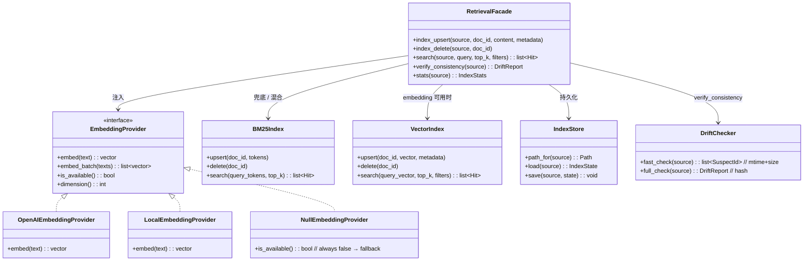

## Positioning

**项目本地的检索原语库**，类比一个嵌入式的向量+关键词索引引擎。承载 embedding provider 抽象、BM25 兜底、索引存储、相似度计算、4 源检索 API、漂移校验。**对四个数据源（CC transcript / `.cbim/memory/medium/` / `.dna/` / `.claude/agents/`）一视同仁**，但本模块**不知道**这些源的语义——它只知道 `(source, doc_id, content, metadata)` 四元组。

本模块定位于 `engine/` 之下，与 `engine/execution`、`engine/dream`、`engine/core`、`engine/persistence` 平级，是 CBIM 双根循环（execution 前置召回 + dream 全量校验）共同依赖的核心基础设施层。语义对调用方一视同仁——`memory` / `dna` / `agents` 各自的写入工具也通过这条同一基础设施做同步索引。

**它不是什么**：

| 误解 | 澄清 |
|------|------|
| 记忆服务的子模块 | 不是。`memory` 与本模块是两个独立模块；`memory.crud.write` 把记忆条目落盘后**调用** `retrieval.index_upsert` 作为副作用，但本模块不知道"记忆条目"这个概念。 |
| 知识系统的子模块 | 不是。`.dna/` 写入工具（`dna_edit` / `dna_init` 等）同样会调 `retrieval.index_upsert`，但本模块不知道"模块"概念。 |
| `engine/execution` 的子模块 | 不是。execution 只是本模块的若干调用方之一；dream 也是；memory 写入路径也是。本模块与 execution / dream 在 `engine/` 下平级，互不归属。 |
| 一个会主动扫文件的索引器 | 不是。本模块只接受写入工具的同步调用；**不**主动扫文件、**不**起后台线程、**不**自带触发器。增量同步由调用方负责。 |
| 一定要外接 embedding API 才能用 | 不是。`EmbeddingProvider` 可插拔；当外部 API 不可用或未配置时，自动降级到 BM25 关键词检索，**保证零外部依赖也能工作**。 |
| 一个对话上下文管理器 | 不是。"近期记忆 / agent 信息 / 模块知识图谱"三分类拼装是**调用方**（`engine/execution` 的 retrieval 节点）的语义；本模块只返回排序后的命中列表，谁来读怎么拼是调用方的事。 |
| 一个嵌入向量数据库（如 Chroma / Pinecone） | 不是。本模块是**接口 + 简实现**：默认后端是文件 + numpy 的 cosine 计算，足够单项目规模；后端可换但不引入重依赖。 |

## Class Diagram

**类图说明**：本模块没有子模块，是 leaf。内部分四组职责：(1) `EmbeddingProvider` 抽象 + 多实现（外部 API / 本地模型 / Null）；(2) `VectorIndex` / `BM25Index` 双索引引擎；(3) `IndexStore` 文件持久化；(4) `DriftChecker` 两级校验。`RetrievalFacade` 把它们粘起来对外暴露唯一接口。

## Origin Context

CBIM v2 的记忆架构重设计带来一个共同需求：**多源向量检索**。`bt_tick` 启动前要从 4 个源（最近会话 transcript / 中期记忆 / 模块知识图谱 / agent 能力册）召回相关内容，拼成 3 类上下文喂给主 agent。这 4 个源的写入路径完全不同（hook 写 transcript / `memory_write` 写 medium / `dna_edit` 写 `.dna/` / `agent_update` 写 `.claude/agents/`），但**索引/检索逻辑完全相同**——同一套 embedding、同一套相似度、同一套漂移校验。

**为什么放在 `engine/` 下**：本模块的两个最关键调用方是 `engine/execution`（`bt_tick` 前置 4 源 search）与 `engine/dream`（治理循环里的 `verify_consistency` + `index_delete`），二者都是核心循环的根驱动；retrieval 是它们共享的基础设施。把它放在 `engine/` 下与 `execution` / `dream` / `core` / `persistence` 平级，能让"核心循环 + 其基础设施"在 `engine/` 这一个父目录下完整自洽——memory / dna / agents 调用方虽多，但它们的核心使命是"让 execution / dream 能拿到上下文"。把 retrieval 抽到 `kernel/` 顶层与 memory 平级会模糊"核心循环 infra 子层"这个归属。

如果把检索塞进 `kernel/memory`：
- `memory` 要 import `.dna/` 与 `.claude/agents/` 路径解析，破坏"被动数据层不知道外部概念"的铁律；
- 索引存储要分散在每个源模块内部，没法用统一漂移校验；
- embedding provider 抽象被锁死在 `memory` 内部，`.dna/` / agents 想用要重写一遍。

如果把检索散到每个源模块内部：
- 4 套独立索引、4 套独立 embedding 调用、4 套独立兜底逻辑——重复且漂移；
- BM25 / cosine / 索引文件格式没有单一权威；
- 换 embedding 后端要改 4 个地方。

抽出独立的 `engine/retrieval` leaf 模块解决全部三个问题：
- 4 个源模块通过同一个 facade 接口写索引、查索引、查漂移；
- embedding 后端可插拔，BM25 兜底由本模块统一承担；
- 索引文件布局、漂移校验语义在本模块内部演进，对调用方透明。

## Key Decisions

- **本模块是 leaf，无下级子模块。** 内部四组职责（EmbeddingProvider / VectorIndex+BM25Index / IndexStore / DriftChecker）通过 `RetrievalFacade` 粘合对外。任何“把 EmbeddingProvider 拔出来做独立子模块”的提议都要先回答“它有没有独立的写入入口和生命周期”——目前没有，它只是 facade 注入的策略对象。
- **本模块在 `engine/` 之下，与 `execution` / `dream` / `core` / `persistence` 平级。** 依赖方向单向：`{execution, dream, memory.crud, memory.compaction, services._reindex, mcp_server.tools.dna, mcp_server.tools.agents, hooks.session_*} → engine/retrieval`，本模块对它们零依赖。
- **EmbeddingProvider 是可插拔接口；BM25 是永远在线的兜底。** `EmbeddingProvider.is_available()` 在每次 `search` / `index_upsert` 调用前查询；返回 `False` 时自动降级为 BM25 关键词检索。“零外部依赖也能工作”是铁律。
- **4 个源共享同一套接口，源名是字符串枚举。** `source ∈ {"transcript", "memory_medium", "dna", "agents"}`，本模块内部按源分目录存索引文件（`.cbim/index/<source>/`），但接口对源一视同仁。
- **索引更新是写入工具的同步副作用，本模块不主动触发。** `services._reindex` 在每个 write 函数末尾内联调 `index_upsert` / `index_delete`；hooks.session_stop 写 transcript 后同步调。本模块不订阅事件、不起 watcher、不扫文件系统。
- **两级漂移校验：mtime+size 快检 + hash 兜底。** SessionStart hook 调 `verify_consistency(source, mode="fast")`；治理循环（`engine/dream` 的 MemRebuildIndex 节点）调 `verify_consistency(source, mode="full")` 跑全量 hash 校验。
- **`persist_atomic` 三/四文件事务 + 跨进程锁 + emergency-fallback 开关；`docs/<doc_id>.txt` 快照不在事务边界内。** `IndexStore.persist_atomic(meta, bm25, vectors, header_vectors=None)` 是索引产物的唯一事务口——`meta.json` / `bm25.json` / `vectors.bin`（+ 可选 `header_vectors.bin`，仅 `dna` 源）作为一笔事务原子提交。策略：(1) 在 `<source_dir>/.staging/` 下并发写全部阶段文件；(2) 持跨进程锁进入 Phase 2 前预扫并清除残余 `*.bak`；(3) 锁保护下轮转重命名：每个 live `<name>` 先重命名为 `<name>.bak`，再把阶段文件重命名为 `<name>`；(4) 成功后删除所有 `*.bak` 与阶段目录。任何中间步失败，回滚路径将 `*.bak` 还原为 `<name>`，并报 `RetrievalError`；三/四索引文件要么全是旧值要么全是新值，决不出现跨文件不一致。

  **docs 快照的顺序**：`docs/<doc_id>.txt` 不在这条事务里。写路径是「先提交事务、后写快照」（`_do_upsert` 内 `_persist(state)` 之后再 `state.store.write_doc(doc_id, content)`）；删路径是「先提交事务、后删快照」（`index_delete` 内 `_persist(state)` 之后再 `state.store.delete_doc(doc_id)`）。crash 窗口只产生两种残留：**孤儿快照**（delete 场景：事务已提交、文件还没删）或**缺失快照**（upsert 场景：事务已提交、文件还没写）——均只导致磁盘泄漏或读侧内容退化为空字符串（`read_doc(...) or ""`），**永远不会出现「meta 说文档存在、内容却错乱」这种真正的数据不一致**。

  **`verify_consistency(mode="full")` 的自愈能力按源分裂**：`full_check` 对**不带 `source_path` 的记录**（当前只有 `memory_medium` 源）读快照文件重新算 sha256，能发现快照缺失或内容不对；对**带 `source_path` 的记录**（`dna` / `agents` / `transcript` 三个源）hash 的是**源文件本身**，不是快照——所以「源文件没变但快照缺失」这种残留 `full_check` **发现不了**，快照要等下一次该文档被 upsert / 触发 reindex 时才会被重写。这段窗口内读侧仍靠 `read_doc(...) or ""` 兜底不崩（返回空 content），不算数据丢失，但「缺失快照会被 full_check 自动修复」这个说法**只对 `memory_medium` 源精确成立，`dna` / `agents` / `transcript` 三源不成立**。
- **跨进程锁索引为 `<source_dir>/.lock`，跨平台实现。** POSIX 走 `fcntl.flock(LOCK_EX)`；Windows 走 `msvcrt.locking(LK_LOCK, 1)` 锁首字节。`.lock` 文件创建后从不删除，但同一进程同时只能有一者持锁。锁范围是整个 `persist_atomic`（包含阶段写 + 轮转重命名），以保证多进程同时写同一个 `source` 不产生主插与 `*.bak` 交叉。
- **`.staging/` 与 `*.bak` 的清理统一在 `persist_atomic` 内、持跨进程锁的阶段里完成；`IndexStore.__init__` 不再做无锁清理。** `persist_atomic` Phase 1 开头清 `.staging/`、Phase 2 pre-flight 清残余 `*.bak`，两处都在 `_cross_process_lock` 保护下执行。曾经在 `IndexStore.__init__` 里跑的 `_cleanup_orphans()` 已移除——它是**无锁**清理，会与并发中的另一进程的 `persist_atomic` 竞态：例如 process A 在 Phase 2 中间（live 已 rename 为 `.bak`、staged 还没上位）时，process B 构造 IndexStore 触发的清理会擦掉 A 的 `.bak` 与 `.staging/`，A 后续 rollback 试图 `os.replace(bak, live)` 时 `.bak` 已不存在，live 文件**永久丢失**。这些工件（`.staging/` / `*.bak`）仍需被 `.gitignore` / `.cbim/.gitignore` 指定为不跟踪。
- **`RetrievalConfig.atomic_persist` 是 emergency-fallback，不是性能旋钮。** 默认 `True`，走 `persist_atomic` 三文件事务；设 `False` 后退回逆老的同步 `os.replace` 逐文件写（可能产生跨文件不一致）。该开关仅用于现场故障处理（如同事出现 staging 作业性问题需临时绕过），不是供调优使用。文档、默认、测试都金“默认 atomic”这个语义；emergency-fallback 状态走完后必须调回 `True`。
- **索引存储路径是公共契约。** `.cbim/index/<source>/{index.json, vectors.bin, bm25.json, meta.json}` 进契约。`<source>/.lock` 与 `.staging/` / `*.bak` 是实现依赖的工件，不进契约、不供下游消费。
- **检索结果带 `source` 标签返回，由调用方做语义分类。** `Hit{doc_id, source, score, content, metadata}`——调用方拿到列表后按 `source` 分桶拼装。本模块不做语义分桶。
- **`embed_batch` 是性能契约，不是新接口语义。** 批量 embedding 与单条 embedding 语义完全等价，仅用于减少外部 API 往返。

- **Phase 3 — `dna` 源支持 `search(filters={"expand_hops": k})` k 跳邻域扩展。** 接口签名零变（仍是冻结的 5 函数），仅在 `filters` 中识别保留键 `expand_hops`：解析后从 filters 弹出，进入图扩展路径；`expand_hops` 缺省 / 0 / 不传时字节级等价于 Phase 2 行为。仅 `source="dna"` 接受该键，其他源传入抛 `RetrievalError("expand_hops filter is only supported for source='dna'")`。
- **图谱物化为 `.cbim/index/dna/graph.json`，与 BM25/vector 同层但侧路独立。** 图谱与 BM25/vector 同属 `dna` 索引器副产物，路径布局 `<index_root>/dna/graph.json`，沿用 `<index_root>/dna/.lock` 跨进程锁；不进入 `IndexStore.persist_atomic` 的三文件事务（meta/bm25/vectors），是"第四件"独立物化产物。这样选取的两条理由：(1) graph 与 vector/bm25 的写入节奏不同——graph 是结构性（仅在模块拓扑变更时改），bm25/vector 是内容性（每次 upsert 都改）；强行四件原子会拖慢热路径；(2) graph 缺失 / 损坏时只让扩展路径退化为"种子-only"，不影响 BM25/vector 检索本身——把它绑进同一事务反而扩大了故障半径。
- **`GraphIndex` 在 retrieval 内只持"加载 + BFS"两件事；图谱构造在 retrieval 之外。** `engine/retrieval/index/graph.py` 的 `GraphIndex` 是只读视图：`load(project_root)` 懒导入 `cbi._primitives.modules.graph_builder.load_graph` 读 `graph.json`，`bfs(seeds, hops)` 做迭代式跳数受限的双向邻接遍历（`adjacency_out` + `adjacency_in`，跳上限 ~5000 防爆膨胀）。**构造图谱（解析 frontmatter `dependencies` + Mermaid `..>` 边、物化 `graph.json`）的责任放在 `cbi/_primitives/modules/graph_builder.py`**，retrieval 不参与解析。这一刀守的是"对源一视同仁"铁律：retrieval 不知道 `.dna/` 的业务语义（frontmatter 字段、Mermaid 类图），它只知道 `(source, doc_id, content, metadata)` 四元组——graph 构造一旦进 retrieval，就要 retrieval 反向 import `cbi/_primitives` 解析模块文档，破坏 leaf 模块的边界。
- **k 跳扩展打分按 `seed_score * 0.6**hop` 衰减，向后兼容旧 5 函数语义。** 命中合并由 `_merge_seeded_neighbours` 完成：种子保持原次序与原分数靠前；邻居以 `seed_score * 0.6**hop` 排在种子之后，并在 metadata 注入 `expanded_from`（拉它进来的种子）+ `hop` 距离两个观测字段，但**不**改变 `Hit` 字段集（`{doc_id, source, score, content, metadata}`），契约层零变。`expand_hops` 缺省路径不进入合并逻辑，按 `_split_graph_directives` 早返回保证字节级等价。

## Sub-module Relationships

无下级子模块。本模块是 leaf。

**对外协作方**（无依赖，仅被调用）：

| 调用方 | 调用入口 | 时机 |
|--------|---------|------|
| `kernel/memory/crud` | `index_upsert("memory_medium", ...)` / `index_delete` | `write` / `update` / `delete` 内同步触发 |
| `kernel/memory/compaction` | `verify_consistency("memory_medium", mode="full")` | `MemRebuildIndex` 内 |
| `mcp_server` 的 `dna_*` 工具 | `index_upsert("dna", ...)` / `index_delete` | `dna_edit` / `dna_init` / `dna_split` 等 .dna/ 写入后同步触发 |
| `mcp_server` 的 `agent_*` 工具 | `index_upsert("agents", ...)` / `index_delete` | `agent_update` / `agent_init` 等写入后同步触发 |
| `.claude/hooks/cbim_session_stop.py` | `index_upsert("transcript", ...)` | Session 结束写新 transcript JSONL 时同步触发 |
| `engine/execution` 的 retrieval 节点 | `search(source, query, top_k)` × 4 源 | `bt_tick` 启动后、`ModeClassify` 前 |
| `engine/dream` 的 MemRebuildIndex 节点 | `verify_consistency(source, mode="full")` | 治理循环记忆步内 |
| `engine/dream` 的 TranscriptDelete 节点 | `index_delete("transcript", doc_id)` | 治理循环删 transcript 后 |
| `engine/dream` 的 DnaGraphRebuild 节点 | 间接——调 `cbi/_primitives/modules/graph_builder.build_graph(root)` 写 `<index_root>/dna/graph.json`；retrieval 仅负责读（`GraphIndex.load`） | 治理循环记忆步末尾（mem_seq 第 14 节点） |
| `.claude/hooks/cbim_session_start.py` | `verify_consistency(source, mode="fast")` + `_ensure_graph(root)` 兑底调 `build_graph` | 每次 session 启动 |
| `services/_reindex.reindex_dna` | 在 `index_upsert("dna", ...)` 末尾调 `cbi/_primitives/modules/graph_builder.patch_graph(root, module_dir)` 增量 patch | `dna_edit` / `dna_init` 等写入后同步触发 |

**与 `cbi/_primitives/modules/graph_builder` 的兑子关系**：retrieval 不进行任何图谱构造。`GraphIndex` （`engine/retrieval/index/graph.py`）只是反转读取点——懒导入 `cbi._primitives.modules.graph_builder.load_graph` 读出 graph.json，本地为 (src, kind) 堆堆邻接表后提供 BFS。导入方向：`engine/retrieval/index/graph.py → cbi/_primitives/modules/graph_builder`，这与「`memory.crud → engine/retrieval`」是同样的「调用方 → retrieval」与「被调供应者 ← 被调者」两重关系：`graph_builder` 以「输出者」的身份向 retrieval 提供 graph.json，而 retrieval 以「被代理者」的身份被 graph_builder 调 (`load_graph`)。两侧仅以 graph.json 这个 JSON 文件为接口边界，retrieval 不反向 import `cbi/_primitives`，不造成环。

依赖方向：上述调用方 → `engine/retrieval`；`engine/retrieval` 加载 graph.json 时 → `cbi/_primitives/modules/graph_builder.load_graph`（单向，后者不反向导入 retrieval）。**本模块仅依赖 cbi/_primitives/modules/graph_builder 这一个轻量外部输出者**（其他仍是 Python 标准库 + 可选 embedding SDK）。无循环依赖。

## Non-Goals

- **不是事件源。** 不 emit 事件、不通知任何方、不起后台线程。索引更新由调用方同步触发；漂移校验由调用方主动跑。
- **不知道数据源的业务语义。** `source` 是字符串枚举；本模块不区分 transcript 与 medium 哪个更重要、不为 `.dna/` 做特殊排序、不为 agents 做特殊过滤。语义差异在调用方。
- **不主动扫文件。** 一切索引动作要么由写入工具同步触发、要么由治理循环显式调 `verify_consistency`；本模块不持有任何 watcher / inotify / 定时器。
- **不做语义分桶 / 上下文拼装。** 拿到 `Hit` 列表后怎么按 `source` 分桶、按 3 类 / 4 类 / N 类拼装、用什么标题加在每段前面——全是调用方的事。本模块只返回排序后的命中列表。
- **不假定 embedding 一定可用。** 任何"假定能调外部 API"的实现都要在 facade 入口先查 `is_available()` 决策；BM25 兜底必须永远在场。
- **不假定 BM25 与 embedding 谁更好。** 默认 embedding 可用时走 embedding，不可用时走 BM25；混合检索（如 RRF 融合）作为可选策略，由 facade 内部一个开关字段决定，不强制。
- **不把索引文件作为数据真实源。** 索引可重建——只要 4 个源的数据文件还在，跑一次 `verify_consistency(mode="full")` 就能补齐。任何"丢了索引就丢了数据"的设计都是反模式。
- **不归属 execution / dream 任一根循环。** 既然两根都依赖本模块，本模块在 `engine/` 下与它们平级，不被任一根私有化。

## Outbound

本模块对外**无依赖**。仅依赖 Python 标准库（`json` / `pathlib` / `hashlib`）+ 可选 numpy（vector 索引存在时）+ 可选 embedding SDK（外部 provider 启用时）。

依赖方向：`memory.crud → engine/retrieval`、`memory.compaction → engine/retrieval`、`mcp_server.tools.dna → engine/retrieval`、`mcp_server.tools.agents → engine/retrieval`、`hooks.session_* → engine/retrieval`、`engine/execution → engine/retrieval`、`engine/dream → engine/retrieval`。无环。
