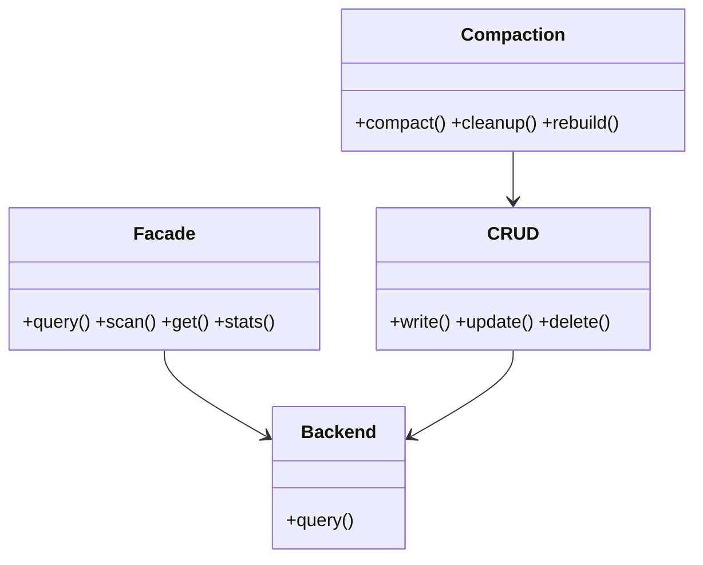

## Positioning

Memory is a passive project-local document store. It provides validated CRUD, keyword
retrieval, candidate maintenance, health observation, and explicit index rebuilding. It does
not capture conversations, load context, schedule work, or decide when memory should be used.

## Class Diagram

## Key Decisions

- **Explicit writes**: only user-requested CLI/service operations write memory; matching a
  Skill never implicitly reads or writes it.
- **Tier boundary**: `medium` is the writable tier; `candidates` is an explicit maintenance
  workspace; the removed `short` tier is rejected.
- **Single persistence path**: CRUD preserves frontmatter, path, atomic-write, and retrieval
  index checks. Index failures are reported separately from storage results.
- **Separate knowledge**: durable business facts belong in `.dna/`; reusable procedures belong
  in Agents and Skills. Memory organization never silently promotes content.
