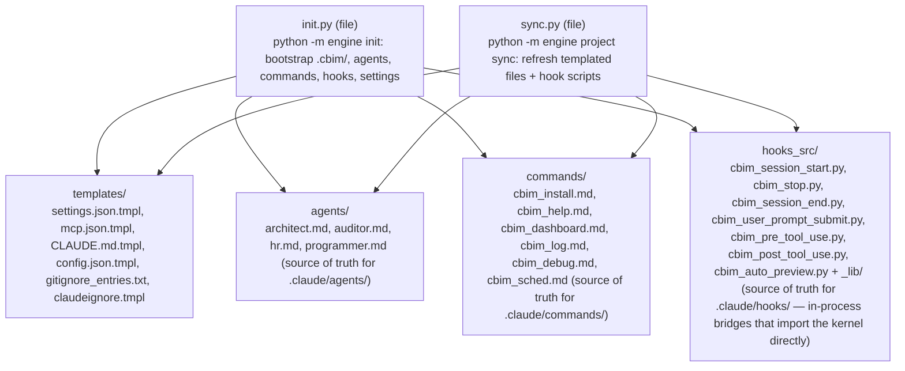

## Positioning

The install side of the kernel. Owns everything that prepares a project to use CBIM: writes `.cbim/run` shims, drops `.cbim/config.json`, installs the 4 source-of-truth agents into `.claude/agents/`, installs the 6 source-of-truth slash commands into `.claude/commands/`, merges hook + MCP wiring into `.claude/settings.json`, drops `CLAUDE.md`, and appends `.cbim/` to `.gitignore`.

Not runtime. Not memory. Not hooks. Once init is done, `project/` plays no role in normal operation — it re-engages only when the user runs `cbim project sync` to refresh the kernel-managed templated files.

## Sub-module Relationships

`init.py` and `sync.py` are siblings; neither imports the other. They share `templates/`, `agents/`, `commands/`, and `hooks_src/` as read-only source data — `init` writes them at bootstrap, `sync` refreshes them later.

Four resource subdirectories, each playing the same role (source-of-truth for a kernel-managed slice of the user's workspace):

- `templates/` — text templates dropped at `.cbim/config.json`, `CLAUDE.md`, `.claude/settings.json`, `.mcp.json` (project-root MCP server registration), `.claudeignore`, and patched into `.gitignore`.
- `agents/` — the 4 built-in agent Markdown files copied to `.claude/agents/<name>/<name>.md`.
- `commands/` — the 6 built-in slash command Markdown files copied to `.claude/commands/cbim_*.md`.
- `hooks_src/` — the 7 hook scripts (`cbim_*.py`, executable, stdlib-only + `_lib/`) copied to `.claude/hooks/` with 0755 on the scripts. The scripts are in-process bridges: each one bootstraps `<project>/.cbim/kernel/` onto `sys.path` via `_lib/bridge.py`, then imports `memory.*` / `cbi.*` / `engine.*` directly to do its work — no MCP transport, no UDS, no subprocess hop. The companion `_lib/` package (`paths.py` / `event_io.py` / `bridge.py` / `__init__.py`) is the stdlib-only support library copied alongside the scripts.

No other sub-packages exist here; everything `project/` does decomposes into "copy one of these four directories into the user's workspace".

## Origin Context

A CBIM project's filesystem footprint is fixed and small:

- `.cbim/run` + `.cbim/run.cmd` — the shim that resolves its own directory and execs `.cbim/.venv/bin/python -m engine` with `PYTHONPATH=<project>/.cbim/kernel`
- `.cbim/.venv/` — managed venv built by `init` using a bootstrap `python3`; holds `mcp` (and any future CBIM Python deps). Never modifies the user's system Python.
- `.cbim/kernel/` — the kernel code drop (downloaded by `/cbim_install`, not written by this module)
- `.cbim/config.json` — project-local config
- `.cbim/memory/` — memory store (created on first write, not by init)
- `.cbim/logs/` — session logs (created on first hook fire)
- `.claude/agents/{architect,auditor,hr,programmer}/<name>.md` — agent definitions
- `.claude/commands/cbim_*.md` — slash commands
- `.claude/settings.json` — hook + MCP server wiring (merged, never clobbered)
- `CLAUDE.md` — coordinator prompt
- `.gitignore` — `.cbim/` appended

Two trigger events write this layout: first-use bootstrap (`init`) and explicit template refresh (`project sync`). One sub-file per trigger. Both read the same `templates/` + `agents/` + `commands/` directories — the *shape* of a CBIM project is one design; the *trigger* for materializing it differs.

## Key Decisions

- **There is exactly one install path: `/cbim_install` slash command → download kernel → `python -m engine init`.** No installer subprocess, no multi-version staging, no version pin file, no migrate command, no upgrade command. To "upgrade" the kernel, the user re-runs `/cbim_install`. To refresh templated files (agents, settings, CLAUDE.md), the user runs `cbim project sync`. Two operations, both idempotent.
- **Install/sync semantics: built-in items are ALWAYS overwritten, user-created items are NEVER touched.** Built-in surfaces are the 4 kernel agents (architect/auditor/hr/programmer), the 6 kernel slash commands (cbim_install/help/dashboard/debug/log/sched), all `cbim_*.py` hook scripts + `.claude/hooks/_lib/`, the cbim entries in `.claude/settings.json` (hook entries whose command starts with `.claude/hooks/cbim_`, the 4 cbim deny patterns, and `permissions.defaultMode`), and the `cbim` key in `.mcp.json`'s `mcpServers`. Every init / sync rewrites these from template, idempotently — `--force` is redundant for built-ins (kept only for signature parity with non-templated files like `.cbim/config.json`). Any artifact outside that built-in set — user agents under different names, user slash commands, user `.py` files under `.claude/hooks/`, user hook entries / deny patterns / top-level keys in settings.json, other `mcpServers.<name>` entries — is never read, written, or removed by install/sync.
- **`.claude/settings.json` merge is surgical, per-event and per-entry.** For each event the kernel template declares (SessionStart, SessionEnd, Stop, UserPromptSubmit, PreToolUse, PostToolUse), cbim-owned hook entries (`command` prefix `.claude/hooks/cbim_`) are refreshed from template while every other entry in that event is preserved in place; events the template does not declare (e.g. user `OnSave`) are left completely untouched. For `permissions.deny`, the 4 cbim patterns are ensured present in template order at the tail; user patterns keep their original positions. Empty hook groups (after cbim-entry removal) are dropped. Everything outside `hooks`, `permissions.deny`, and `permissions.defaultMode` survives verbatim.
- **`project/` reads `cbi/` only via templates (no Python import).** The 4 agent markdowns under `agents/` (`architect.md` / `auditor.md` / `hr.md` / `programmer.md`) are the **single source of truth for agent definitions** — they feed both `cbim soul show` (which reads `project/agents/<name>.md` directly) and the deploy path (`init.py` / `sync.py` copy them verbatim into `.claude/agents/<name>/<name>.md`). `init.py` and `sync.py` never `import cbi`. The earlier soul-py model (one `agent.py` per agent under `cbi/agents/<name>/` exporting `<NAME>_MD`, rendered into a Markdown at release time) has been removed; install-side concerns stay decoupled from the capability/business primitive package, and there is no separate "render" step — the markdown IS the source.
- **`project/` does not depend on `engine`, `memory`, `services`, or `mcp_server`.** Init is callable as a library (`project.init.init_project(target)`) without touching any of those. The reverse direction is also forbidden — `cbi`, `memory`, etc. never import `project`.
- **Hook scripts under `hooks_src/` are install-time snapshots, not a runtime dependency.** They are pure text/code that init copies into `.claude/hooks/`; `project/` itself never imports them. They live here (not in a separate top-level package) precisely because their job is to be copied into the user's workspace.
- **Source-of-truth agent and command Markdown lives here, under `agents/` and `commands/`.** These directories are not "documentation" — they are the canonical copies the kernel ships. Init copies them verbatim into the user's `.claude/` tree. Edits to user-side files (`.claude/agents/architect/architect.md` etc.) get overwritten on the next init or `cbim project sync`; a warning is printed when `cbim agent update` targets one of the kernel-managed names.

- **`cbim_user_prompt_submit.py` 在 mark-busy/log 之外新承担「记忆召回注入」职责（记忆系统「无感知自动召回」重构阶段 1）。** 每次用户输入提交后，该 hook 经 `_lib/bridge.py` bootstrap kernel，跑 4 源 retrieval search（`transcript` / `memory_medium` / `dna` / `agents`），在 hook 内做相关性门控 + 字符预算裁剪，经 `event_io.write_additional_context(text, event_name="UserPromptSubmit")` 把「永久知识 + 相关记忆」注入 **coordinator 主上下文**；retrieval / kernel 异常一律 swallow（exit 0 不阻塞用户输入）。**受众边界**：仅 coordinator 主上下文受益，子 agent 不自动继承——子 agent 的 prompt 级召回仍由 `engine/execution` 的 `ContextRetrieval` 叶（BT 内同步 4 源 search）承担。两条召回路径受众不同，互不替代。

- **All kernel-managed file writes go through `atomic_io.atomic_write_text/bytes` — no bare `Path.write_text`, no `shutil.copy2` for single-file replaces.** Hook scripts (`.claude/hooks/cbim_*.py`) and shim scripts (`.cbim/run`) explicitly `os.chmod(0o755)` after the atomic write to restore the exec bit that `atomic_io`'s 0o644 tmp mode would otherwise drop. Mass tree copies (`_lib/`) still use `shutil.copytree` because they run inside a `rmtree`→copy sequence where torn-write risk is negligible. **This rule extends to `~/.claude/settings.json` via `_clean_global_settings` — the highest-risk write in the module, since a torn write there breaks every CBIM project on the machine.**

- **`_lib/event_io.py::write_additional_context` 走 bytes 层写出，不走 `sys.stdout.reconfigure`。** `json.dumps(payload, ensure_ascii=False)` 得到 str 后交给 `sys.stdout.write`，在 Windows 上文本模式 stdout 使用系统默认代码页（GBK），emoji / 生僻字必然触发 `UnicodeEncodeError`，hook 崩溃。方案定为 `json.dumps(payload, ensure_ascii=False).encode("utf-8")` 得 bytes，直接 `sys.stdout.buffer.write(...)` + `flush()`，绕开文本层编码。**否决 `sys.stdout.reconfigure(encoding="utf-8")`**：修改进程全局 stdout 状态，且必须 `try/except (AttributeError, ValueError)` 兜底 stdout 被测试 harness 替换、不支持 reconfigure 的极端场景；bytes 方案与本模块「文件/文本 I/O 显式声明 UTF-8，不依赖平台默认」的既有原则同轨。**边界**：`read_event()` 与 `write_additional_context(text, *, event_name=...)` 的公开签名不变；两个调用者 `cbim_session_start.py` / `cbim_user_prompt_submit.py` 不动；上游 `hooks_src/_lib/event_io.py` 与部署副本 `.claude/hooks/_lib/event_io.py` 同批同步、逐字节一致。

## Non-Goals

- No `migrate.py`, no `upgrade/` sub-package, no `pin.py`, no `.cbim/.pin` accessor, no `versions.json` reader.
- No installer subprocess. No multi-version kernel staging under `<install_root>/kernel/<ver>/`.
- No diagnostic 7-scenario matrix. There are no scenarios — install is binary (the kernel is either present at `.cbim/kernel/` or it isn't).

