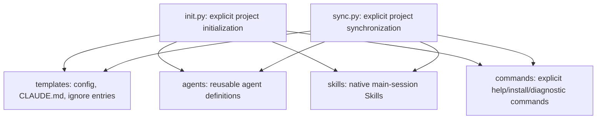

## Positioning

The project package prepares an isolated project for CBIM V1. It owns the local
launcher, configuration, registry bootstrap, reusable agent files, native main-session
Skills, commands, CLAUDE.md template, and ignore entries. It is not a runtime router, memory hook, server, dashboard, or background service.

## Sub-module Relationships

`init.py` and `sync.py` are called by the explicit CLI domains. They preserve
user-authored files and only remove precisely identified legacy CBIM registrations.
Existing memory, indexes, logs, scheduler data, settings, and business knowledge
are not recursively deleted.

## Key Decisions

- New initialization does not install lifecycle hooks, MCP registrations, schedulers,
  dashboards, or background processes.
- Native Skills use specific descriptions, are user-invocable, may be automatically
  matched by Claude Code, and run in the main conversation. Unmatched requests use
  normal Claude Code behavior.
- Memory operations remain explicit user actions; initialization never captures or
  recalls conversation data.
- Synchronization may remove only exact legacy CBIM hook/MCP entries. Third-party
  settings, permissions, hooks, and registrations remain untouched.
- Existing `.cbim/logs/` and other historical runtime data are preserved, but new
  initialization does not create lifecycle-log directories.
