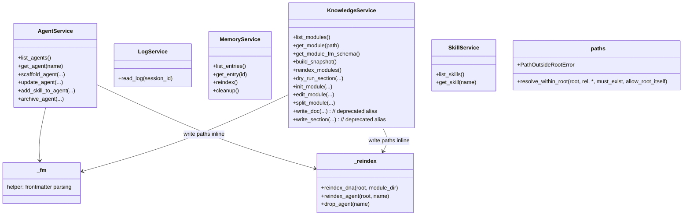

## Positioning

Read-write facade layer between long-lived servers (`mcp_server`, `dashboard`) and kernel internals (`cbi`, `memory`, `engine.retrieval`). Provides stable, narrow APIs so the servers and CLI handlers never reach into volatile sub-package internals. **Both surfaces** — read (`get_module` / `get_agent` / `list_modules` / `list_agents` / `get_module_fm_schema` / `build_snapshot` / `list_skills` / `get_skill` / `dry_run_section` / `read_log`) and write (`init_module` / `edit_module` / `split_module` / `scaffold_agent` / `update_agent` / `add_skill_to_agent` / `archive_agent` / `reindex_modules` / `memory_reindex` / `memory_cleanup`) — flow through this layer. MCP tool handlers and the unified CLI dispatcher are thin shells over service functions; this is the single source of truth for multi-file orchestration and post-write retrieval-index side effects.

## Class Diagram

## Key Decisions

- **Services exist so the surface mcp_server / dashboard / CLI depend on stays stable across kernel refactors.** Without this layer, every renaming inside `cbi/_primitives/modules/` (the 10-file split package) or inside `memory.crud` would break the MCP and dashboard tool surfaces.
- **Services own transactional write facades for all governance domains (agent / dna / memory).** Both CLI handlers (`engine/cli/dna.py` / `engine/cli/agent.py` / `engine/cli/memory.py`) and MCP tools (`mcp_server/tools/*.py`) are thin shells over the service functions — this is the single source of truth for multi-file orchestration (e.g. `init_module` writes `.dna/module.md` + optional `contract.md` + registry update atomically; `split_module` rewrites multiple `.dna/module.md` files plus the index in one transaction).
- **Services are the read-write double-faced facade.** Read-side functions (`get_module` / `get_agent` / `get_module_fm_schema` / `build_snapshot` / `list_skills` / `get_skill` / `reindex_modules` / `dry_run_section`) live alongside write-side functions in the same package. MCP read tools (`dna_show` / `agent_show` / `project_snapshot` / `skill_*` / `dna_reindex` / `dna_dry_run`) and CLI read commands route through services for the same boundary reason write tools do; nobody reaches into `cbi/_primitives` or `memory.crud` directly.
- **Every write function ends with an inline retrieval-index side-effect via `services/_reindex.py`.** `_reindex.reindex_dna` / `reindex_agent` / `drop_agent` are called *inside* the service functions immediately after the data write succeeds. The CLI surface and the MCP surface therefore never need to remember to reindex — it is impossible to write through services and forget. The retrieval module's Key Decision ("index updates are the writer's synchronous side-effect, retrieval never scans") is enforced here, once, for every write surface.
- **Reindex is no longer a tool-layer responsibility.** The legacy MCP `dna_reindex` tool still exists for explicit user-driven full rebuilds, but the steady-state path is the per-write inline call. Tool layers (`mcp_server.tools.*`, `engine.cli.*`) MUST NOT post-process service results to maintain the index.
- **Path-traversal guard `services/_paths.py` is the single defence.** `resolve_within_root(root, rel, *, must_exist, allow_root_itself)` and `PathOutsideRootError` are owned here; **enforced at the MCP entry**, not in services or `cbi/_primitives`. Services trust the entry layer (MCP / CLI handlers / dashboard) to have already validated paths — enforcing twice would force every internal helper to take a `root` parameter for a check the entry already performed. The guard rejects Windows drive-relative forms (`C:foo` — OS interprets vs per-drive cwd, never against root) and absolute paths that escape root via `..` or symlinks/reparse points; absolute paths that *do* land inside root are allowed (CLI surface routinely passes them).
- **`_fm` is the single frontmatter parser.** `cbi/_primitives/modules/loader.py` and `cbi/_primitives/agents.py` both delegate to `services._fm` after the P3 Wave 1 deduplication; no module owns its own frontmatter parser.
- **`find_project_root` no longer lives in services or `_fm`.** Project-root resolution is owned by `kernel/context.py` exclusively (the `project_root()` STRICT and `resolve_root_or_cwd()` LENIENT facades). Services consume those two helpers; they do not implement walk-up logic of their own.

- **`SkillService` 从只读升级为读写双面（2026-07-14 已落地）**。写侧方法集合：

  - `create_agent_skill(agent_name, skill_name, body, *, as_dir: bool = False, cwd: str = "") -> str` — 创建新 skill（单文件或目录形）。
  - `update_agent_skill(agent_name, skill_name, target, payload, *, cwd) -> str` — **当前仅支持 `target="body"`**，payload 形状 `{"content": str}`；其他 target 值拒 `ValueError`。能力缺口：`target="frontmatter"` / `target="section"` 尚未支持，因 `_primitives/skills.py` 只提供整体 body 替换原语。后续如需 section 级别更新，需先给原语层加 section 写入能力，再在服务层扩展 target 枚举。
  - `delete_agent_skill(agent_name, skill_name, *, cwd) -> str` — 删 skill；目录形写只删目录（含 `assets/`，一层 `shutil.rmtree`）。
  - `add_skill_asset(agent_name, skill_name, asset_rel_path, content, *, is_executable: bool, cwd) -> str` — 向 skill 的 `assets/` 写一个资产。
  - `remove_skill_asset(agent_name, skill_name, asset_rel_path, *, cwd) -> str` — 删一个资产。

  **护栏均在服务层完成，不下沉到 `_primitives.skills`**：

  1. **agent 名字校验**。复用 `services._identifiers.validate_identifier(kind="agent"|"skill")` 拒 path traversal；额外多一道“拒内置四 agent”（常量 `_FORBIDDEN_AGENTS = {"architect","auditor","hr","programmer"}` 位于服务层）→ `ForbiddenAgentError`（ValueError 子类）。
  2. **路径护栏**。asset_rel_path 需过 `_paths.resolve_within_root(root=<skill>/assets, rel=asset_rel_path, allow_root_itself=False)`，专隔 `..` / 绝对路径 / 驱动器相对形。不得跨出该 skill 的 assets/。
  3. **is_executable 铁律**。可执行后缀白名单 = `_EXECUTABLE_ASSET_SUFFIXES`（服务层常量，不可配置）；命中后缀但 `is_executable=False` → `ExecutableAssetRequiresFlagError`（ValueError 子类）拒写。
  4. **audit log 写入点**。写入/删除可执行资产上 `engine.logger.append("CBIM:skill_asset", ...)`；日志失败不回滚（与现有 logger 一致“日志不能崩写入”铁律）。
  5. **同名共存拒写**。创建时同时命中两种形态 → `AmbiguousSkillError`；`create_agent_skill(as_dir=True)` 发现同名 `<skill>.md` → `FileExistsError`；`create_agent_skill(as_dir=False)` 发现同名 `<skill>/` → `FileExistsError`。
  6. **事务副作用**。create/update/delete skill 与 create/remove asset 都在主写成功后调 `_reindex.reindex_agent(root, agent_name)`。与已有“inline 索引副作用”铁律对齐。

  **`services/__init__.py` 未把新方法/异常挂到包顶层**。调用方需 `from services.skill_service import ...` 直接导入——与现有 knowledge_service / agent_service 的旧写侧方法一致（旧写侧也未顶层重导入）。

- **`services/_identifiers.py` 新增为服务层内部 identifier 校验 helper（2026-07-14 已落地）**。背景：`agent_service.py` 原本私有一个 `_validate_identifier`，`skill_service.py` 需复用同一套 path-traversal / 命名校验逻辑。方案上把它提升为服务层新建 `_identifiers.py` 的公开函数 `validate_identifier(name, *, kind)`，`agent_service` 与 `skill_service` 同时 import；行为与旧封装完全一致。**归属判定**：存放在本模块内，不单独立模块——与 `_paths.py` / `_reindex.py` / `_fm.py` 平行，都是服务层内部 helper（下划线前缀标识“服务层私有具”）。命名 helper 自身不够“一个模块一个职责”的权重，拆到顶层会造成“一个 helper 一个模块”的模块碎片化。与现有内部 helper 安展方式对齐，无需新 `.dna/`。

- **已知缺陷：`_paths.resolve_within_root` 对 POSIX 绝对路径字符串拼接场景漏判（2026-07-14 发现，拒当前修）**。现象：`root / rel` 形式下，若 `rel` 为 POSIX 绝对路径（如 `"/etc/passwd"`），pathlib 的拼接归一化会把前缀 root 吃掉——`Path("D:/proj") / "/etc/passwd" == Path("/etc/passwd")` ——后续 `resolve()` 直接落在 root 外，但 relative_to 判定“不在 root 内” 成立——报错——。看似安全，实则依赖的是“拼接后仍然不在 root 内”这个副作用保护；若将来某个调用方不小心把 `resolve_within_root(<other_root>, "/etc/passwd")` 中的 `<other_root>` 写成 `"/"` 或另一个能包含“/etc”的目录，护栏直接漏判。**当前局部修补**：`skill_service.py` 在调 `resolve_within_root` 前加了预检——拒以 `/`、`\` 开头、`Path.is_absolute()==True`、Windows 驱动器相对形式（如 `C:foo`）三类。其他现有调用 `resolve_within_root` 的地方（agent_service.py / knowledge_service.py / 可能的其他）**还未加预检**，遇到相同拼接场景仍存在同类风险。

  **架构方判断：应当在 `services/_paths.py` 本身修复，不该让每个调用方各自加预检**。理由：(a) 护栏写到入口上才能“一个地方修、全面十。”的单防护初衷；现在让每个写侧 service 又自加一道，与本模块已有 Key Decision “路径护栏是单防护”相反——能够回到单入口。 (b) POSIX 绝对路径与 Windows 驱动器相对形式本属一类“目标能绕过 root 拼接”风险，`_paths.py` 已拒 Windows 驱动器相对形式，同位拒 POSIX 绝对路径以保持一致。**本轮不修**（需 kernel 同步 + 全面回归测），作为已知技术债记录在此；后续需：(1) 在 `_paths.resolve_within_root` 对 `rel.startswith("/")` 与 `Path(rel).is_absolute()` 报 `PathOutsideRootError`（与 Windows 驱动器相对形式同等待遇）；(2) 同时将 `skill_service.py` 中的预检删除（避免双层护栏）；(3) 后续回归测需覆盖 `resolve_within_root` 现有全部调用点，确保无依赖隔“拼接后在 root 外”副作用的现有用例。

