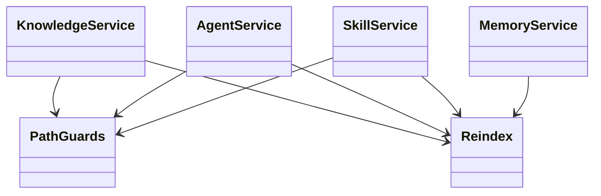

## Positioning

Services provide stable read/write boundaries between CLI or resource callers and volatile
storage primitives. They centralize validation, path safety, atomic updates, and post-write
index synchronization.

## Class Diagram

## Key Decisions

- **One governed boundary**: callers use service functions rather than private primitives,
  keeping validation and error semantics consistent.
- **Explicit operations**: services do not dispatch agents, start background work, or mutate
  memory without an explicit request.
- **Visible index state**: post-write reindexing is part of the service contract; failures are
  returned or raised instead of being hidden.
