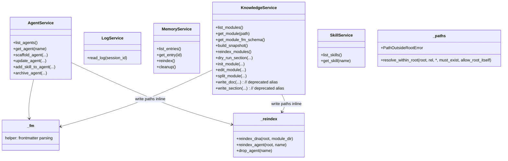

## Positioning

Read-write facade layer between long-lived servers (`mcp_server`, `dashboard`) and kernel internals (`cbi`, `memory`, `engine.retrieval`). Provides stable, narrow APIs so the servers and CLI handlers never reach into volatile sub-package internals. **Both surfaces** — read (`get_module` / `get_agent` / `list_modules` / `list_agents` / `get_module_fm_schema` / `build_snapshot` / `list_skills` / `get_skill` / `dry_run_section` / `read_log`) and write (`init_module` / `edit_module` / `split_module` / `scaffold_agent` / `update_agent` / `add_skill_to_agent` / `archive_agent` / `reindex_modules` / `memory_reindex` / `memory_cleanup`) — flow through this layer. MCP tool handlers and the unified CLI dispatcher are thin shells over service functions; this is the single source of truth for multi-file orchestration and post-write retrieval-index side effects.

## Class Diagram

## Key Decisions

- **Services exist so the surface mcp_server / dashboard / CLI depend on stays stable across kernel refactors.** Without this layer, every renaming inside `cbi/_primitives/modules/` (the 10-file split package) or inside `memory.crud` would break the MCP and dashboard tool surfaces.
- **Services own transactional write facades for all governance domains (agent / dna / memory).** Both CLI handlers (`engine/cli/dna.py` / `engine/cli/agent.py` / `engine/cli/memory.py`) and MCP tools (`mcp_server/tools/*.py`) are thin shells over the service functions — this is the single source of truth for multi-file orchestration (e.g. `init_module` writes `.dna/module.md` + optional `contract.md` + registry update atomically; `split_module` rewrites multiple `.dna/module.md` files plus the index in one transaction).
- **Services are the read-write double-faced facade.** Read-side functions (`get_module` / `get_agent` / `get_module_fm_schema` / `build_snapshot` / `list_skills` / `get_skill` / `reindex_modules` / `dry_run_section`) live alongside write-side functions in the same package. MCP read tools (`dna_show` / `agent_show` / `project_snapshot` / `skill_*` / `dna_reindex` / `dna_dry_run`) and CLI read commands route through services for the same boundary reason write tools do; nobody reaches into `cbi/_primitives` or `memory.crud` directly.
- **Every write function ends with an inline retrieval-index side-effect via `services/_reindex.py`.** `_reindex.reindex_dna` / `reindex_agent` / `drop_agent` are called *inside* the service functions immediately after the data write succeeds. The CLI surface and the MCP surface therefore never need to remember to reindex — it is impossible to write through services and forget. The retrieval module's Key Decision ("index updates are the writer's synchronous side-effect, retrieval never scans") is enforced here, once, for every write surface.
- **Reindex is no longer a tool-layer responsibility.** The legacy MCP `dna_reindex` tool still exists for explicit user-driven full rebuilds, but the steady-state path is the per-write inline call. Tool layers (`mcp_server.tools.*`, `engine.cli.*`) MUST NOT post-process service results to maintain the index.
- **Path-traversal guard `services/_paths.py` is the single defence.** `resolve_within_root(root, rel, *, must_exist, allow_root_itself)` and `PathOutsideRootError` are owned here; **enforced at the MCP entry**, not in services or `cbi/_primitives`. Services trust the entry layer (MCP / CLI handlers / dashboard) to have already validated paths — enforcing twice would force every internal helper to take a `root` parameter for a check the entry already performed. The guard rejects Windows drive-relative forms (`C:foo` — OS interprets vs per-drive cwd, never against root) and absolute paths that escape root via `..` or symlinks/reparse points; absolute paths that *do* land inside root are allowed (CLI surface routinely passes them).
- **`_fm` is the single frontmatter parser.** `cbi/_primitives/modules/loader.py` and `cbi/_primitives/agents.py` both delegate to `services._fm` after the P3 Wave 1 deduplication; no module owns its own frontmatter parser.
- **`find_project_root` no longer lives in services or `_fm`.** Project-root resolution is owned by `kernel/context.py` exclusively (the `project_root()` STRICT and `resolve_root_or_cwd()` LENIENT facades). Services consume those two helpers; they do not implement walk-up logic of their own.

